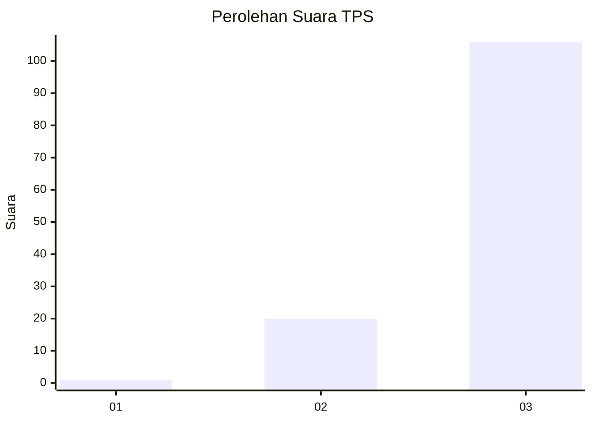
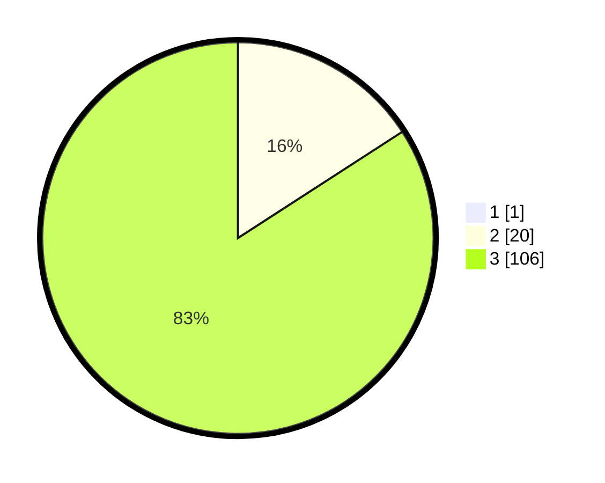

# Hasil

## Grafik

## Tabel

| No. | Nama Paslon    | Suara | Suara (raw) | Persentase |
|:--- |:-------------- | -----:| -----------:| ----------:|
| 1   | ANIES MUHAIMIN | 1     | [1][p-1]    | 0,79       |
| 2   | PRABOWO GIBRAN | 20    | [20][p-2]   | 15,75      |
| 3   | GANJAR MAHFUD  | 106   | [106][p-3]  | 83,46      |

[p-1]: https://github.com/gigit-pemilu/pemilu-2024-32-jawa-barat/blob/main/pilpres/hitung-suara/sub/32-jawa-barat/sub/05-garut/sub/21-sukaresmi/sub/2005-sukamulya/sub/021-tps/sub/paslon-1.txt
[p-2]: https://github.com/gigit-pemilu/pemilu-2024-32-jawa-barat/blob/main/pilpres/hitung-suara/sub/32-jawa-barat/sub/05-garut/sub/21-sukaresmi/sub/2005-sukamulya/sub/021-tps/sub/paslon-2.txt
[p-3]: https://github.com/gigit-pemilu/pemilu-2024-32-jawa-barat/blob/main/pilpres/hitung-suara/sub/32-jawa-barat/sub/05-garut/sub/21-sukaresmi/sub/2005-sukamulya/sub/021-tps/sub/paslon-3.txt

## Foto C Plano

https://sirekap-obj-formc.kpu.go.id/075d/pemilu/ppwp/32/05/21/20/05/3205212005021-20240214-210728--0f22dd7b-5783-44e5-9d9a-d3060a4274f7.jpg

https://sirekap-obj-formc.kpu.go.id/075d/pemilu/ppwp/32/05/21/20/05/3205212005021-20240215-153556--fc2855b2-f191-454d-9a91-4ac08ce2404c.jpg

https://sirekap-obj-formc.kpu.go.id/075d/pemilu/ppwp/32/05/21/20/05/3205212005021-20240215-153845--d879a6ad-92e6-4cf5-8a0c-4ddd6ed43976.jpg

## Metadata

| Key        | Value               |
| ---------- | ------------------- |
| Time Stamp | 2024-02-15 23:29:50 |

