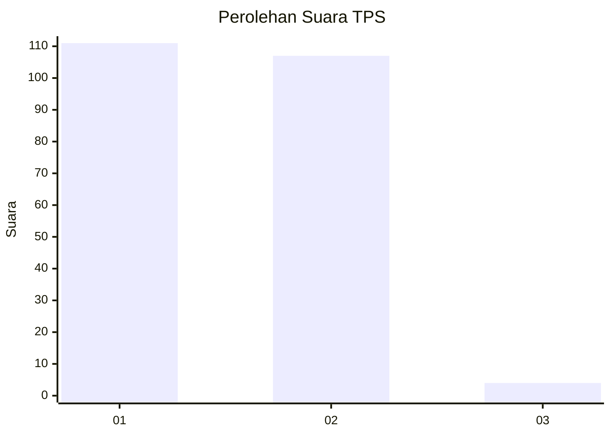
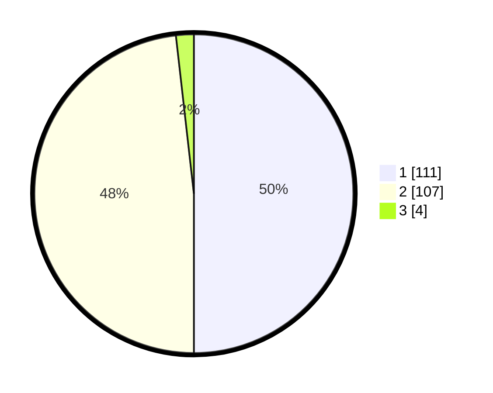

# Hasil

## Grafik

## Tabel

| No. | Nama Paslon    | Suara | Suara (raw) | Persentase |
|:--- |:-------------- | -----:| -----------:| ----------:|
| 1   | ANIES MUHAIMIN | 111   | [111][p-1]  | 50,00      |
| 2   | PRABOWO GIBRAN | 107   | [107][p-2]  | 48,20      |
| 3   | GANJAR MAHFUD  | 4     | [4][p-3]    | 1,80       |

[p-1]: https://github.com/gigit-pemilu/pemilu-2024-32-jawa-barat/blob/main/pilpres/hitung-suara/sub/32-jawa-barat/sub/05-garut/sub/22-cikajang/sub/2001-cikajang/sub/003-tps/sub/paslon-1.txt
[p-2]: https://github.com/gigit-pemilu/pemilu-2024-32-jawa-barat/blob/main/pilpres/hitung-suara/sub/32-jawa-barat/sub/05-garut/sub/22-cikajang/sub/2001-cikajang/sub/003-tps/sub/paslon-2.txt
[p-3]: https://github.com/gigit-pemilu/pemilu-2024-32-jawa-barat/blob/main/pilpres/hitung-suara/sub/32-jawa-barat/sub/05-garut/sub/22-cikajang/sub/2001-cikajang/sub/003-tps/sub/paslon-3.txt

## Foto C Plano

https://sirekap-obj-formc.kpu.go.id/5ec8/pemilu/ppwp/32/05/22/20/01/3205222001003-20240214-155432--c3fe406c-ef95-4417-95da-6c2e1701dd77.jpg

https://sirekap-obj-formc.kpu.go.id/5ec8/pemilu/ppwp/32/05/22/20/01/3205222001003-20240214-155452--689f2972-4770-4675-b647-673245b5d65c.jpg

https://sirekap-obj-formc.kpu.go.id/5ec8/pemilu/ppwp/32/05/22/20/01/3205222001003-20240214-155508--397bd4f1-4028-4c64-8419-e33527a20426.jpg

## Metadata

| Key        | Value               |
| ---------- | ------------------- |
| Time Stamp | 2024-02-15 12:00:28 |

