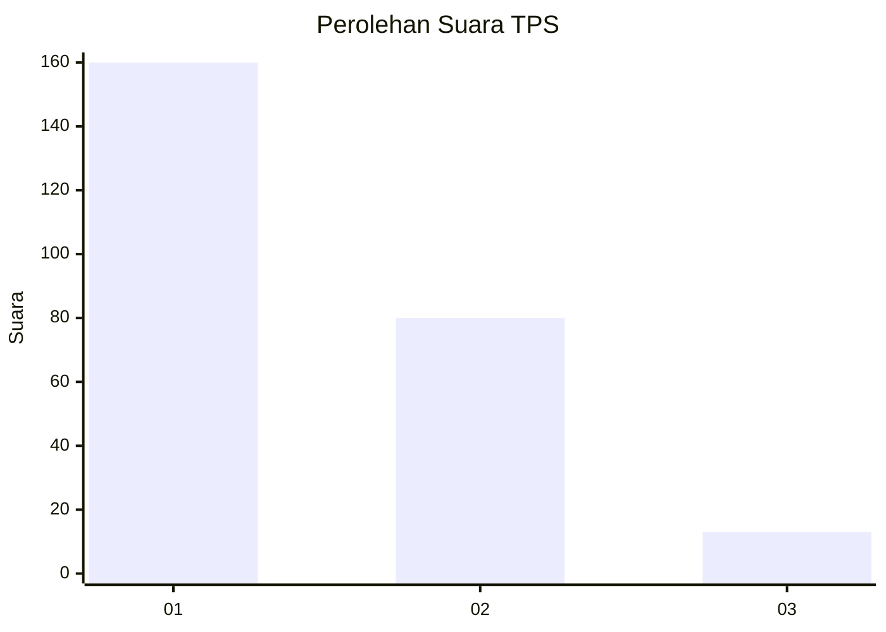
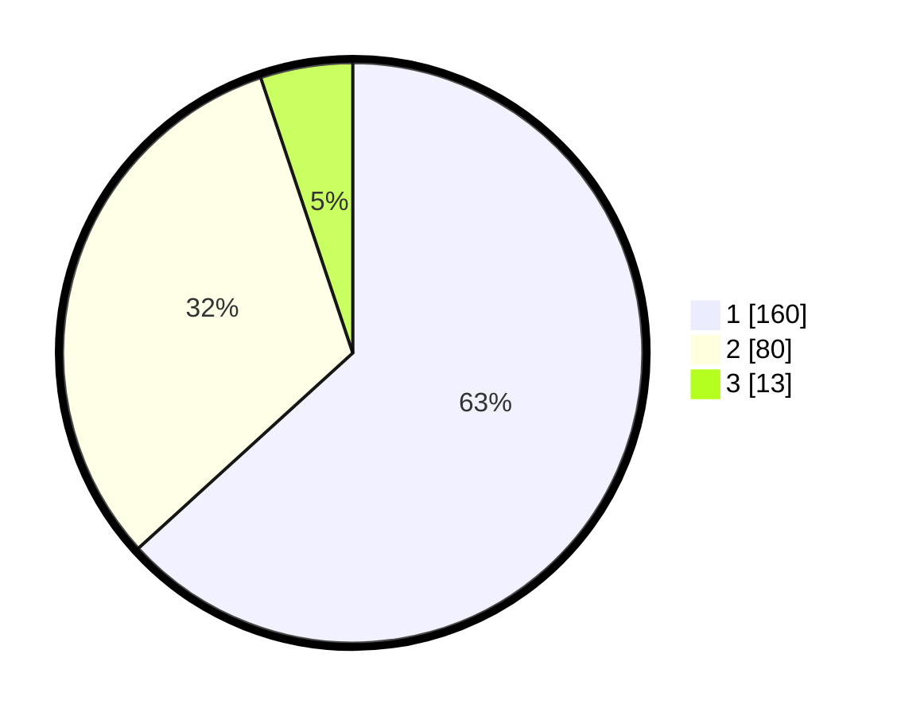

# Hasil

## Grafik

## Tabel

| No. | Nama Paslon    | Suara | Suara (raw) | Persentase |
|:--- |:-------------- | -----:| -----------:| ----------:|
| 1   | ANIES MUHAIMIN | 160   | [160][p-1]  | 63,24      |
| 2   | PRABOWO GIBRAN | 80    | [80][p-2]   | 31,62      |
| 3   | GANJAR MAHFUD  | 13    | [13][p-3]   | 5,14       |

[p-1]: https://github.com/gigit-pemilu/pemilu-2024/blob/main/pilpres/hitung-suara/sub/32-jawa-barat/sub/05-garut/sub/22-cikajang/sub/2007-mekarjaya/sub/006-tps/sub/paslon-1.txt
[p-2]: https://github.com/gigit-pemilu/pemilu-2024/blob/main/pilpres/hitung-suara/sub/32-jawa-barat/sub/05-garut/sub/22-cikajang/sub/2007-mekarjaya/sub/006-tps/sub/paslon-2.txt
[p-3]: https://github.com/gigit-pemilu/pemilu-2024/blob/main/pilpres/hitung-suara/sub/32-jawa-barat/sub/05-garut/sub/22-cikajang/sub/2007-mekarjaya/sub/006-tps/sub/paslon-3.txt

## Foto C Plano

https://sirekap-obj-formc.kpu.go.id/a3ee/pemilu/ppwp/32/05/22/20/07/3205222007006-20240214-235223--8031ceab-88af-48a6-9a2c-3a0aaa6ebd83.jpg

https://sirekap-obj-formc.kpu.go.id/a3ee/pemilu/ppwp/32/05/22/20/07/3205222007006-20240214-235555--e4b25088-c309-4f2c-931c-8abe37908d4f.jpg

https://sirekap-obj-formc.kpu.go.id/a3ee/pemilu/ppwp/32/05/22/20/07/3205222007006-20240214-235915--d74df9bc-4013-4ebc-afb6-815faf5e4f32.jpg

## Metadata

| Key        | Value               |
| ---------- | ------------------- |
| Time Stamp | 2024-02-15 17:30:25 |

