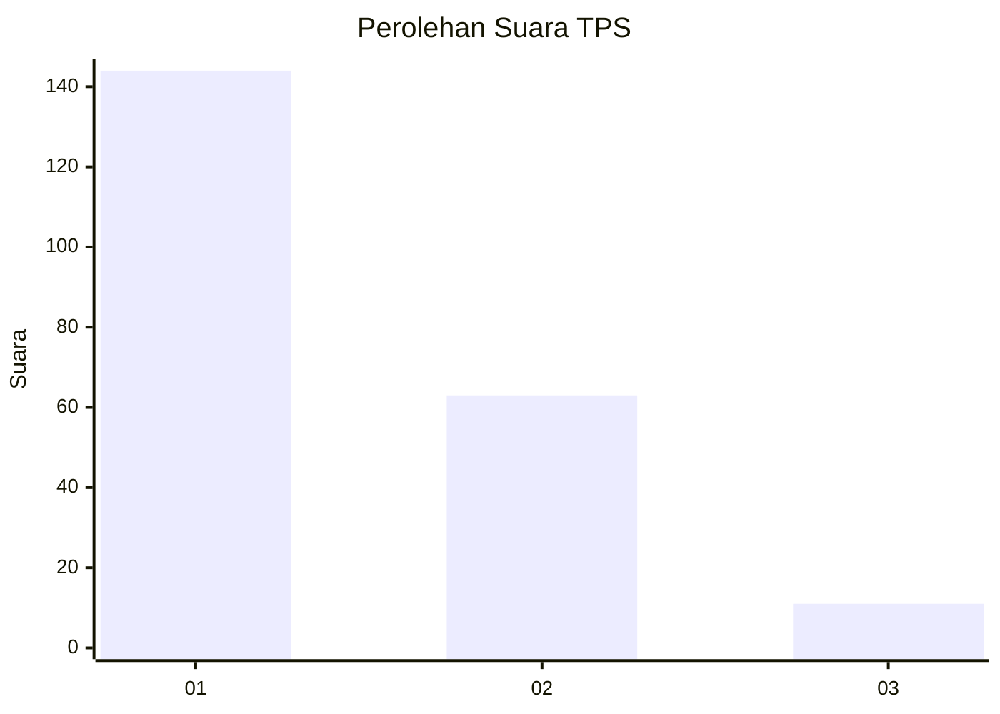
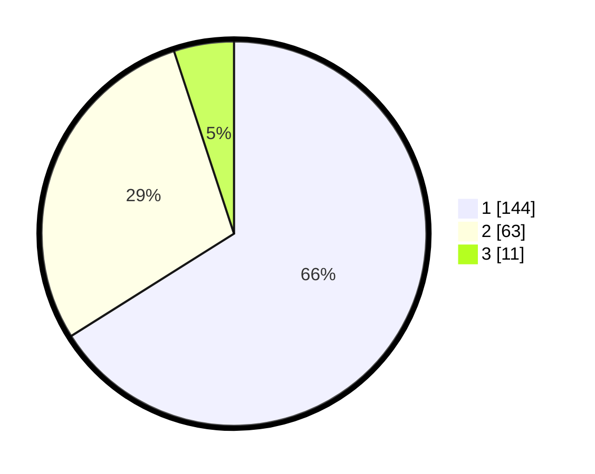

# Hasil

## Grafik

## Tabel

| No. | Nama Paslon    | Suara | Suara (raw) | Persentase |
|:--- |:-------------- | -----:| -----------:| ----------:|
| 1   | ANIES MUHAIMIN | 144   | [144][p-1]  | 66,06      |
| 2   | PRABOWO GIBRAN | 63    | [63][p-2]   | 28,90      |
| 3   | GANJAR MAHFUD  | 11    | [11][p-3]   | 5,05       |

[p-1]: https://github.com/gigit-pemilu/pemilu-2024/blob/main/pilpres/hitung-suara/sub/32-jawa-barat/sub/05-garut/sub/22-cikajang/sub/2007-mekarjaya/sub/009-tps/sub/paslon-1.txt
[p-2]: https://github.com/gigit-pemilu/pemilu-2024/blob/main/pilpres/hitung-suara/sub/32-jawa-barat/sub/05-garut/sub/22-cikajang/sub/2007-mekarjaya/sub/009-tps/sub/paslon-2.txt
[p-3]: https://github.com/gigit-pemilu/pemilu-2024/blob/main/pilpres/hitung-suara/sub/32-jawa-barat/sub/05-garut/sub/22-cikajang/sub/2007-mekarjaya/sub/009-tps/sub/paslon-3.txt

## Foto C Plano

https://sirekap-obj-formc.kpu.go.id/c010/pemilu/ppwp/32/05/22/20/07/3205222007009-20240215-051300--bc096545-e45e-409f-8a00-fd275498c718.jpg

https://sirekap-obj-formc.kpu.go.id/c010/pemilu/ppwp/32/05/22/20/07/3205222007009-20240215-052400--86f4efe4-af6f-4d71-a4b1-b42920044b39.jpg

https://sirekap-obj-formc.kpu.go.id/c010/pemilu/ppwp/32/05/22/20/07/3205222007009-20240215-052533--f1e5f959-1756-4cb0-91e6-ecf974dcdf60.jpg

## Metadata

| Key        | Value               |
| ---------- | ------------------- |
| Time Stamp | 2024-02-15 16:00:26 |

