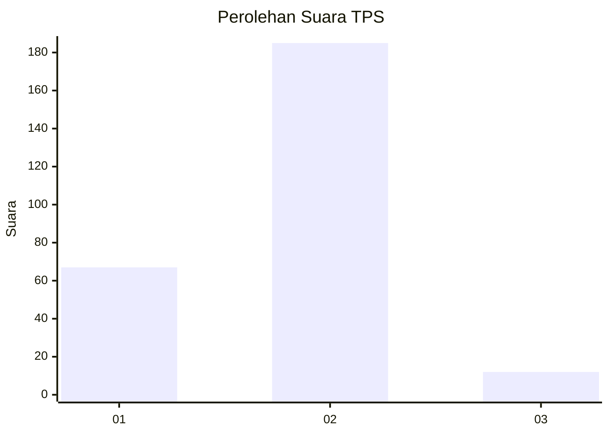
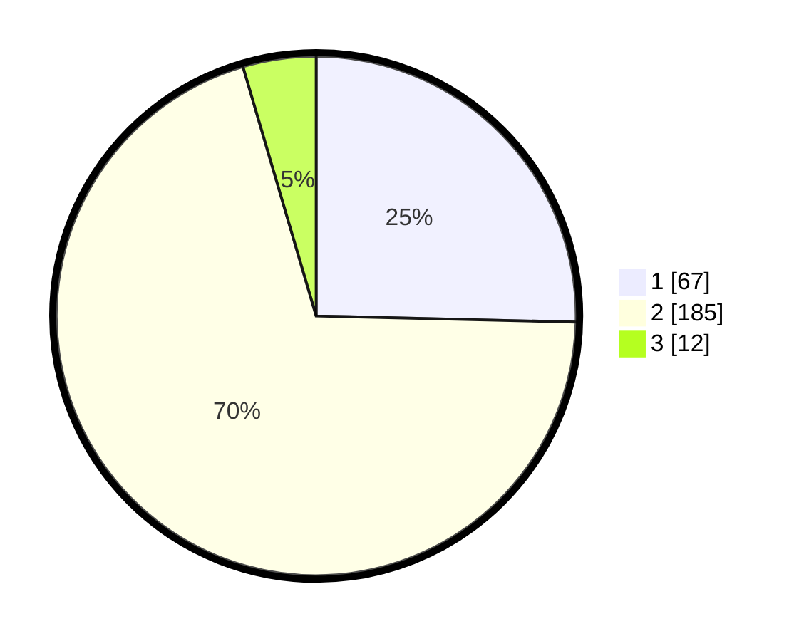

# Hasil

## Grafik

## Tabel

| No. | Nama Paslon    | Suara | Suara (raw) | Persentase |
|:--- |:-------------- | -----:| -----------:| ----------:|
| 1   | ANIES MUHAIMIN | 67    | [67][p-1]   | 25,38      |
| 2   | PRABOWO GIBRAN | 185   | [185][p-2]  | 70,08      |
| 3   | GANJAR MAHFUD  | 12    | [12][p-3]   | 4,55       |

[p-1]: https://github.com/gigit-pemilu/pemilu-2024-32-jawa-barat/blob/main/pilpres/hitung-suara/sub/32-jawa-barat/sub/05-garut/sub/22-cikajang/sub/2008-cikandang/sub/018-tps/sub/paslon-1.txt
[p-2]: https://github.com/gigit-pemilu/pemilu-2024-32-jawa-barat/blob/main/pilpres/hitung-suara/sub/32-jawa-barat/sub/05-garut/sub/22-cikajang/sub/2008-cikandang/sub/018-tps/sub/paslon-2.txt
[p-3]: https://github.com/gigit-pemilu/pemilu-2024-32-jawa-barat/blob/main/pilpres/hitung-suara/sub/32-jawa-barat/sub/05-garut/sub/22-cikajang/sub/2008-cikandang/sub/018-tps/sub/paslon-3.txt

## Foto C Plano

https://sirekap-obj-formc.kpu.go.id/092f/pemilu/ppwp/32/05/22/20/08/3205222008018-20240214-234039--6c4c3086-44e0-438d-a91c-2588b4dcb013.jpg

https://sirekap-obj-formc.kpu.go.id/092f/pemilu/ppwp/32/05/22/20/08/3205222008018-20240214-234157--39b8c782-a4d6-4640-9303-671895ff169a.jpg

https://sirekap-obj-formc.kpu.go.id/092f/pemilu/ppwp/32/05/22/20/08/3205222008018-20240214-234252--c73c8904-5615-4cd1-a650-8c103b1f93ff.jpg

## Metadata

| Key        | Value               |
| ---------- | ------------------- |
| Time Stamp | 2024-02-15 12:00:28 |

