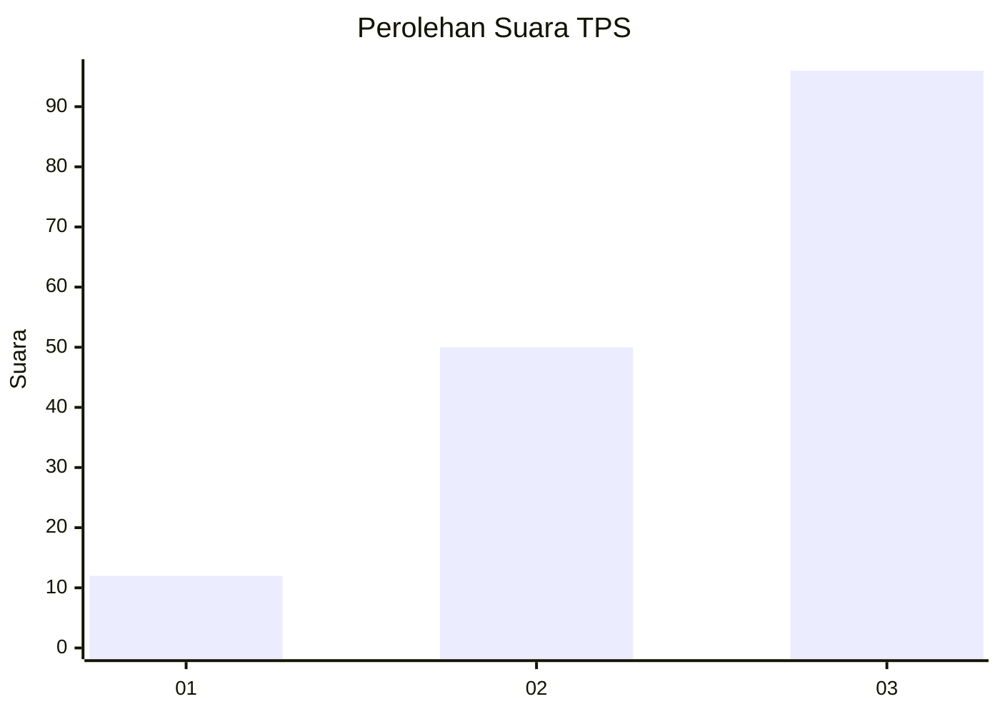
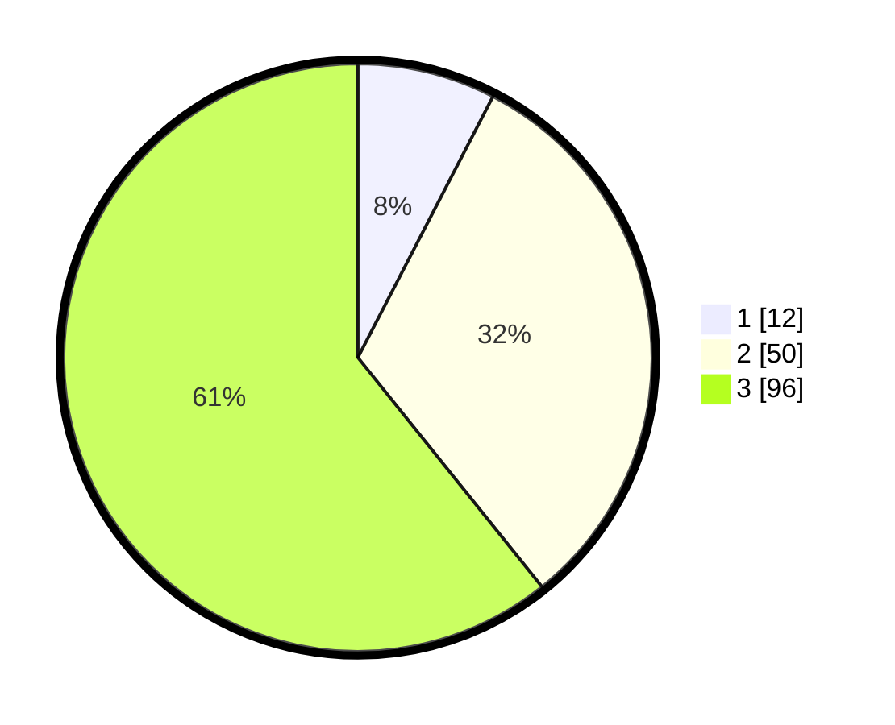

# Hasil

## Grafik

## Tabel

| No. | Nama Paslon    | Suara | Suara (raw) | Persentase |
|:--- |:-------------- | -----:| -----------:| ----------:|
| 1   | ANIES MUHAIMIN | 12    | [12][p-1]   | 7,59       |
| 2   | PRABOWO GIBRAN | 50    | [50][p-2]   | 31,65      |
| 3   | GANJAR MAHFUD  | 96    | [96][p-3]   | 60,76      |

[p-1]: https://github.com/gigit-pemilu/pemilu-2024-32-jawa-barat/blob/main/pilpres/hitung-suara/sub/32-jawa-barat/sub/05-garut/sub/22-cikajang/sub/2011-cipangramatan/sub/015-tps/sub/paslon-1.txt
[p-2]: https://github.com/gigit-pemilu/pemilu-2024-32-jawa-barat/blob/main/pilpres/hitung-suara/sub/32-jawa-barat/sub/05-garut/sub/22-cikajang/sub/2011-cipangramatan/sub/015-tps/sub/paslon-2.txt
[p-3]: https://github.com/gigit-pemilu/pemilu-2024-32-jawa-barat/blob/main/pilpres/hitung-suara/sub/32-jawa-barat/sub/05-garut/sub/22-cikajang/sub/2011-cipangramatan/sub/015-tps/sub/paslon-3.txt

## Foto C Plano

https://sirekap-obj-formc.kpu.go.id/a778/pemilu/ppwp/32/05/22/20/11/3205222011015-20240215-113821--fe27a10b-bdab-4774-9d18-93ce9332da17.jpg

https://sirekap-obj-formc.kpu.go.id/a778/pemilu/ppwp/32/05/22/20/11/3205222011015-20240215-113901--0c956f9c-2cd4-40c5-a47f-e1459ed8233c.jpg

https://sirekap-obj-formc.kpu.go.id/a778/pemilu/ppwp/32/05/22/20/11/3205222011015-20240215-113949--3086b1c2-4b48-45ed-a8be-263d0ac46799.jpg

## Metadata

| Key        | Value               |
| ---------- | ------------------- |
| Time Stamp | 2024-02-15 15:00:29 |

