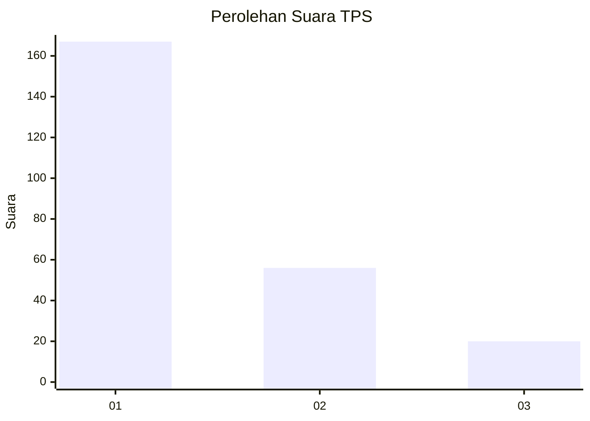
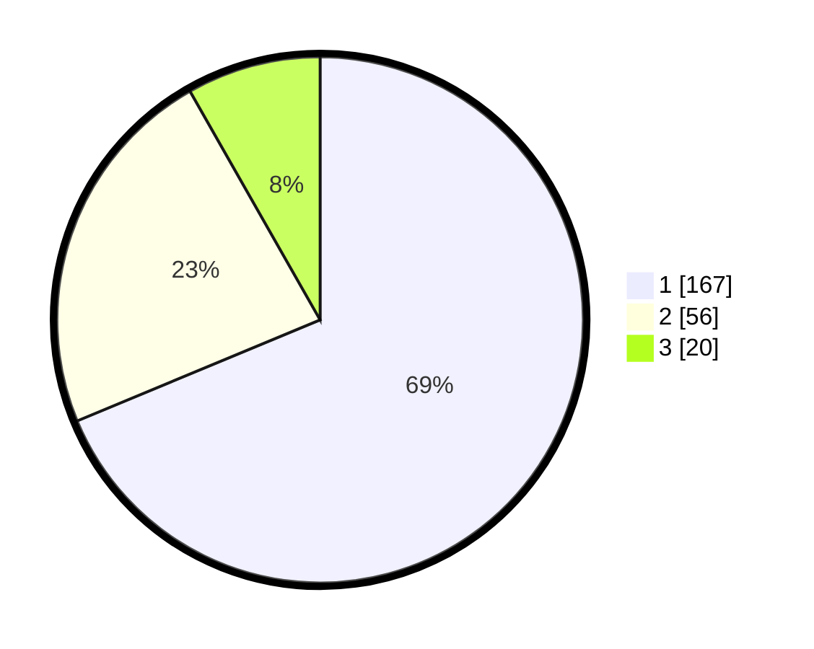

# Hasil

## Grafik

## Tabel

| No. | Nama Paslon    | Suara | Suara (raw) | Persentase |
|:--- |:-------------- | -----:| -----------:| ----------:|
| 1   | ANIES MUHAIMIN | 167   | [167][p-1]  | 68,72      |
| 2   | PRABOWO GIBRAN | 56    | [56][p-2]   | 23,05      |
| 3   | GANJAR MAHFUD  | 20    | [20][p-3]   | 8,23       |

[p-1]: https://github.com/gigit-pemilu/pemilu-2024/blob/main/pilpres/hitung-suara/sub/32-jawa-barat/sub/05-garut/sub/23-banjarwangi/sub/2002-talagajaya/sub/005-tps/sub/paslon-1.txt
[p-2]: https://github.com/gigit-pemilu/pemilu-2024/blob/main/pilpres/hitung-suara/sub/32-jawa-barat/sub/05-garut/sub/23-banjarwangi/sub/2002-talagajaya/sub/005-tps/sub/paslon-2.txt
[p-3]: https://github.com/gigit-pemilu/pemilu-2024/blob/main/pilpres/hitung-suara/sub/32-jawa-barat/sub/05-garut/sub/23-banjarwangi/sub/2002-talagajaya/sub/005-tps/sub/paslon-3.txt

## Foto C Plano

https://sirekap-obj-formc.kpu.go.id/c45a/pemilu/ppwp/32/05/23/20/02/3205232002005-20240215-094739--92733766-2094-4d39-9be6-ba4dcc711d50.jpg

https://sirekap-obj-formc.kpu.go.id/c45a/pemilu/ppwp/32/05/23/20/02/3205232002005-20240215-093242--4e1ec922-88c6-4f8b-81a9-51567b33a7cb.jpg

https://sirekap-obj-formc.kpu.go.id/c45a/pemilu/ppwp/32/05/23/20/02/3205232002005-20240215-093423--1b798fb6-6ff9-47b9-8ba5-9862a3057500.jpg

## Metadata

| Key        | Value               |
| ---------- | ------------------- |
| Time Stamp | 2024-02-25 14:00:00 |

