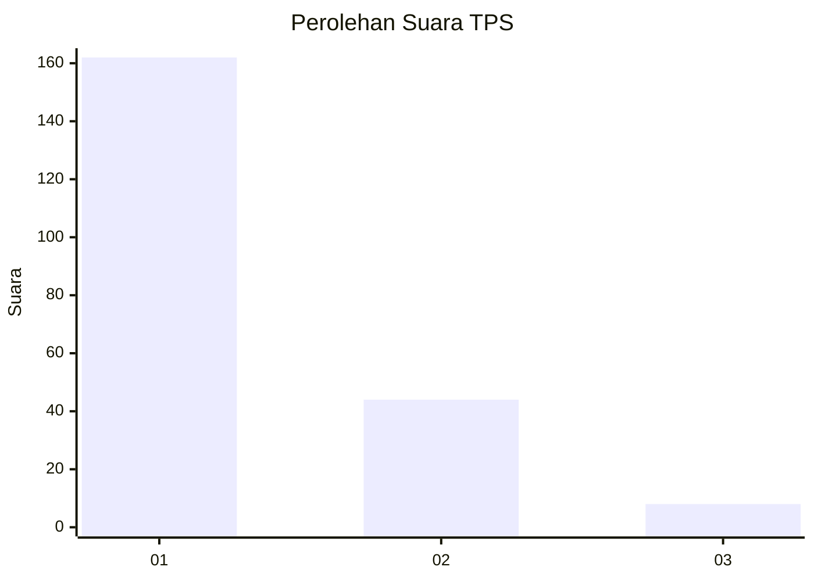
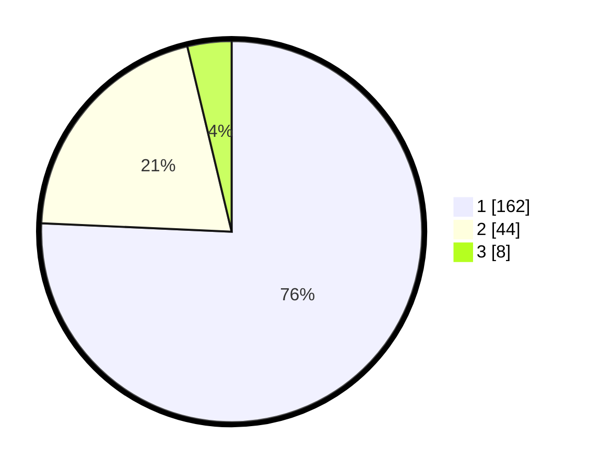

# Hasil

## Grafik

## Tabel

| No. | Nama Paslon    | Suara | Suara (raw) | Persentase |
|:--- |:-------------- | -----:| -----------:| ----------:|
| 1   | ANIES MUHAIMIN | 162   | [162][p-1]  | 75,70      |
| 2   | PRABOWO GIBRAN | 44    | [44][p-2]   | 20,56      |
| 3   | GANJAR MAHFUD  | 8     | [8][p-3]    | 3,74       |

[p-1]: https://github.com/gigit-pemilu/pemilu-2024-32-jawa-barat/blob/main/pilpres/hitung-suara/sub/32-jawa-barat/sub/05-garut/sub/23-banjarwangi/sub/2004-kadongdong/sub/016-tps/sub/paslon-1.txt
[p-2]: https://github.com/gigit-pemilu/pemilu-2024-32-jawa-barat/blob/main/pilpres/hitung-suara/sub/32-jawa-barat/sub/05-garut/sub/23-banjarwangi/sub/2004-kadongdong/sub/016-tps/sub/paslon-2.txt
[p-3]: https://github.com/gigit-pemilu/pemilu-2024-32-jawa-barat/blob/main/pilpres/hitung-suara/sub/32-jawa-barat/sub/05-garut/sub/23-banjarwangi/sub/2004-kadongdong/sub/016-tps/sub/paslon-3.txt

## Foto C Plano

https://sirekap-obj-formc.kpu.go.id/be46/pemilu/ppwp/32/05/23/20/04/3205232004016-20240215-133104--a410f0ab-6fa3-40bd-ac02-ca02c5e8b131.jpg

https://sirekap-obj-formc.kpu.go.id/be46/pemilu/ppwp/32/05/23/20/04/3205232004016-20240215-132921--bc18c330-4413-4f57-801f-cb4f818e9261.jpg

https://sirekap-obj-formc.kpu.go.id/be46/pemilu/ppwp/32/05/23/20/04/3205232004016-20240215-133155--ae9be373-7348-4022-91e9-5799fcc27902.jpg

## Metadata

| Key        | Value               |
| ---------- | ------------------- |
| Time Stamp | 2024-02-15 19:30:26 |

