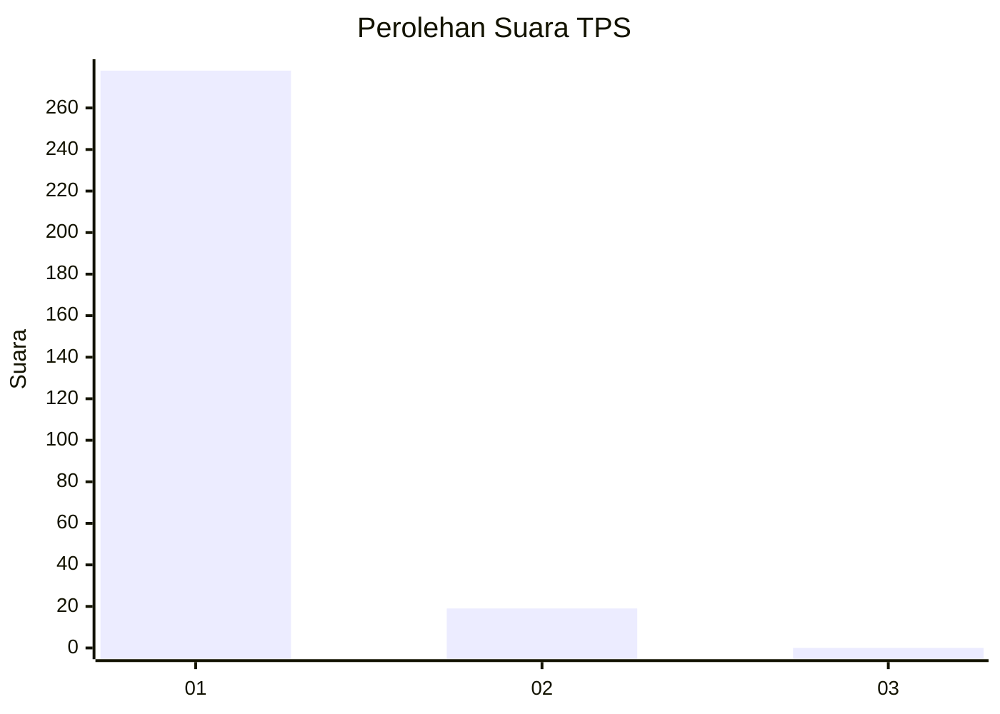
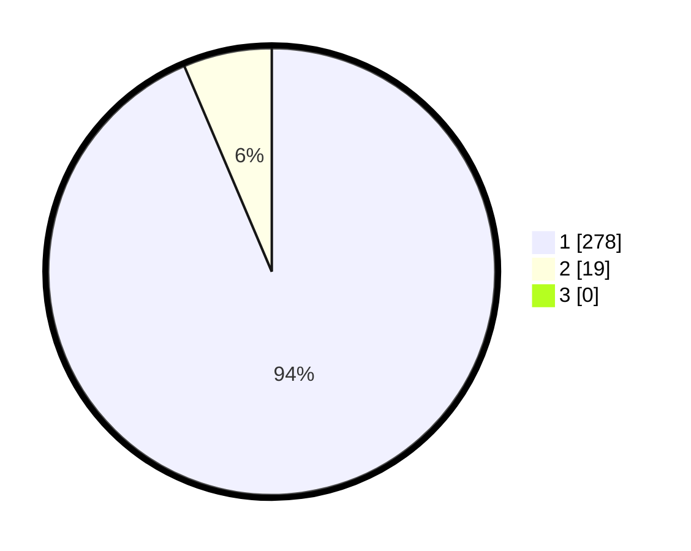

# Hasil

## Grafik

## Tabel

| No. | Nama Paslon    | Suara | Suara (raw) | Persentase |
|:--- |:-------------- | -----:| -----------:| ----------:|
| 1   | ANIES MUHAIMIN | 278   | [278][p-1]  | 93,60      |
| 2   | PRABOWO GIBRAN | 19    | [19][p-2]   | 6,40       |
| 3   | GANJAR MAHFUD  | 0     | [0][p-3]    | 0,00       |

[p-1]: https://github.com/gigit-pemilu/pemilu-2024/blob/main/pilpres/hitung-suara/sub/32-jawa-barat/sub/05-garut/sub/23-banjarwangi/sub/2009-tanjungjaya/sub/015-tps/sub/paslon-1.txt
[p-2]: https://github.com/gigit-pemilu/pemilu-2024/blob/main/pilpres/hitung-suara/sub/32-jawa-barat/sub/05-garut/sub/23-banjarwangi/sub/2009-tanjungjaya/sub/015-tps/sub/paslon-2.txt
[p-3]: https://github.com/gigit-pemilu/pemilu-2024/blob/main/pilpres/hitung-suara/sub/32-jawa-barat/sub/05-garut/sub/23-banjarwangi/sub/2009-tanjungjaya/sub/015-tps/sub/paslon-3.txt

## Foto C Plano

https://sirekap-obj-formc.kpu.go.id/5174/pemilu/ppwp/32/05/23/20/09/3205232009015-20240215-201341--1b928925-aedc-4f71-9726-e1a07cd2721d.jpg

https://sirekap-obj-formc.kpu.go.id/5174/pemilu/ppwp/32/05/23/20/09/3205232009015-20240215-201433--30a0a760-652c-4e74-8056-85ef341efe46.jpg

https://sirekap-obj-formc.kpu.go.id/5174/pemilu/ppwp/32/05/23/20/09/3205232009015-20240215-201518--bb85f3a6-f481-4406-8fd5-56a2ddbcaac1.jpg

## Metadata

| Key        | Value               |
| ---------- | ------------------- |
| Time Stamp | 2024-02-16 21:01:00 |

