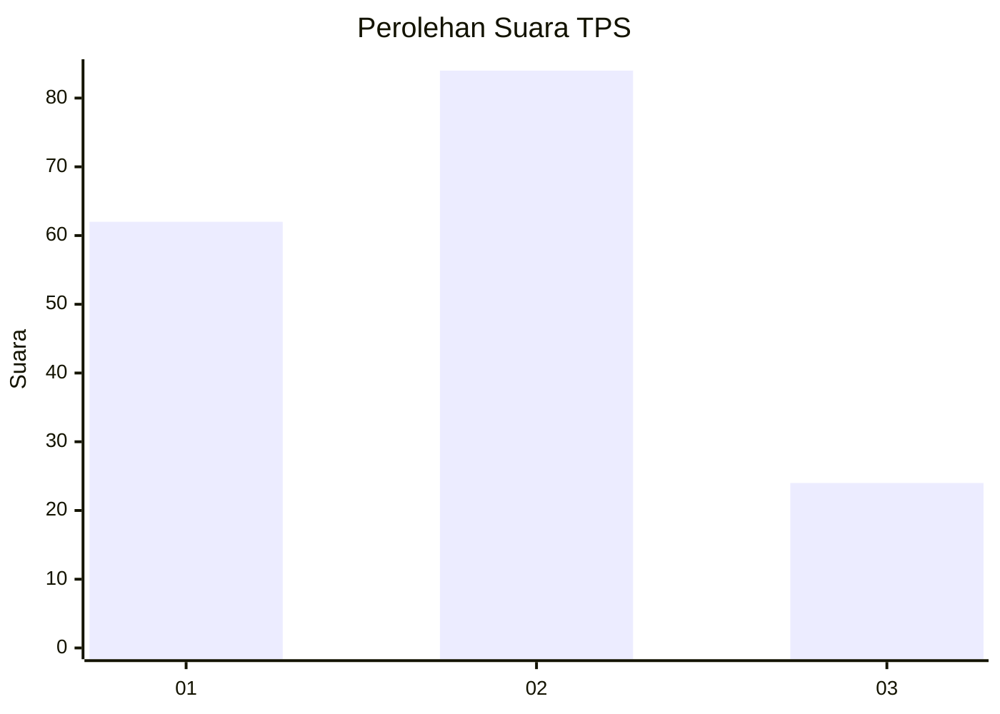
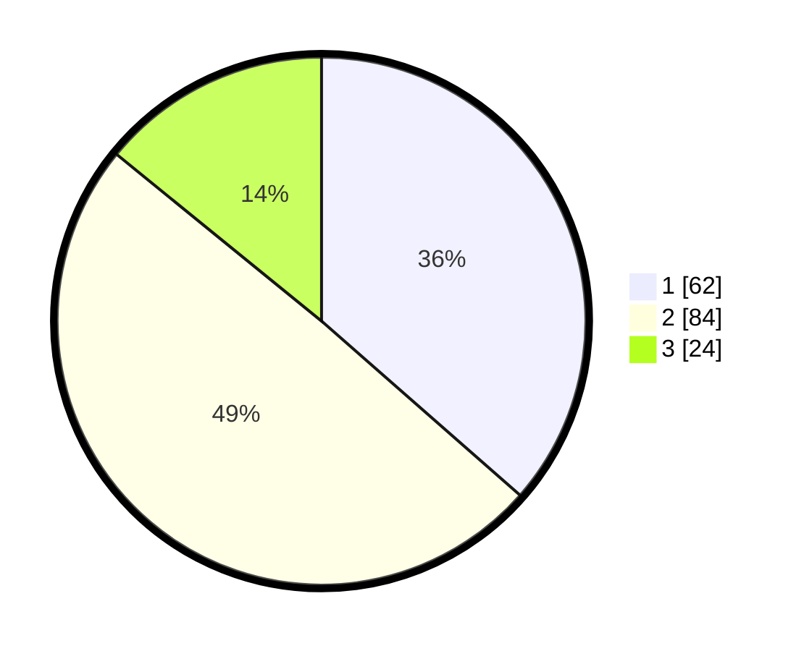

# Hasil

## Grafik

## Tabel

| No. | Nama Paslon    | Suara | Suara (raw) | Persentase |
|:--- |:-------------- | -----:| -----------:| ----------:|
| 1   | ANIES MUHAIMIN | 62    | [62][p-1]   | 36,47      |
| 2   | PRABOWO GIBRAN | 84    | [84][p-2]   | 49,41      |
| 3   | GANJAR MAHFUD  | 24    | [24][p-3]   | 14,12      |

[p-1]: https://github.com/gigit-pemilu/pemilu-2024/blob/main/pilpres/hitung-suara/sub/32-jawa-barat/sub/05-garut/sub/24-singajaya/sub/2001-singajaya/sub/002-tps/sub/paslon-1.txt
[p-2]: https://github.com/gigit-pemilu/pemilu-2024/blob/main/pilpres/hitung-suara/sub/32-jawa-barat/sub/05-garut/sub/24-singajaya/sub/2001-singajaya/sub/002-tps/sub/paslon-2.txt
[p-3]: https://github.com/gigit-pemilu/pemilu-2024/blob/main/pilpres/hitung-suara/sub/32-jawa-barat/sub/05-garut/sub/24-singajaya/sub/2001-singajaya/sub/002-tps/sub/paslon-3.txt

## Foto C Plano

https://sirekap-obj-formc.kpu.go.id/224d/pemilu/ppwp/32/05/24/20/01/3205242001002-20240215-180137--ec30d820-2717-4352-8c84-f0c64611bdd8.jpg

https://sirekap-obj-formc.kpu.go.id/224d/pemilu/ppwp/32/05/24/20/01/3205242001002-20240215-180231--19a94d72-a67c-4ba8-bc2e-8cc600aad1a9.jpg

https://sirekap-obj-formc.kpu.go.id/224d/pemilu/ppwp/32/05/24/20/01/3205242001002-20240215-180311--fa2db223-eb6d-42ea-82ce-d56d072f9595.jpg

## Metadata

| Key        | Value               |
| ---------- | ------------------- |
| Time Stamp | 2024-02-20 01:00:00 |

