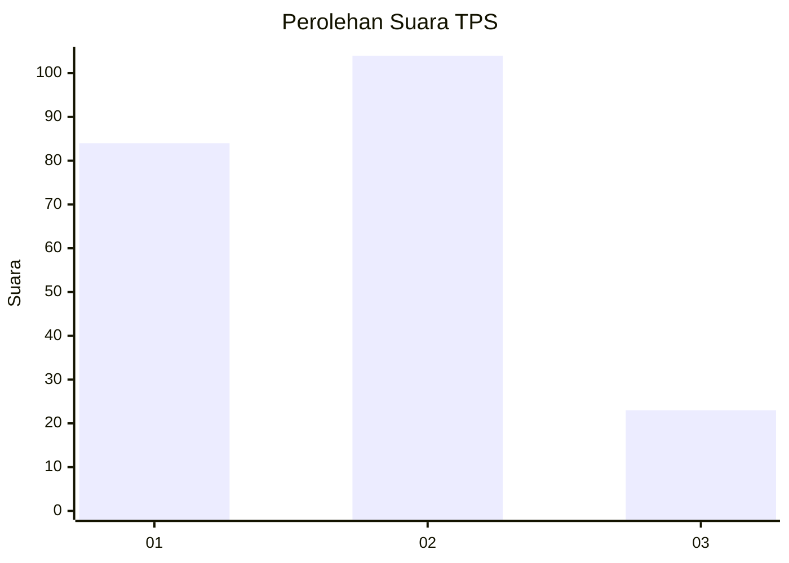
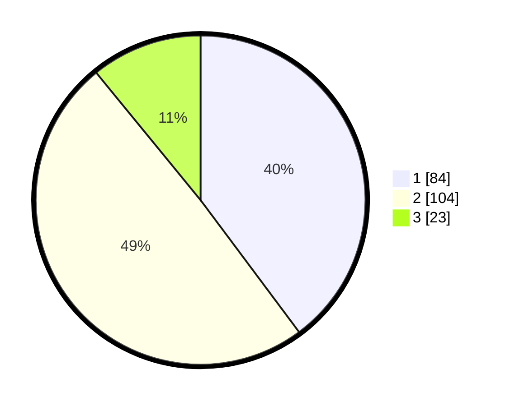

# Hasil

## Grafik

## Tabel

| No. | Nama Paslon    | Suara | Suara (raw) | Persentase |
|:--- |:-------------- | -----:| -----------:| ----------:|
| 1   | ANIES MUHAIMIN | 84    | [84][p-1]   | 39,81      |
| 2   | PRABOWO GIBRAN | 104   | [104][p-2]  | 49,29      |
| 3   | GANJAR MAHFUD  | 23    | [23][p-3]   | 10,90      |

[p-1]: https://github.com/gigit-pemilu/pemilu-2024-32-jawa-barat/blob/main/pilpres/hitung-suara/sub/32-jawa-barat/sub/05-garut/sub/24-singajaya/sub/2001-singajaya/sub/003-tps/sub/paslon-1.txt
[p-2]: https://github.com/gigit-pemilu/pemilu-2024-32-jawa-barat/blob/main/pilpres/hitung-suara/sub/32-jawa-barat/sub/05-garut/sub/24-singajaya/sub/2001-singajaya/sub/003-tps/sub/paslon-2.txt
[p-3]: https://github.com/gigit-pemilu/pemilu-2024-32-jawa-barat/blob/main/pilpres/hitung-suara/sub/32-jawa-barat/sub/05-garut/sub/24-singajaya/sub/2001-singajaya/sub/003-tps/sub/paslon-3.txt

## Foto C Plano

https://sirekap-obj-formc.kpu.go.id/660b/pemilu/ppwp/32/05/24/20/01/3205242001003-20240215-110049--3c72417e-a90c-4081-bc4b-a4156ac1c24b.jpg

https://sirekap-obj-formc.kpu.go.id/660b/pemilu/ppwp/32/05/24/20/01/3205242001003-20240215-110153--2f5a7cd7-2ed8-4c76-b044-2bfb2da2c356.jpg

https://sirekap-obj-formc.kpu.go.id/660b/pemilu/ppwp/32/05/24/20/01/3205242001003-20240215-110331--fd567ab1-a493-42f1-8880-08a70b8802ff.jpg

## Metadata

| Key        | Value               |
| ---------- | ------------------- |
| Time Stamp | 2024-02-20 16:00:00 |

