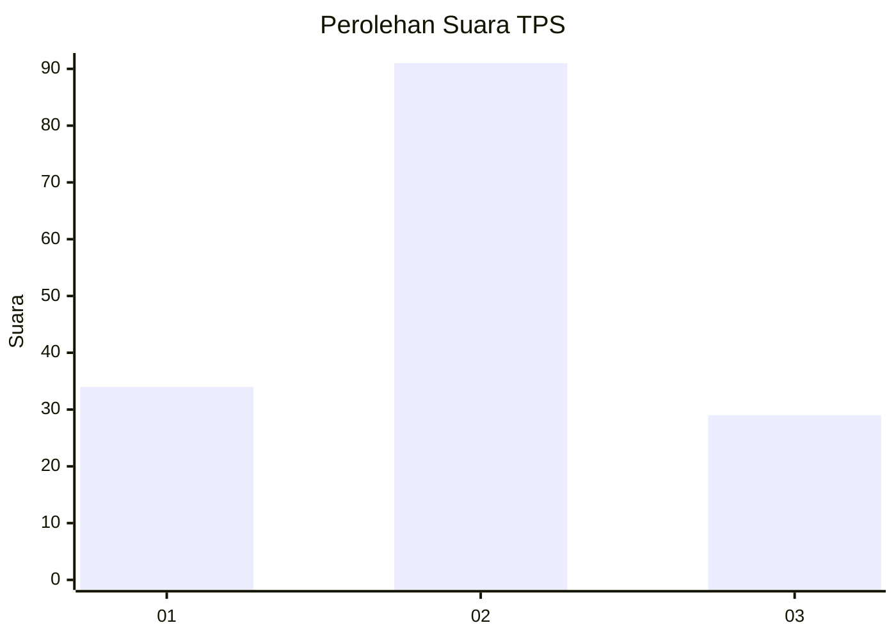
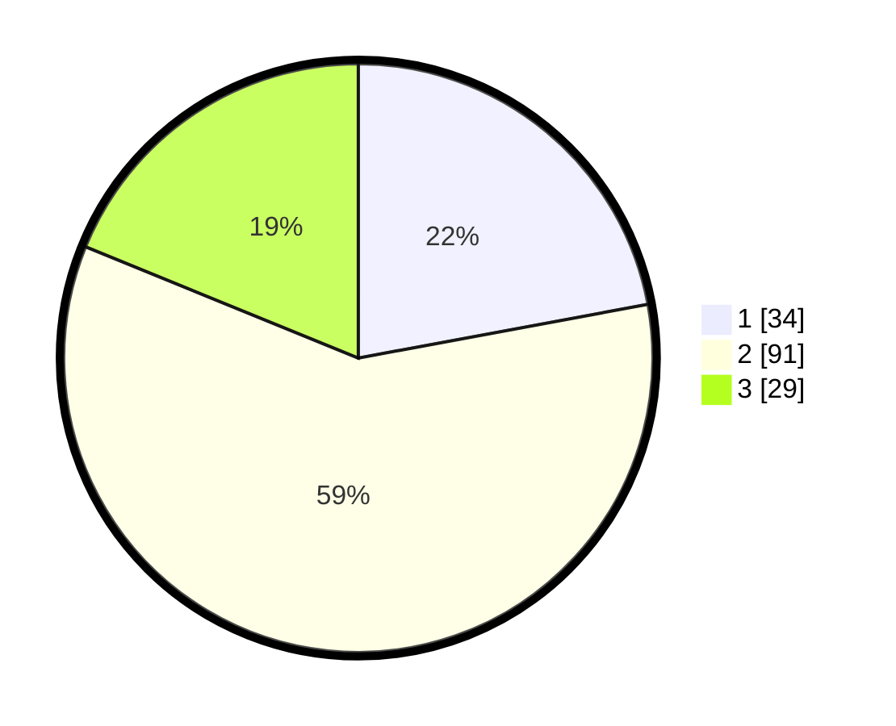

# Hasil

## Grafik

## Tabel

| No. | Nama Paslon    | Suara | Suara (raw) | Persentase |
|:--- |:-------------- | -----:| -----------:| ----------:|
| 1   | ANIES MUHAIMIN | 34    | [34][p-1]   | 22,08      |
| 2   | PRABOWO GIBRAN | 91    | [91][p-2]   | 59,09      |
| 3   | GANJAR MAHFUD  | 29    | [29][p-3]   | 18,83      |

[p-1]: https://github.com/gigit-pemilu/pemilu-2024/blob/main/pilpres/hitung-suara/sub/32-jawa-barat/sub/05-garut/sub/24-singajaya/sub/2001-singajaya/sub/005-tps/sub/paslon-1.txt
[p-2]: https://github.com/gigit-pemilu/pemilu-2024/blob/main/pilpres/hitung-suara/sub/32-jawa-barat/sub/05-garut/sub/24-singajaya/sub/2001-singajaya/sub/005-tps/sub/paslon-2.txt
[p-3]: https://github.com/gigit-pemilu/pemilu-2024/blob/main/pilpres/hitung-suara/sub/32-jawa-barat/sub/05-garut/sub/24-singajaya/sub/2001-singajaya/sub/005-tps/sub/paslon-3.txt

## Foto C Plano

https://sirekap-obj-formc.kpu.go.id/77ee/pemilu/ppwp/32/05/24/20/01/3205242001005-20240215-120447--bb2e3dc0-63af-4000-9273-c3fc426a3170.jpg

https://sirekap-obj-formc.kpu.go.id/77ee/pemilu/ppwp/32/05/24/20/01/3205242001005-20240214-203412--809fa02a-9c4b-4880-b6b3-de249cecb0f7.jpg

https://sirekap-obj-formc.kpu.go.id/77ee/pemilu/ppwp/32/05/24/20/01/3205242001005-20240214-203603--e8537fee-2ba9-4ea1-8aed-7d86a2b424eb.jpg

## Metadata

| Key        | Value               |
| ---------- | ------------------- |
| Time Stamp | 2024-02-20 01:00:00 |

