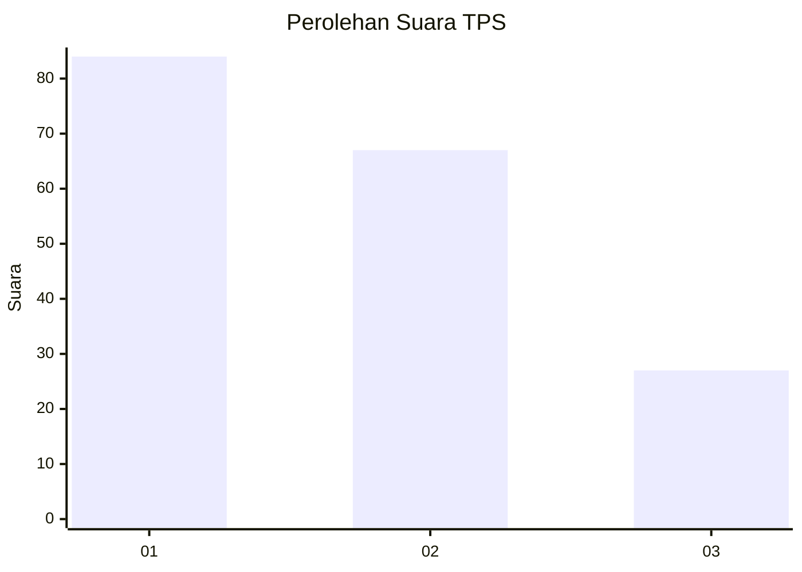
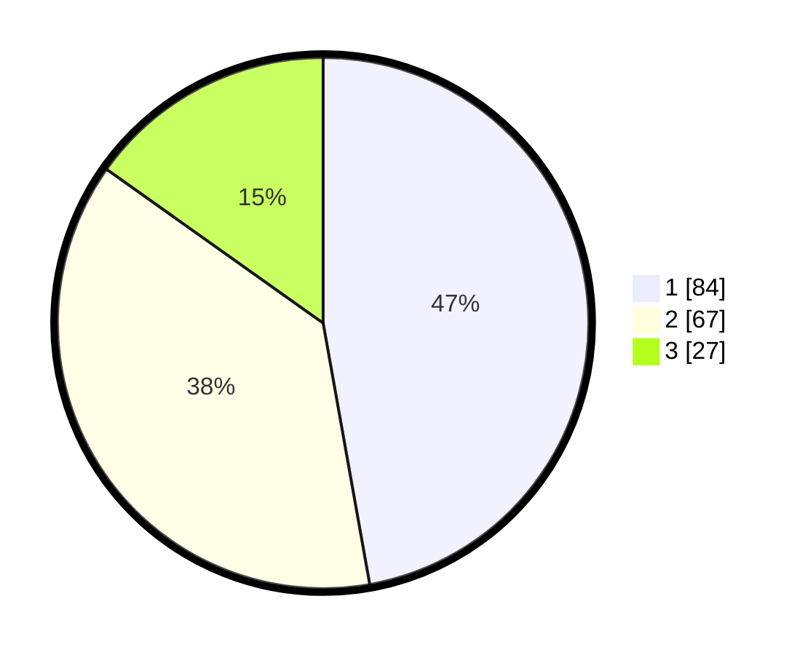

# Hasil

## Grafik

## Tabel

| No. | Nama Paslon    | Suara | Suara (raw) | Persentase |
|:--- |:-------------- | -----:| -----------:| ----------:|
| 1   | ANIES MUHAIMIN | 84    | [84][p-1]   | 47,19      |
| 2   | PRABOWO GIBRAN | 67    | [67][p-2]   | 37,64      |
| 3   | GANJAR MAHFUD  | 27    | [27][p-3]   | 15,17      |

[p-1]: https://github.com/gigit-pemilu/pemilu-2024/blob/main/pilpres/hitung-suara/sub/32-jawa-barat/sub/05-garut/sub/24-singajaya/sub/2001-singajaya/sub/006-tps/sub/paslon-1.txt
[p-2]: https://github.com/gigit-pemilu/pemilu-2024/blob/main/pilpres/hitung-suara/sub/32-jawa-barat/sub/05-garut/sub/24-singajaya/sub/2001-singajaya/sub/006-tps/sub/paslon-2.txt
[p-3]: https://github.com/gigit-pemilu/pemilu-2024/blob/main/pilpres/hitung-suara/sub/32-jawa-barat/sub/05-garut/sub/24-singajaya/sub/2001-singajaya/sub/006-tps/sub/paslon-3.txt

## Foto C Plano

https://sirekap-obj-formc.kpu.go.id/d956/pemilu/ppwp/32/05/24/20/01/3205242001006-20240215-125301--2ddb2cb8-749c-4ef0-a955-859df8822e14.jpg

https://sirekap-obj-formc.kpu.go.id/d956/pemilu/ppwp/32/05/24/20/01/3205242001006-20240215-125456--5b680e15-cbb4-4923-a937-a1a0b8e09417.jpg

https://sirekap-obj-formc.kpu.go.id/d956/pemilu/ppwp/32/05/24/20/01/3205242001006-20240215-125634--58825985-7f76-481c-a488-11fcabaa85bf.jpg

## Metadata

| Key        | Value               |
| ---------- | ------------------- |
| Time Stamp | 2024-02-20 01:00:00 |

