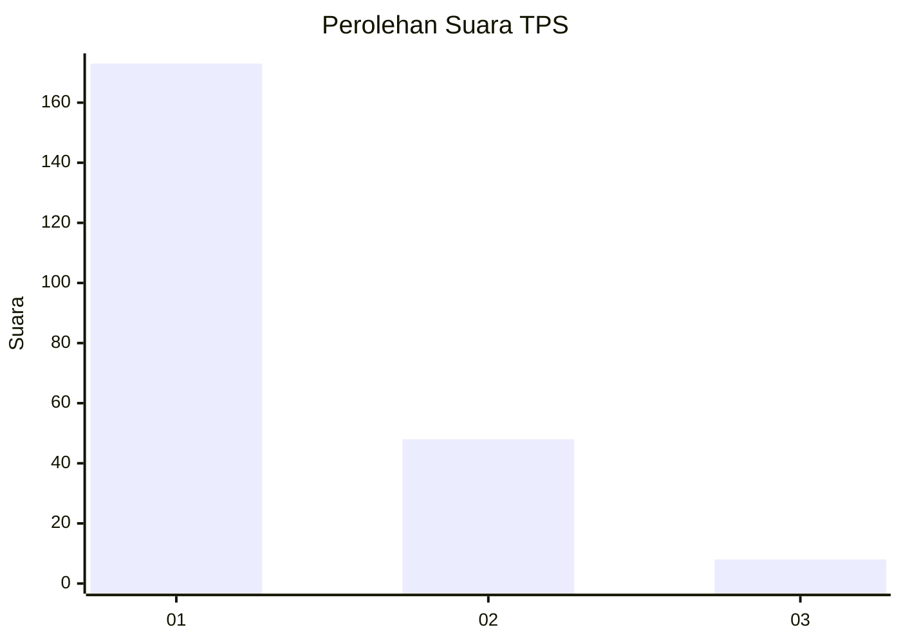
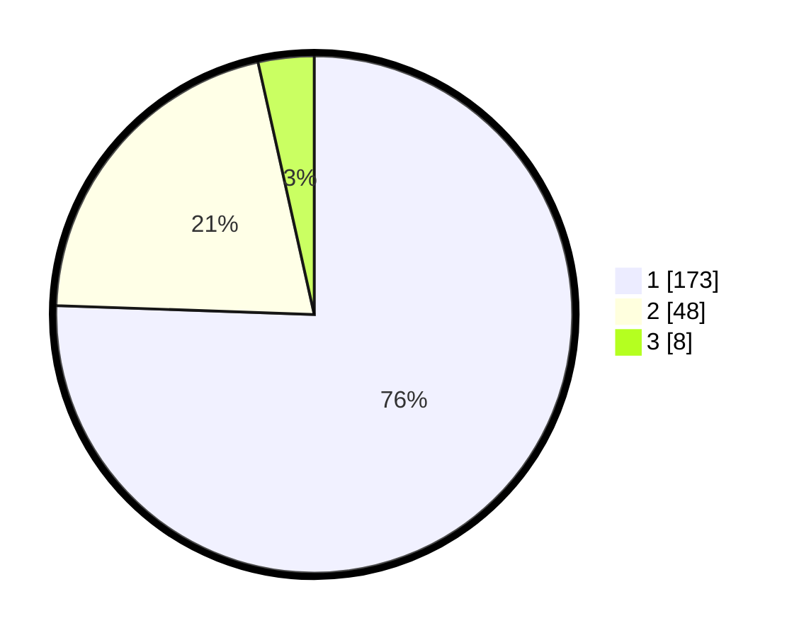

# Hasil

## Grafik

## Tabel

| No. | Nama Paslon    | Suara | Suara (raw) | Persentase |
|:--- |:-------------- | -----:| -----------:| ----------:|
| 1   | ANIES MUHAIMIN | 173   | [173][p-1]  | 75,55      |
| 2   | PRABOWO GIBRAN | 48    | [48][p-2]   | 20,96      |
| 3   | GANJAR MAHFUD  | 8     | [8][p-3]    | 3,49       |

[p-1]: https://github.com/gigit-pemilu/pemilu-2024-32-jawa-barat/blob/main/pilpres/hitung-suara/sub/32-jawa-barat/sub/05-garut/sub/24-singajaya/sub/2002-ciudian/sub/003-tps/sub/paslon-1.txt
[p-2]: https://github.com/gigit-pemilu/pemilu-2024-32-jawa-barat/blob/main/pilpres/hitung-suara/sub/32-jawa-barat/sub/05-garut/sub/24-singajaya/sub/2002-ciudian/sub/003-tps/sub/paslon-2.txt
[p-3]: https://github.com/gigit-pemilu/pemilu-2024-32-jawa-barat/blob/main/pilpres/hitung-suara/sub/32-jawa-barat/sub/05-garut/sub/24-singajaya/sub/2002-ciudian/sub/003-tps/sub/paslon-3.txt

## Foto C Plano

https://sirekap-obj-formc.kpu.go.id/ecdc/pemilu/ppwp/32/05/24/20/02/3205242002003-20240215-014630--92575edd-8dfd-4844-a9b4-e0d4e9ef9b20.jpg

https://sirekap-obj-formc.kpu.go.id/ecdc/pemilu/ppwp/32/05/24/20/02/3205242002003-20240215-014755--d6aaf5f8-e60a-400a-86ad-7f4a0f9c6974.jpg

https://sirekap-obj-formc.kpu.go.id/ecdc/pemilu/ppwp/32/05/24/20/02/3205242002003-20240215-014835--94e2bd14-8d67-4520-ae43-383a58339db5.jpg

## Metadata

| Key        | Value               |
| ---------- | ------------------- |
| Time Stamp | 2024-02-20 01:00:00 |

