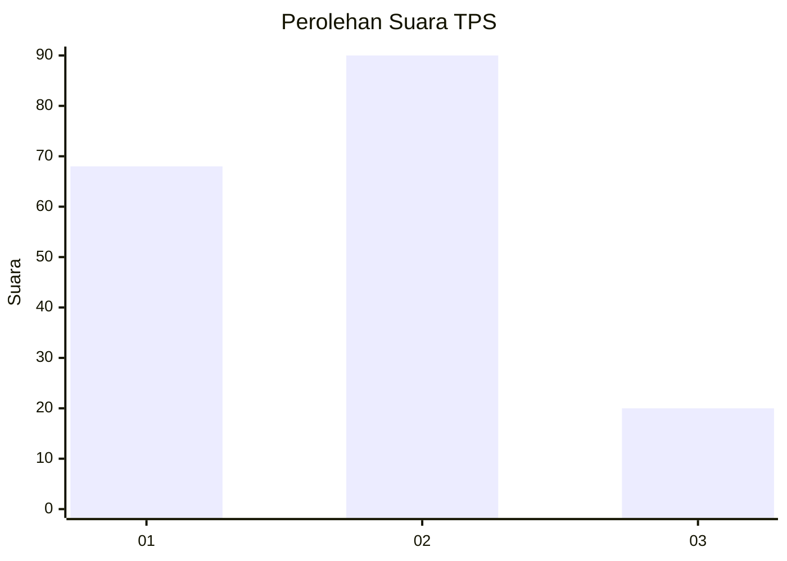
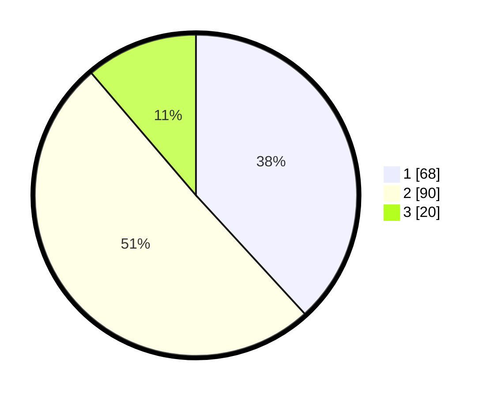

# Hasil

## Grafik

## Tabel

| No. | Nama Paslon    | Suara | Suara (raw) | Persentase |
|:--- |:-------------- | -----:| -----------:| ----------:|
| 1   | ANIES MUHAIMIN | 68    | [68][p-1]   | 38,20      |
| 2   | PRABOWO GIBRAN | 90    | [90][p-2]   | 50,56      |
| 3   | GANJAR MAHFUD  | 20    | [20][p-3]   | 11,24      |

[p-1]: https://github.com/gigit-pemilu/pemilu-2024-32-jawa-barat/blob/main/pilpres/hitung-suara/sub/32-jawa-barat/sub/05-garut/sub/24-singajaya/sub/2002-ciudian/sub/005-tps/sub/paslon-1.txt
[p-2]: https://github.com/gigit-pemilu/pemilu-2024-32-jawa-barat/blob/main/pilpres/hitung-suara/sub/32-jawa-barat/sub/05-garut/sub/24-singajaya/sub/2002-ciudian/sub/005-tps/sub/paslon-2.txt
[p-3]: https://github.com/gigit-pemilu/pemilu-2024-32-jawa-barat/blob/main/pilpres/hitung-suara/sub/32-jawa-barat/sub/05-garut/sub/24-singajaya/sub/2002-ciudian/sub/005-tps/sub/paslon-3.txt

## Foto C Plano

https://sirekap-obj-formc.kpu.go.id/b811/pemilu/ppwp/32/05/24/20/02/3205242002005-20240214-204643--eae761ca-e232-43cb-8ec4-e97eefd096fe.jpg

https://sirekap-obj-formc.kpu.go.id/b811/pemilu/ppwp/32/05/24/20/02/3205242002005-20240214-204842--e1871c3c-c755-4bb4-b6e1-d49ea53a2924.jpg

https://sirekap-obj-formc.kpu.go.id/b811/pemilu/ppwp/32/05/24/20/02/3205242002005-20240214-204938--c7d0cdc3-f60a-4637-9f4e-c98497f28486.jpg

## Metadata

| Key        | Value               |
| ---------- | ------------------- |
| Time Stamp | 2024-02-20 16:00:00 |

## DATA PEMILIH TETAP

Jumlah pemilih dalam DPT: **857**.
 * L: **225**.
 * P: **144**.

## DATA PENGGUNA HAK PILIH

Jumlah pengguna hak pilih dalam DPT: **147**.
 * L: **540**.
 * P: **802**.

Jumlah pengguna hak pilih dalam DPTb: **381**.
 * L: **588**.
 * P: **434**.

Jumlah pengguna hak pilih dalam DPK: **82**.
 * L: **88**.
 * P: **842**.

Jumlah pengguna hak pilih: **884**.
 * L: **830**.
 * P: **604**.

## JUMLAH SUARA SAH DAN TIDAK SAH

JUMLAH SELURUH SUARA SAH: **178**.

JUMLAH SUARA TIDAK SAH: **6**.

JUMLAH SELURUH SUARA SAH DAN SUARA TIDAK SAH: **184**.

