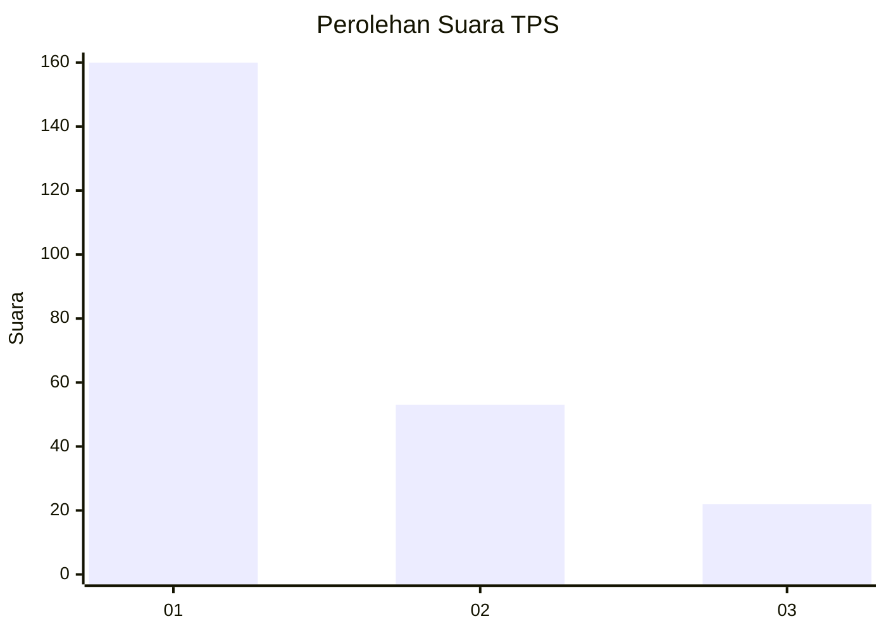
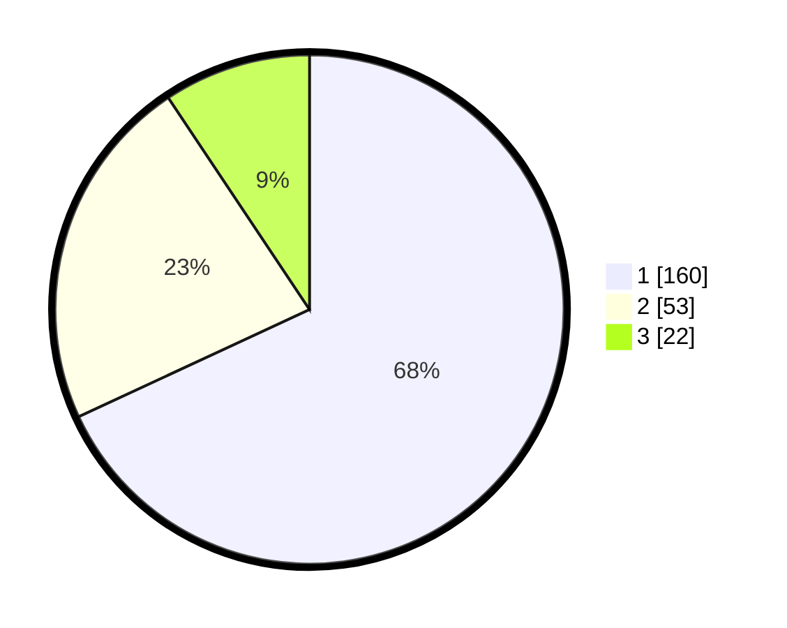

# Hasil

## Grafik

## Tabel

| No. | Nama Paslon    | Suara | Suara (raw) | Persentase |
|:--- |:-------------- | -----:| -----------:| ----------:|
| 1   | ANIES MUHAIMIN | 160   | [160][p-1]  | 68,09      |
| 2   | PRABOWO GIBRAN | 53    | [53][p-2]   | 22,55      |
| 3   | GANJAR MAHFUD  | 22    | [22][p-3]   | 9,36       |

[p-1]: https://github.com/gigit-pemilu/pemilu-2024-32-jawa-barat/blob/main/pilpres/hitung-suara/sub/32-jawa-barat/sub/05-garut/sub/24-singajaya/sub/2003-mekartani/sub/013-tps/sub/paslon-1.txt
[p-2]: https://github.com/gigit-pemilu/pemilu-2024-32-jawa-barat/blob/main/pilpres/hitung-suara/sub/32-jawa-barat/sub/05-garut/sub/24-singajaya/sub/2003-mekartani/sub/013-tps/sub/paslon-2.txt
[p-3]: https://github.com/gigit-pemilu/pemilu-2024-32-jawa-barat/blob/main/pilpres/hitung-suara/sub/32-jawa-barat/sub/05-garut/sub/24-singajaya/sub/2003-mekartani/sub/013-tps/sub/paslon-3.txt

## Foto C Plano

https://sirekap-obj-formc.kpu.go.id/5887/pemilu/ppwp/32/05/24/20/03/3205242003013-20240215-102229--af68b39e-9b24-4194-a5bb-961ae09bbcc5.jpg

https://sirekap-obj-formc.kpu.go.id/5887/pemilu/ppwp/32/05/24/20/03/3205242003013-20240215-102342--e7c04297-38e9-41d0-88e6-40666eb01e04.jpg

https://sirekap-obj-formc.kpu.go.id/5887/pemilu/ppwp/32/05/24/20/03/3205242003013-20240215-102617--c8b62fa7-67a1-425f-bc1e-b111c4aed962.jpg

## Metadata

| Key        | Value               |
| ---------- | ------------------- |
| Time Stamp | 2024-02-20 16:00:00 |

