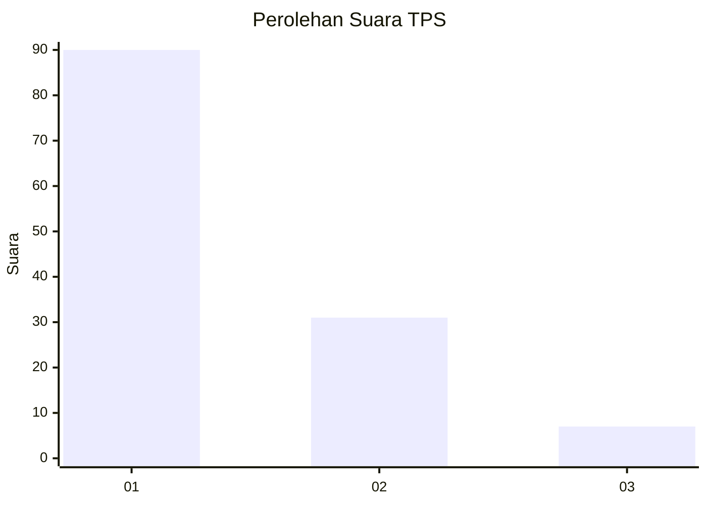
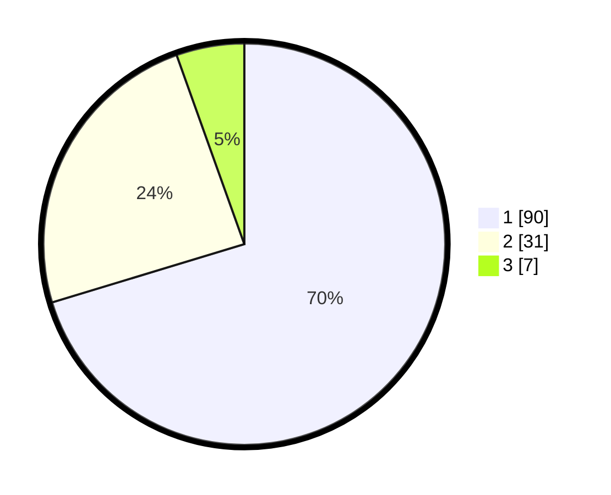

# Hasil

## Grafik

## Tabel

| No. | Nama Paslon    | Suara | Suara (raw) | Persentase |
|:--- |:-------------- | -----:| -----------:| ----------:|
| 1   | ANIES MUHAIMIN | 90    | [90][p-1]   | 70,31      |
| 2   | PRABOWO GIBRAN | 31    | [31][p-2]   | 24,22      |
| 3   | GANJAR MAHFUD  | 7     | [7][p-3]    | 5,47       |

[p-1]: https://github.com/gigit-pemilu/pemilu-2024/blob/main/pilpres/hitung-suara/sub/32-jawa-barat/sub/05-garut/sub/24-singajaya/sub/2004-sukamulya/sub/002-tps/sub/paslon-1.txt
[p-2]: https://github.com/gigit-pemilu/pemilu-2024/blob/main/pilpres/hitung-suara/sub/32-jawa-barat/sub/05-garut/sub/24-singajaya/sub/2004-sukamulya/sub/002-tps/sub/paslon-2.txt
[p-3]: https://github.com/gigit-pemilu/pemilu-2024/blob/main/pilpres/hitung-suara/sub/32-jawa-barat/sub/05-garut/sub/24-singajaya/sub/2004-sukamulya/sub/002-tps/sub/paslon-3.txt

## Foto C Plano

https://sirekap-obj-formc.kpu.go.id/2bc3/pemilu/ppwp/32/05/24/20/04/3205242004002-20240215-062303--704c56ca-b11e-4fad-8aba-2d6fbd4a5f5a.jpg

https://sirekap-obj-formc.kpu.go.id/2bc3/pemilu/ppwp/32/05/24/20/04/3205242004002-20240215-062316--1571f104-0349-46d3-be12-3027a88fa594.jpg

https://sirekap-obj-formc.kpu.go.id/2bc3/pemilu/ppwp/32/05/24/20/04/3205242004002-20240215-062454--c8194fa4-c8df-4774-ae78-d206bb25711b.jpg

## Metadata

| Key        | Value               |
| ---------- | ------------------- |
| Time Stamp | 2024-02-20 16:00:00 |

