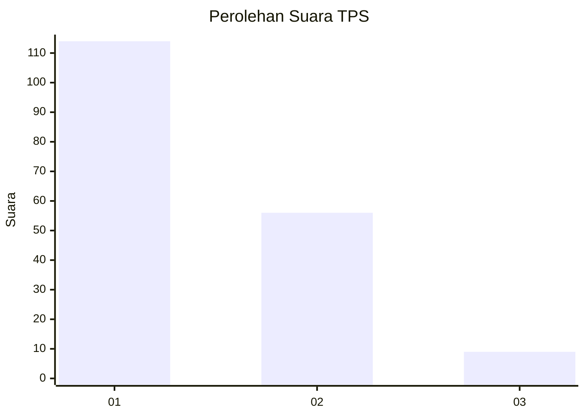
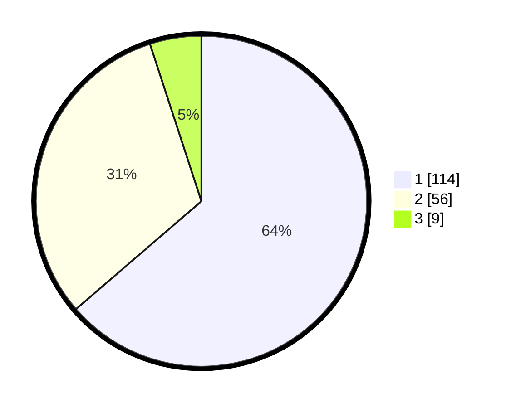

# Hasil

## Grafik

## Tabel

| No. | Nama Paslon    | Suara | Suara (raw) | Persentase |
|:--- |:-------------- | -----:| -----------:| ----------:|
| 1   | ANIES MUHAIMIN | 114   | [114][p-1]  | 63,69      |
| 2   | PRABOWO GIBRAN | 56    | [56][p-2]   | 31,28      |
| 3   | GANJAR MAHFUD  | 9     | [9][p-3]    | 5,03       |

[p-1]: https://github.com/gigit-pemilu/pemilu-2024/blob/main/pilpres/hitung-suara/sub/32-jawa-barat/sub/05-garut/sub/24-singajaya/sub/2004-sukamulya/sub/003-tps/sub/paslon-1.txt
[p-2]: https://github.com/gigit-pemilu/pemilu-2024/blob/main/pilpres/hitung-suara/sub/32-jawa-barat/sub/05-garut/sub/24-singajaya/sub/2004-sukamulya/sub/003-tps/sub/paslon-2.txt
[p-3]: https://github.com/gigit-pemilu/pemilu-2024/blob/main/pilpres/hitung-suara/sub/32-jawa-barat/sub/05-garut/sub/24-singajaya/sub/2004-sukamulya/sub/003-tps/sub/paslon-3.txt

## Foto C Plano

https://sirekap-obj-formc.kpu.go.id/17c4/pemilu/ppwp/32/05/24/20/04/3205242004003-20240215-154238--0f4449ea-c6be-4f88-83ce-f51326eabbb2.jpg

https://sirekap-obj-formc.kpu.go.id/17c4/pemilu/ppwp/32/05/24/20/04/3205242004003-20240215-062049--2db447e6-8816-458b-8a45-395ebab5cc88.jpg

https://sirekap-obj-formc.kpu.go.id/17c4/pemilu/ppwp/32/05/24/20/04/3205242004003-20240215-011919--c710f72e-1beb-4709-893a-d148b1a32c9e.jpg

## Metadata

| Key        | Value               |
| ---------- | ------------------- |
| Time Stamp | 2024-02-20 16:00:00 |

