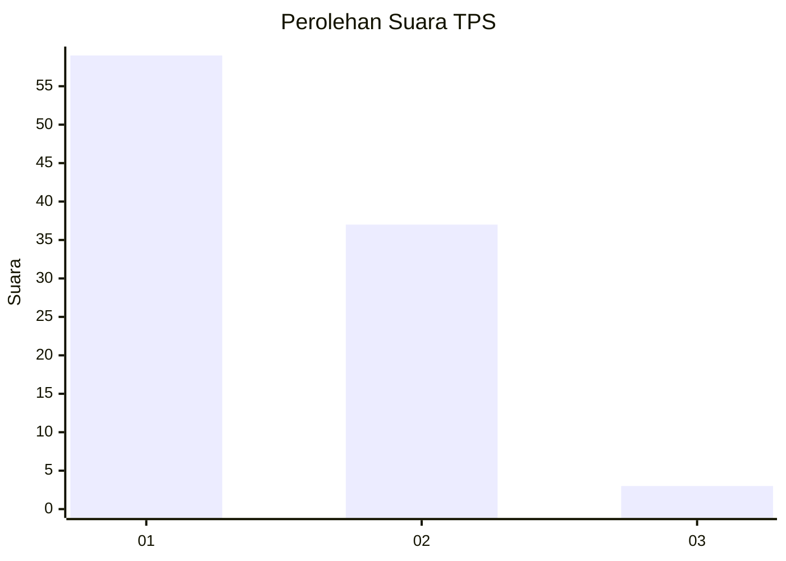
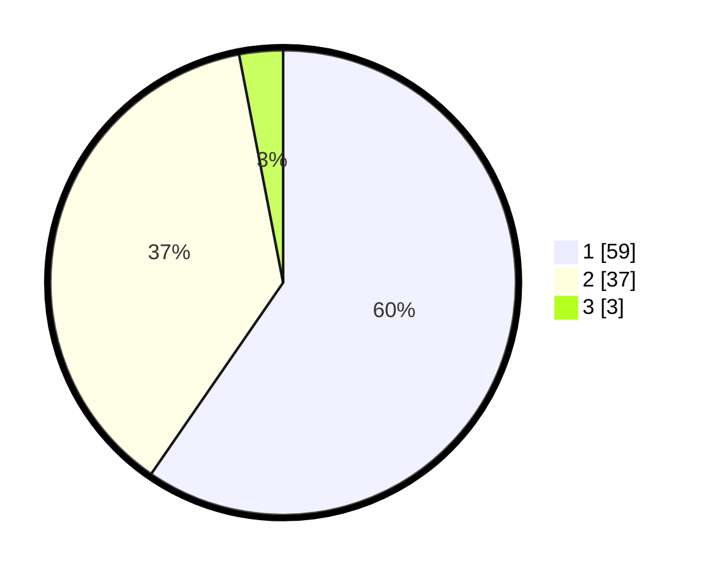

# Hasil

## Grafik

## Tabel

| No. | Nama Paslon    | Suara | Suara (raw) | Persentase |
|:--- |:-------------- | -----:| -----------:| ----------:|
| 1   | ANIES MUHAIMIN | 59    | [59][p-1]   | 59,60      |
| 2   | PRABOWO GIBRAN | 37    | [37][p-2]   | 37,37      |
| 3   | GANJAR MAHFUD  | 3     | [3][p-3]    | 3,03       |

[p-1]: https://github.com/gigit-pemilu/pemilu-2024/blob/main/pilpres/hitung-suara/sub/32-jawa-barat/sub/05-garut/sub/24-singajaya/sub/2004-sukamulya/sub/012-tps/sub/paslon-1.txt
[p-2]: https://github.com/gigit-pemilu/pemilu-2024/blob/main/pilpres/hitung-suara/sub/32-jawa-barat/sub/05-garut/sub/24-singajaya/sub/2004-sukamulya/sub/012-tps/sub/paslon-2.txt
[p-3]: https://github.com/gigit-pemilu/pemilu-2024/blob/main/pilpres/hitung-suara/sub/32-jawa-barat/sub/05-garut/sub/24-singajaya/sub/2004-sukamulya/sub/012-tps/sub/paslon-3.txt

## Foto C Plano

https://sirekap-obj-formc.kpu.go.id/d3a2/pemilu/ppwp/32/05/24/20/04/3205242004012-20240215-041612--a79d79d8-9b6f-4dcc-8907-88c7a4aa7b2f.jpg

https://sirekap-obj-formc.kpu.go.id/d3a2/pemilu/ppwp/32/05/24/20/04/3205242004012-20240215-041719--eb472834-4fad-4afe-897f-0f8a2b1356f5.jpg

https://sirekap-obj-formc.kpu.go.id/d3a2/pemilu/ppwp/32/05/24/20/04/3205242004012-20240215-041916--5504224d-3a8f-4114-b17c-76fac3e660f9.jpg

## Metadata

| Key        | Value               |
| ---------- | ------------------- |
| Time Stamp | 2024-02-20 17:00:00 |

