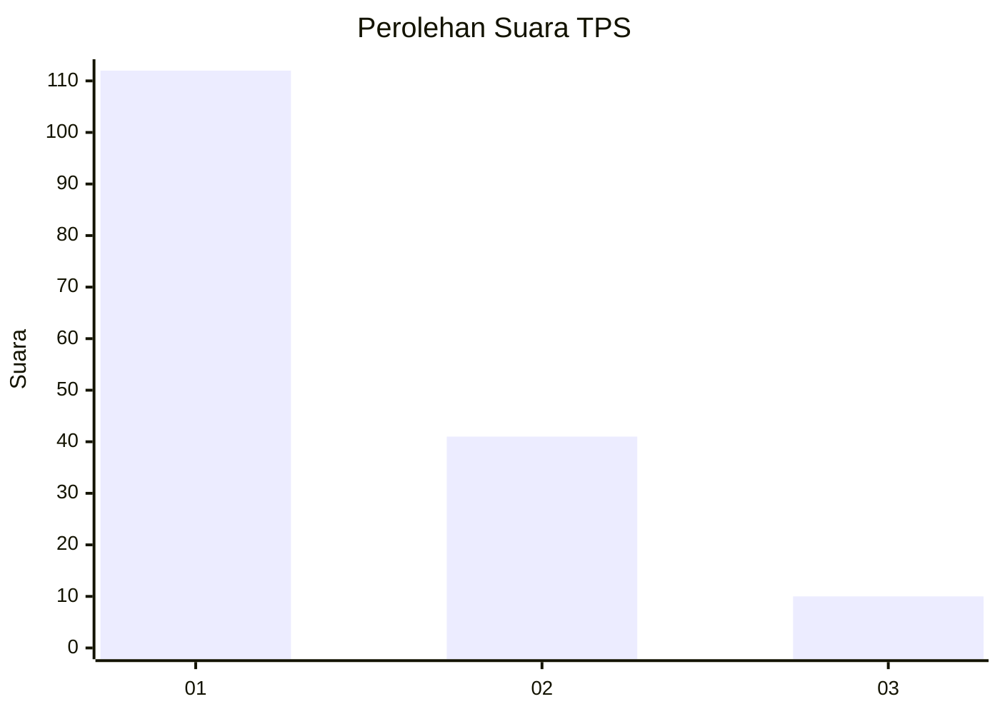
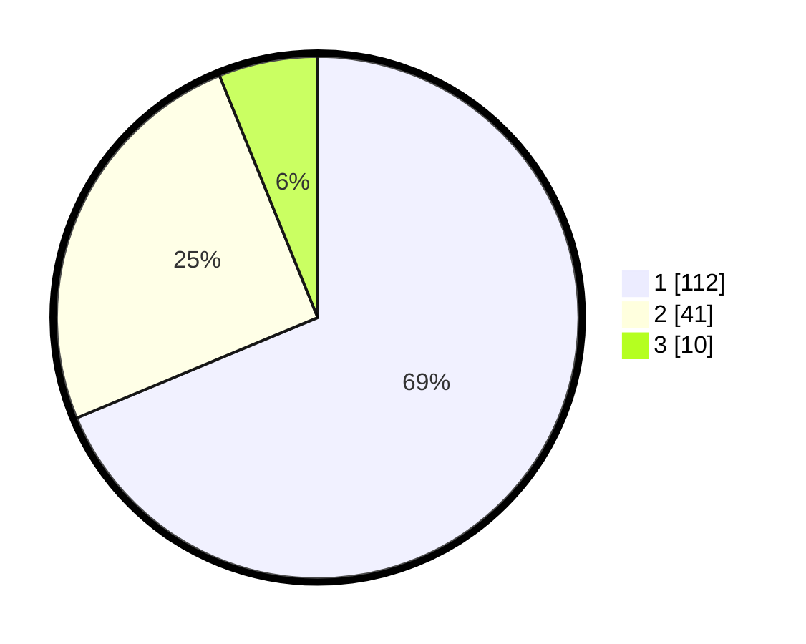

# Hasil

## Grafik

## Tabel

| No. | Nama Paslon    | Suara | Suara (raw) | Persentase |
|:--- |:-------------- | -----:| -----------:| ----------:|
| 1   | ANIES MUHAIMIN | 112   | [112][p-1]  | 68,71      |
| 2   | PRABOWO GIBRAN | 41    | [41][p-2]   | 25,15      |
| 3   | GANJAR MAHFUD  | 10    | [10][p-3]   | 6,13       |

[p-1]: https://github.com/gigit-pemilu/pemilu-2024-32-jawa-barat/blob/main/pilpres/hitung-suara/sub/32-jawa-barat/sub/05-garut/sub/24-singajaya/sub/2006-pancasura/sub/008-tps/sub/paslon-1.txt
[p-2]: https://github.com/gigit-pemilu/pemilu-2024-32-jawa-barat/blob/main/pilpres/hitung-suara/sub/32-jawa-barat/sub/05-garut/sub/24-singajaya/sub/2006-pancasura/sub/008-tps/sub/paslon-2.txt
[p-3]: https://github.com/gigit-pemilu/pemilu-2024-32-jawa-barat/blob/main/pilpres/hitung-suara/sub/32-jawa-barat/sub/05-garut/sub/24-singajaya/sub/2006-pancasura/sub/008-tps/sub/paslon-3.txt

## Foto C Plano

https://sirekap-obj-formc.kpu.go.id/d068/pemilu/ppwp/32/05/24/20/06/3205242006008-20240215-073546--c2a28055-77bb-450b-8443-6f2db355285e.jpg

https://sirekap-obj-formc.kpu.go.id/d068/pemilu/ppwp/32/05/24/20/06/3205242006008-20240215-073713--846d289a-ac19-4cd2-9100-5a4f90608d31.jpg

https://sirekap-obj-formc.kpu.go.id/d068/pemilu/ppwp/32/05/24/20/06/3205242006008-20240215-073947--1bcb195f-6f21-49f7-983f-8fbe31192171.jpg

## Metadata

| Key        | Value               |
| ---------- | ------------------- |
| Time Stamp | 2024-02-20 17:00:00 |

