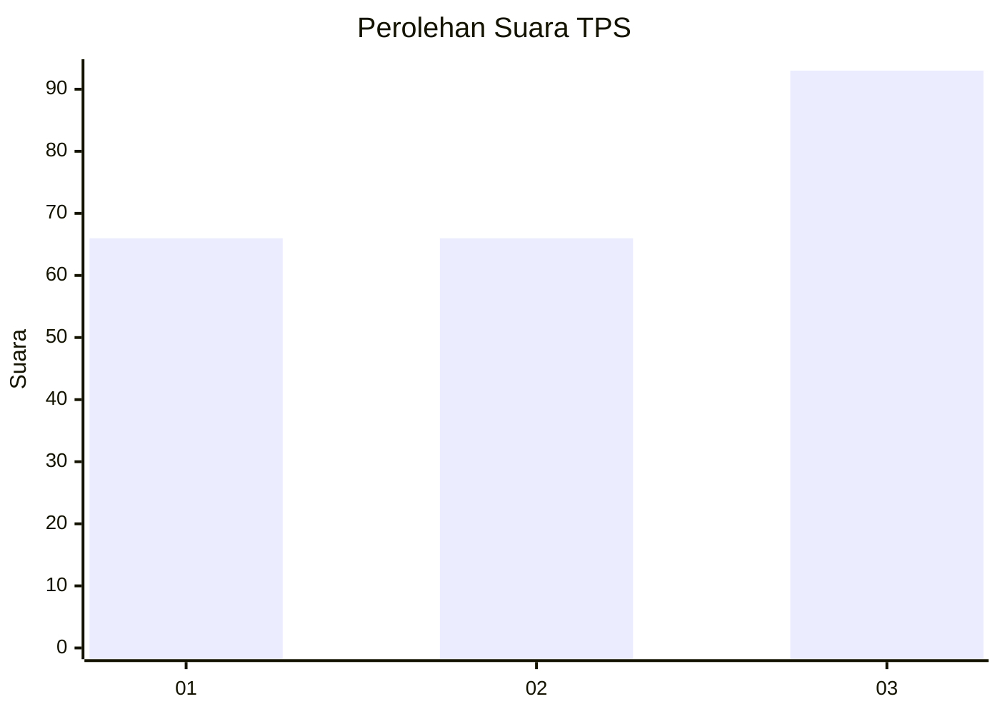
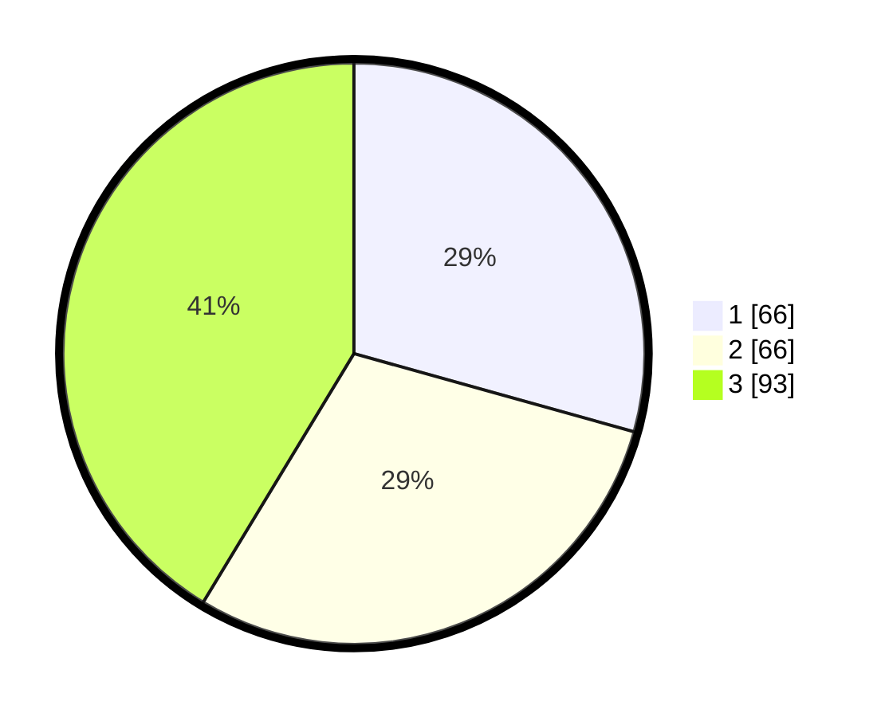

# Hasil

## Grafik

## Tabel

| No. | Nama Paslon    | Suara | Suara (raw) | Persentase |
|:--- |:-------------- | -----:| -----------:| ----------:|
| 1   | ANIES MUHAIMIN | 66    | [66][p-1]   | 29,33      |
| 2   | PRABOWO GIBRAN | 66    | [66][p-2]   | 29,33      |
| 3   | GANJAR MAHFUD  | 93    | [93][p-3]   | 41,33      |

[p-1]: https://github.com/gigit-pemilu/pemilu-2024/blob/main/pilpres/hitung-suara/sub/32-jawa-barat/sub/05-garut/sub/24-singajaya/sub/2009-girimukti/sub/001-tps/sub/paslon-1.txt
[p-2]: https://github.com/gigit-pemilu/pemilu-2024/blob/main/pilpres/hitung-suara/sub/32-jawa-barat/sub/05-garut/sub/24-singajaya/sub/2009-girimukti/sub/001-tps/sub/paslon-2.txt
[p-3]: https://github.com/gigit-pemilu/pemilu-2024/blob/main/pilpres/hitung-suara/sub/32-jawa-barat/sub/05-garut/sub/24-singajaya/sub/2009-girimukti/sub/001-tps/sub/paslon-3.txt

## Foto C Plano

https://sirekap-obj-formc.kpu.go.id/9668/pemilu/ppwp/32/05/24/20/09/3205242009001-20240215-005157--46980001-f815-4041-b843-6f72a7b453db.jpg

https://sirekap-obj-formc.kpu.go.id/9668/pemilu/ppwp/32/05/24/20/09/3205242009001-20240215-010723--73a27628-9fbb-4417-8505-762c65b81c78.jpg

https://sirekap-obj-formc.kpu.go.id/9668/pemilu/ppwp/32/05/24/20/09/3205242009001-20240215-010857--645051a5-af2d-4a0b-a7fe-2d7fe771fa7a.jpg

## Metadata

| Key        | Value               |
| ---------- | ------------------- |
| Time Stamp | 2024-02-20 02:00:00 |

