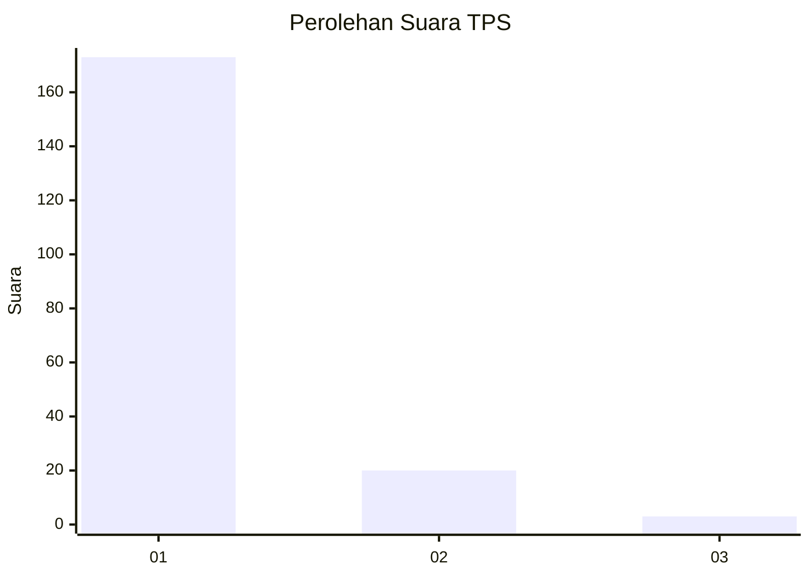
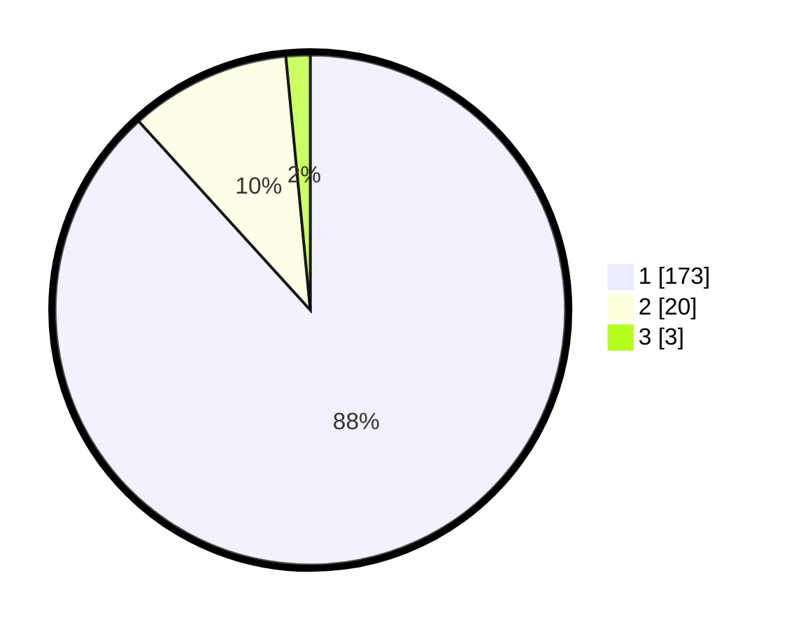

# Hasil

## Grafik

## Tabel

| No. | Nama Paslon    | Suara | Suara (raw) | Persentase |
|:--- |:-------------- | -----:| -----------:| ----------:|
| 1   | ANIES MUHAIMIN | 173   | [173][p-1]  | 88,27      |
| 2   | PRABOWO GIBRAN | 20    | [20][p-2]   | 10,20      |
| 3   | GANJAR MAHFUD  | 3     | [3][p-3]    | 1,53       |

[p-1]: https://github.com/gigit-pemilu/pemilu-2024-32-jawa-barat/blob/main/pilpres/hitung-suara/sub/32-jawa-barat/sub/05-garut/sub/26-peundeuy/sub/2001-peundeuy/sub/002-tps/sub/paslon-1.txt
[p-2]: https://github.com/gigit-pemilu/pemilu-2024-32-jawa-barat/blob/main/pilpres/hitung-suara/sub/32-jawa-barat/sub/05-garut/sub/26-peundeuy/sub/2001-peundeuy/sub/002-tps/sub/paslon-2.txt
[p-3]: https://github.com/gigit-pemilu/pemilu-2024-32-jawa-barat/blob/main/pilpres/hitung-suara/sub/32-jawa-barat/sub/05-garut/sub/26-peundeuy/sub/2001-peundeuy/sub/002-tps/sub/paslon-3.txt

## Foto C Plano

https://sirekap-obj-formc.kpu.go.id/ec27/pemilu/ppwp/32/05/26/20/01/3205262001002-20240214-192250--604d2b6b-0713-4020-9f51-5b5c0ce45895.jpg

https://sirekap-obj-formc.kpu.go.id/ec27/pemilu/ppwp/32/05/26/20/01/3205262001002-20240214-191710--228fa1a0-fd4e-45e2-8626-4cd02d47cec2.jpg

https://sirekap-obj-formc.kpu.go.id/ec27/pemilu/ppwp/32/05/26/20/01/3205262001002-20240214-191716--64822a03-a18a-4d8b-b51b-b338a17bd156.jpg

## Metadata

| Key        | Value               |
| ---------- | ------------------- |
| Time Stamp | 2024-02-14 21:46:01 |

