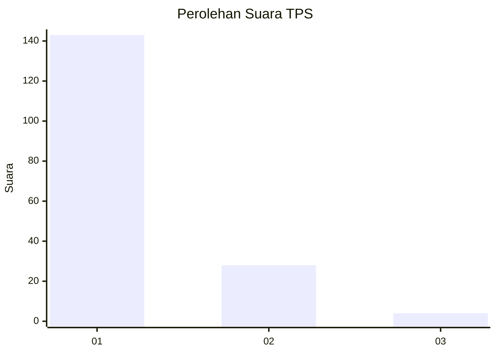
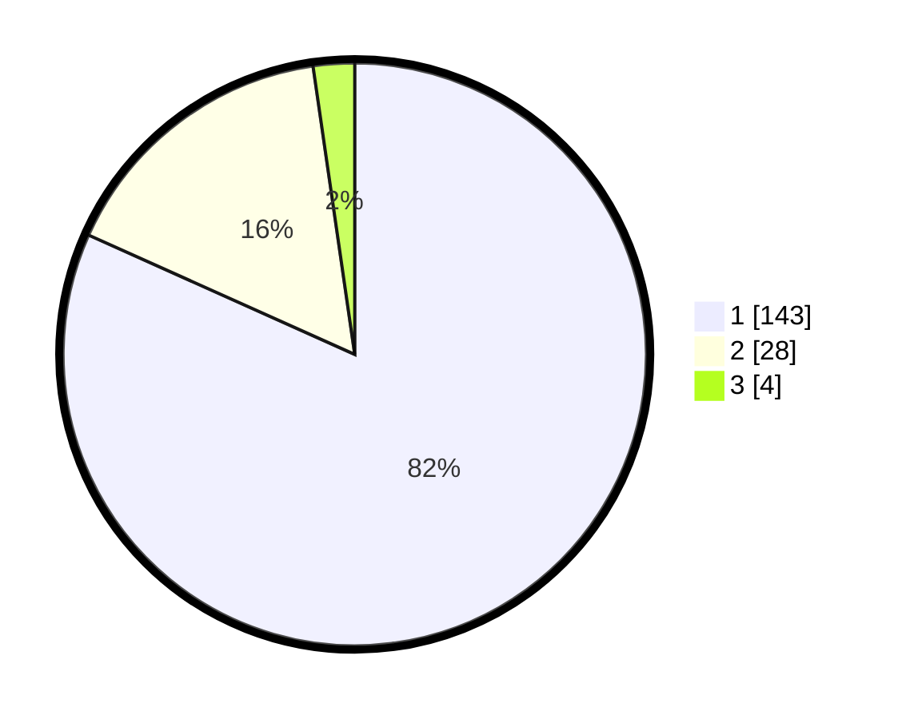

# Hasil

## Grafik

## Tabel

| No. | Nama Paslon    | Suara | Suara (raw) | Persentase |
|:--- |:-------------- | -----:| -----------:| ----------:|
| 1   | ANIES MUHAIMIN | 143   | [143][p-1]  | 81,71      |
| 2   | PRABOWO GIBRAN | 28    | [28][p-2]   | 16,00      |
| 3   | GANJAR MAHFUD  | 4     | [4][p-3]    | 2,29       |

[p-1]: https://github.com/gigit-pemilu/pemilu-2024-32-jawa-barat/blob/main/pilpres/hitung-suara/sub/32-jawa-barat/sub/05-garut/sub/26-peundeuy/sub/2002-toblong/sub/001-tps/sub/paslon-1.txt
[p-2]: https://github.com/gigit-pemilu/pemilu-2024-32-jawa-barat/blob/main/pilpres/hitung-suara/sub/32-jawa-barat/sub/05-garut/sub/26-peundeuy/sub/2002-toblong/sub/001-tps/sub/paslon-2.txt
[p-3]: https://github.com/gigit-pemilu/pemilu-2024-32-jawa-barat/blob/main/pilpres/hitung-suara/sub/32-jawa-barat/sub/05-garut/sub/26-peundeuy/sub/2002-toblong/sub/001-tps/sub/paslon-3.txt

## Foto C Plano

https://sirekap-obj-formc.kpu.go.id/37b5/pemilu/ppwp/32/05/26/20/02/3205262002001-20240215-021746--baba862a-1ce7-4869-8b94-0df79bbecc0d.jpg

https://sirekap-obj-formc.kpu.go.id/37b5/pemilu/ppwp/32/05/26/20/02/3205262002001-20240215-022011--a5b757e9-9f76-4255-8eb9-26f06668c908.jpg

https://sirekap-obj-formc.kpu.go.id/37b5/pemilu/ppwp/32/05/26/20/02/3205262002001-20240215-080421--108c7f00-fe3e-40b8-a11c-623ae12dded0.jpg

## Metadata

| Key        | Value               |
| ---------- | ------------------- |
| Time Stamp | 2024-02-15 16:00:26 |

