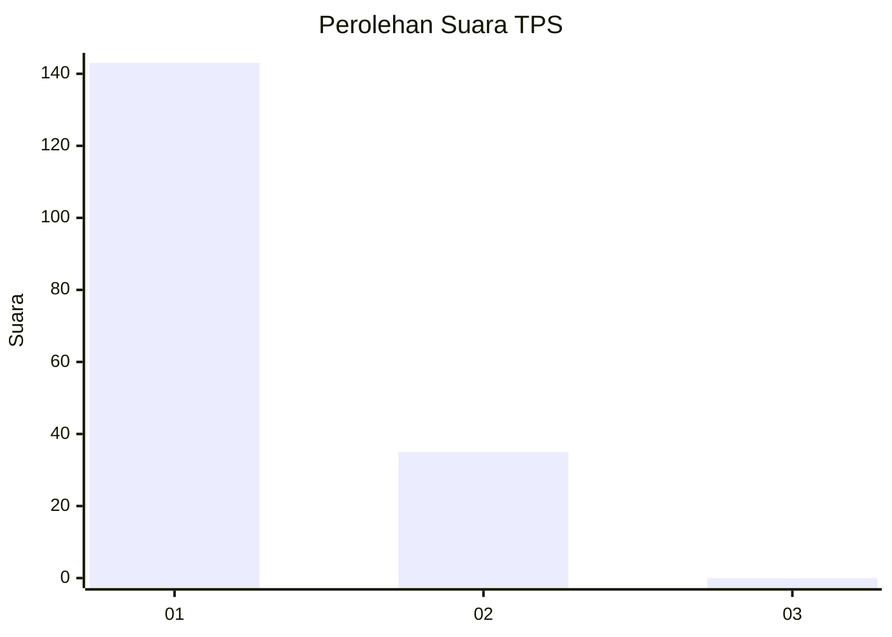
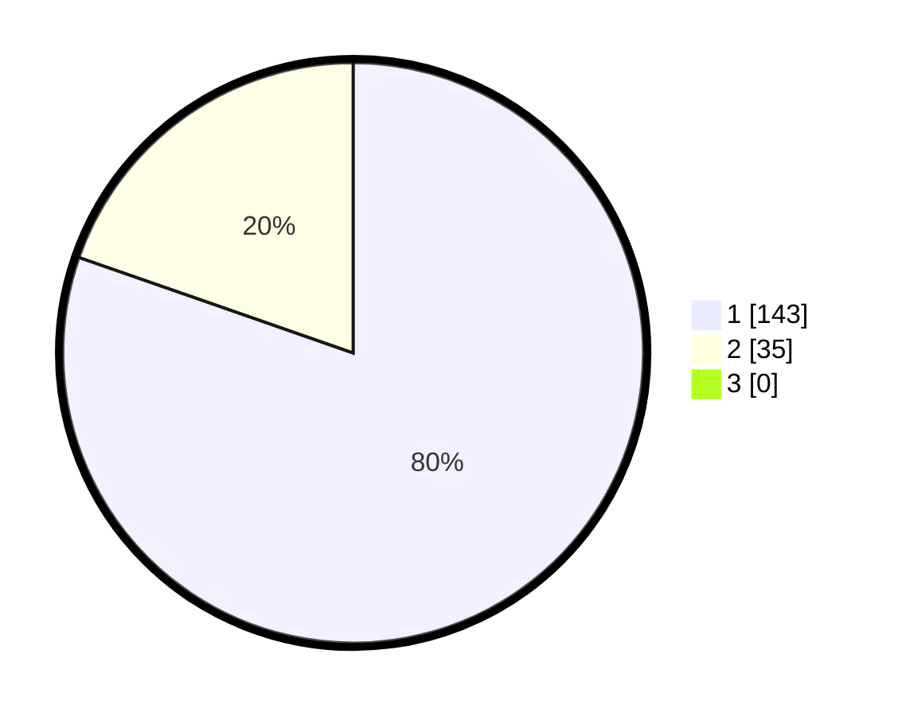

# Hasil

## Grafik

## Tabel

| No. | Nama Paslon    | Suara | Suara (raw) | Persentase |
|:--- |:-------------- | -----:| -----------:| ----------:|
| 1   | ANIES MUHAIMIN | 143   | [143][p-1]  | 80,34      |
| 2   | PRABOWO GIBRAN | 35    | [35][p-2]   | 19,66      |
| 3   | GANJAR MAHFUD  | 0     | [0][p-3]    | 0,00       |

[p-1]: https://github.com/gigit-pemilu/pemilu-2024/blob/main/pilpres/hitung-suara/sub/32-jawa-barat/sub/05-garut/sub/26-peundeuy/sub/2003-saribakti/sub/008-tps/sub/paslon-1.txt
[p-2]: https://github.com/gigit-pemilu/pemilu-2024/blob/main/pilpres/hitung-suara/sub/32-jawa-barat/sub/05-garut/sub/26-peundeuy/sub/2003-saribakti/sub/008-tps/sub/paslon-2.txt
[p-3]: https://github.com/gigit-pemilu/pemilu-2024/blob/main/pilpres/hitung-suara/sub/32-jawa-barat/sub/05-garut/sub/26-peundeuy/sub/2003-saribakti/sub/008-tps/sub/paslon-3.txt

## Foto C Plano

https://sirekap-obj-formc.kpu.go.id/80a9/pemilu/ppwp/32/05/26/20/03/3205262003008-20240214-211644--4de0a104-4ae8-4b1a-aea5-be92de9aa052.jpg

https://sirekap-obj-formc.kpu.go.id/80a9/pemilu/ppwp/32/05/26/20/03/3205262003008-20240214-211913--5c5dba29-a593-416d-9c69-7c622fa8481e.jpg

https://sirekap-obj-formc.kpu.go.id/80a9/pemilu/ppwp/32/05/26/20/03/3205262003008-20240214-212058--9028fdf6-7d20-4a34-bbc0-322c1f26a721.jpg

## Metadata

| Key        | Value               |
| ---------- | ------------------- |
| Time Stamp | 2024-02-15 00:41:44 |

