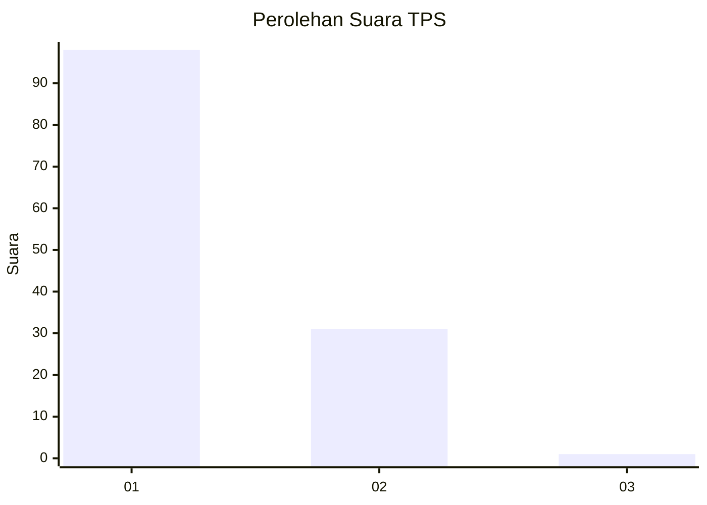
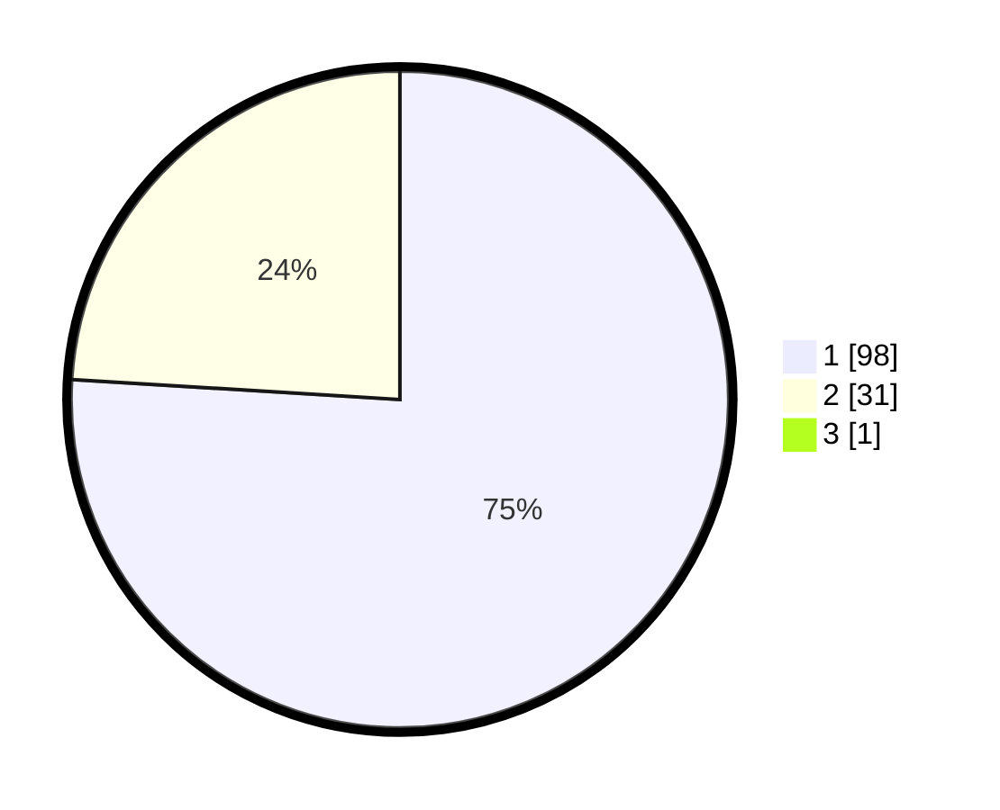

# Hasil

## Grafik

## Tabel

| No. | Nama Paslon    | Suara | Suara (raw) | Persentase |
|:--- |:-------------- | -----:| -----------:| ----------:|
| 1   | ANIES MUHAIMIN | 98    | [98][p-1]   | 75,38      |
| 2   | PRABOWO GIBRAN | 31    | [31][p-2]   | 23,85      |
| 3   | GANJAR MAHFUD  | 1     | [1][p-3]    | 0,77       |

[p-1]: https://github.com/gigit-pemilu/pemilu-2024-32-jawa-barat/blob/main/pilpres/hitung-suara/sub/32-jawa-barat/sub/05-garut/sub/26-peundeuy/sub/2003-saribakti/sub/016-tps/sub/paslon-1.txt
[p-2]: https://github.com/gigit-pemilu/pemilu-2024-32-jawa-barat/blob/main/pilpres/hitung-suara/sub/32-jawa-barat/sub/05-garut/sub/26-peundeuy/sub/2003-saribakti/sub/016-tps/sub/paslon-2.txt
[p-3]: https://github.com/gigit-pemilu/pemilu-2024-32-jawa-barat/blob/main/pilpres/hitung-suara/sub/32-jawa-barat/sub/05-garut/sub/26-peundeuy/sub/2003-saribakti/sub/016-tps/sub/paslon-3.txt

## Foto C Plano

https://sirekap-obj-formc.kpu.go.id/e5e4/pemilu/ppwp/32/05/26/20/03/3205262003016-20240214-214210--83672868-0be1-41af-8bef-f7e52362ef8c.jpg

https://sirekap-obj-formc.kpu.go.id/e5e4/pemilu/ppwp/32/05/26/20/03/3205262003016-20240214-214210--b9f08260-fba6-4ebe-a6a1-b213f511c9b9.jpg

https://sirekap-obj-formc.kpu.go.id/e5e4/pemilu/ppwp/32/05/26/20/03/3205262003016-20240214-214210--d065ac83-49c9-4908-aa0b-480b97e7dd07.jpg

## Metadata

| Key        | Value               |
| ---------- | ------------------- |
| Time Stamp | 2024-02-20 16:00:00 |

