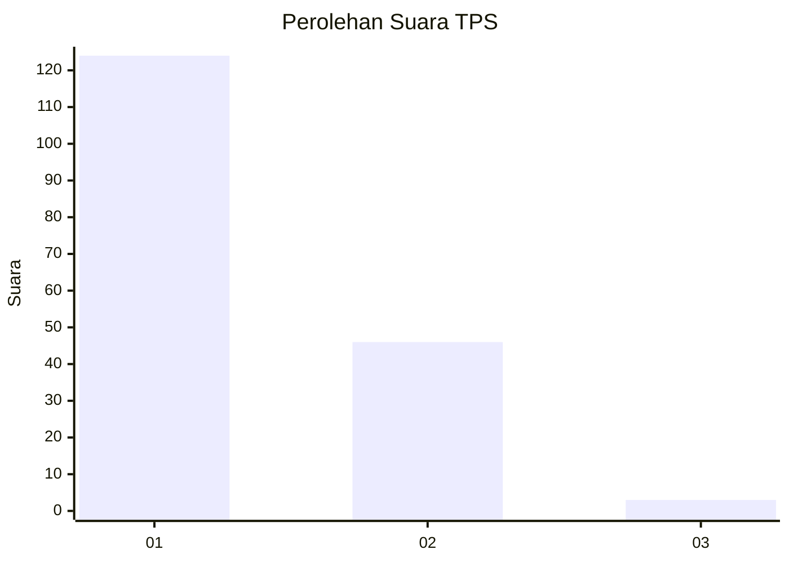
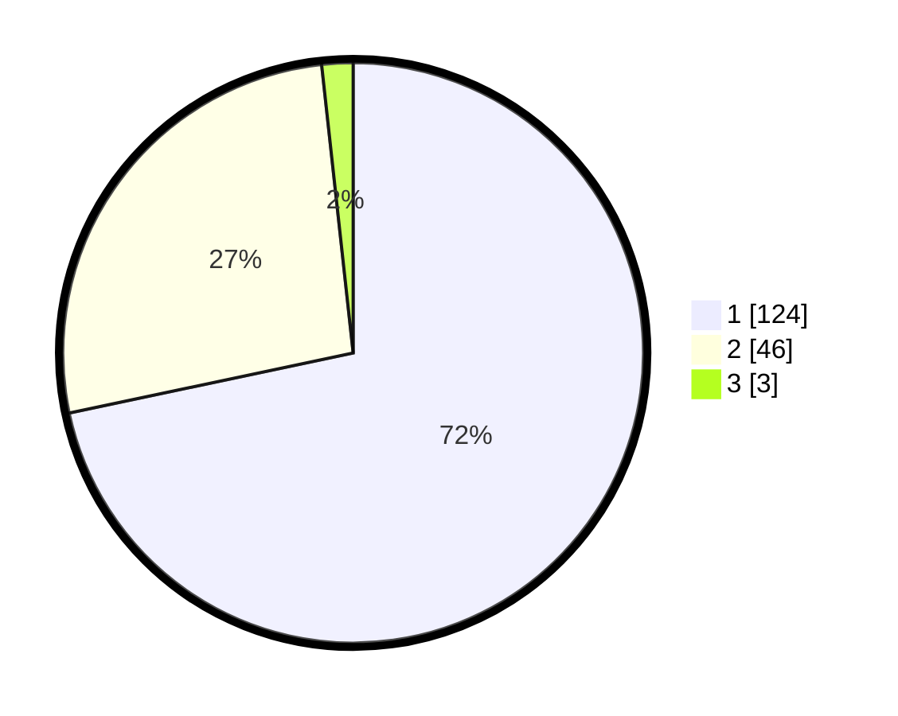

# Hasil

## Grafik

## Tabel

| No. | Nama Paslon    | Suara | Suara (raw) | Persentase |
|:--- |:-------------- | -----:| -----------:| ----------:|
| 1   | ANIES MUHAIMIN | 124   | [124][p-1]  | 71,68      |
| 2   | PRABOWO GIBRAN | 46    | [46][p-2]   | 26,59      |
| 3   | GANJAR MAHFUD  | 3     | [3][p-3]    | 1,73       |

[p-1]: https://github.com/gigit-pemilu/pemilu-2024-32-jawa-barat/blob/main/pilpres/hitung-suara/sub/32-jawa-barat/sub/05-garut/sub/26-peundeuy/sub/2003-saribakti/sub/019-tps/sub/paslon-1.txt
[p-2]: https://github.com/gigit-pemilu/pemilu-2024-32-jawa-barat/blob/main/pilpres/hitung-suara/sub/32-jawa-barat/sub/05-garut/sub/26-peundeuy/sub/2003-saribakti/sub/019-tps/sub/paslon-2.txt
[p-3]: https://github.com/gigit-pemilu/pemilu-2024-32-jawa-barat/blob/main/pilpres/hitung-suara/sub/32-jawa-barat/sub/05-garut/sub/26-peundeuy/sub/2003-saribakti/sub/019-tps/sub/paslon-3.txt

## Foto C Plano

https://sirekap-obj-formc.kpu.go.id/93d2/pemilu/ppwp/32/05/26/20/03/3205262003019-20240215-004423--ec10b83e-7b02-4319-a0e6-6759b836fe5a.jpg

https://sirekap-obj-formc.kpu.go.id/93d2/pemilu/ppwp/32/05/26/20/03/3205262003019-20240214-220055--f922f3a7-5b41-4779-9e43-801b012ce576.jpg

https://sirekap-obj-formc.kpu.go.id/93d2/pemilu/ppwp/32/05/26/20/03/3205262003019-20240215-004524--9f9cab11-6948-4bf1-a93a-f50e7e61e449.jpg

## Metadata

| Key        | Value               |
| ---------- | ------------------- |
| Time Stamp | 2024-02-20 16:00:00 |

