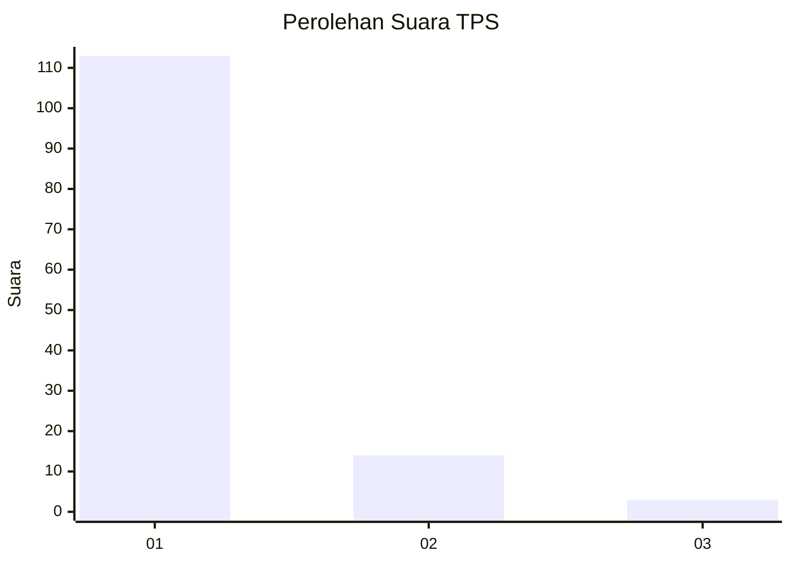
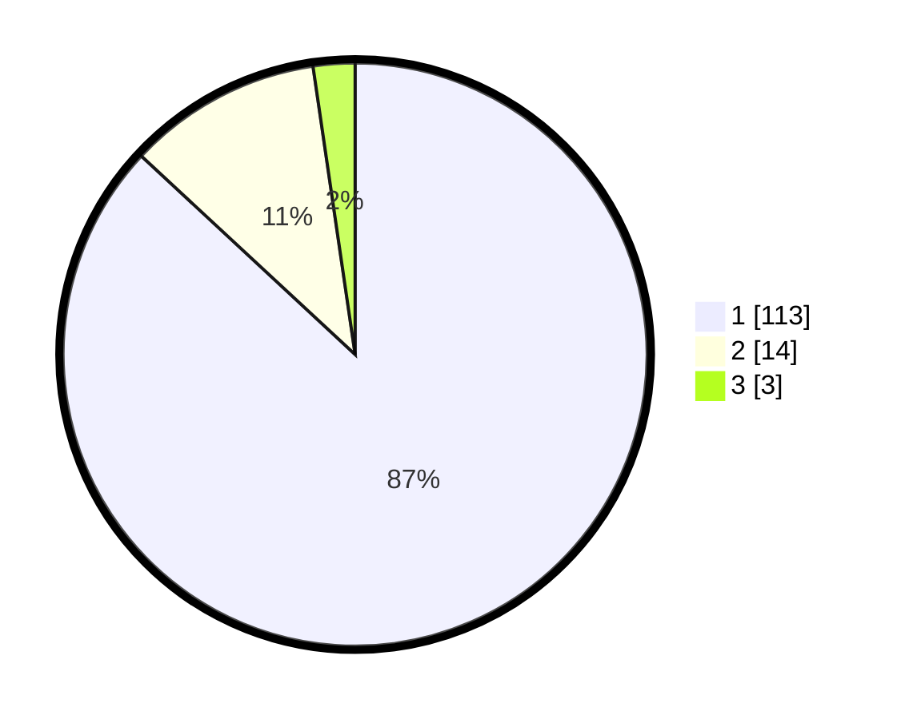

# Hasil

## Grafik

## Tabel

| No. | Nama Paslon    | Suara | Suara (raw) | Persentase |
|:--- |:-------------- | -----:| -----------:| ----------:|
| 1   | ANIES MUHAIMIN | 113   | [113][p-1]  | 86,92      |
| 2   | PRABOWO GIBRAN | 14    | [14][p-2]   | 10,77      |
| 3   | GANJAR MAHFUD  | 3     | [3][p-3]    | 2,31       |

[p-1]: https://github.com/gigit-pemilu/pemilu-2024-32-jawa-barat/blob/main/pilpres/hitung-suara/sub/32-jawa-barat/sub/05-garut/sub/27-pameungpeuk/sub/2006-bojong/sub/009-tps/sub/paslon-1.txt
[p-2]: https://github.com/gigit-pemilu/pemilu-2024-32-jawa-barat/blob/main/pilpres/hitung-suara/sub/32-jawa-barat/sub/05-garut/sub/27-pameungpeuk/sub/2006-bojong/sub/009-tps/sub/paslon-2.txt
[p-3]: https://github.com/gigit-pemilu/pemilu-2024-32-jawa-barat/blob/main/pilpres/hitung-suara/sub/32-jawa-barat/sub/05-garut/sub/27-pameungpeuk/sub/2006-bojong/sub/009-tps/sub/paslon-3.txt

## Foto C Plano

https://sirekap-obj-formc.kpu.go.id/4e93/pemilu/ppwp/32/05/27/20/06/3205272006009-20240215-105943--47f8e302-811e-4bd6-9068-3c56052ebc22.jpg

https://sirekap-obj-formc.kpu.go.id/4e93/pemilu/ppwp/32/05/27/20/06/3205272006009-20240215-141646--f6a263d4-521a-44c4-9ab6-abd6811229d7.jpg

https://sirekap-obj-formc.kpu.go.id/4e93/pemilu/ppwp/32/05/27/20/06/3205272006009-20240218-111711--a841efb0-9e6b-482b-8b9d-0e0c4f2219df.jpg

## Metadata

| Key        | Value               |
| ---------- | ------------------- |
| Time Stamp | 2024-02-25 11:00:00 |

