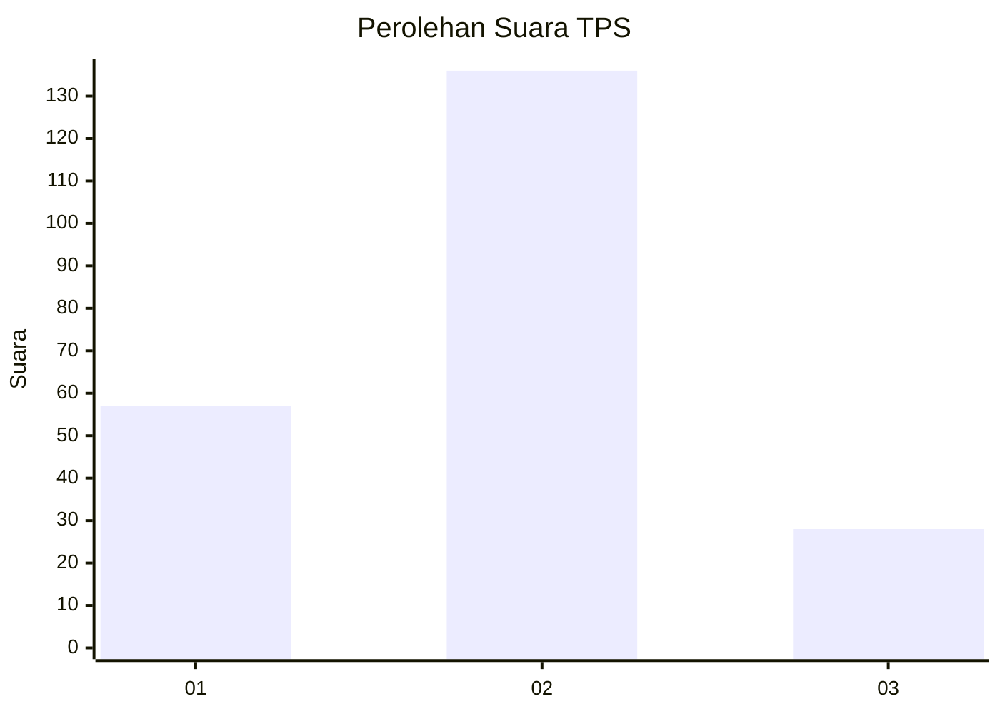
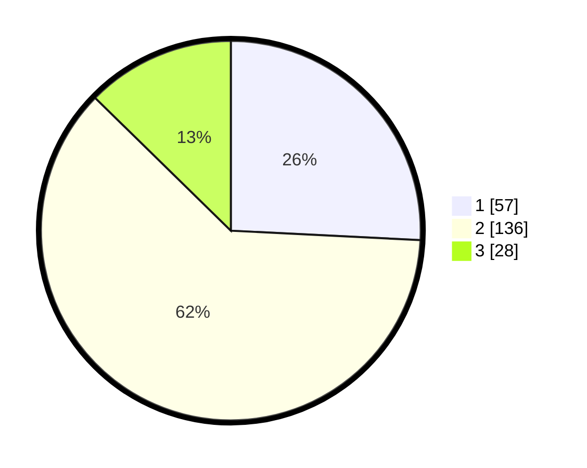

# Hasil

## Grafik

## Tabel

| No. | Nama Paslon    | Suara | Suara (raw) | Persentase |
|:--- |:-------------- | -----:| -----------:| ----------:|
| 1   | ANIES MUHAIMIN | 57    | [57][p-1]   | 25,79      |
| 2   | PRABOWO GIBRAN | 136   | [136][p-2]  | 61,54      |
| 3   | GANJAR MAHFUD  | 28    | [28][p-3]   | 12,67      |

[p-1]: https://github.com/gigit-pemilu/pemilu-2024-32-jawa-barat/blob/main/pilpres/hitung-suara/sub/32-jawa-barat/sub/05-garut/sub/28-cisompet/sub/2001-cisompet/sub/004-tps/sub/paslon-1.txt
[p-2]: https://github.com/gigit-pemilu/pemilu-2024-32-jawa-barat/blob/main/pilpres/hitung-suara/sub/32-jawa-barat/sub/05-garut/sub/28-cisompet/sub/2001-cisompet/sub/004-tps/sub/paslon-2.txt
[p-3]: https://github.com/gigit-pemilu/pemilu-2024-32-jawa-barat/blob/main/pilpres/hitung-suara/sub/32-jawa-barat/sub/05-garut/sub/28-cisompet/sub/2001-cisompet/sub/004-tps/sub/paslon-3.txt

## Foto C Plano

https://sirekap-obj-formc.kpu.go.id/213f/pemilu/ppwp/32/05/28/20/01/3205282001004-20240215-072949--8cd85960-c8a6-446a-a542-2ab1d162612b.jpg

https://sirekap-obj-formc.kpu.go.id/213f/pemilu/ppwp/32/05/28/20/01/3205282001004-20240216-205327--a199c8ec-8154-4a5d-bc93-bd34198d52a3.jpg

https://sirekap-obj-formc.kpu.go.id/213f/pemilu/ppwp/32/05/28/20/01/3205282001004-20240215-073258--b687c23d-622c-4ddd-95ef-fa6c6f84ef07.jpg

## Metadata

| Key        | Value               |
| ---------- | ------------------- |
| Time Stamp | 2024-02-17 02:30:03 |

