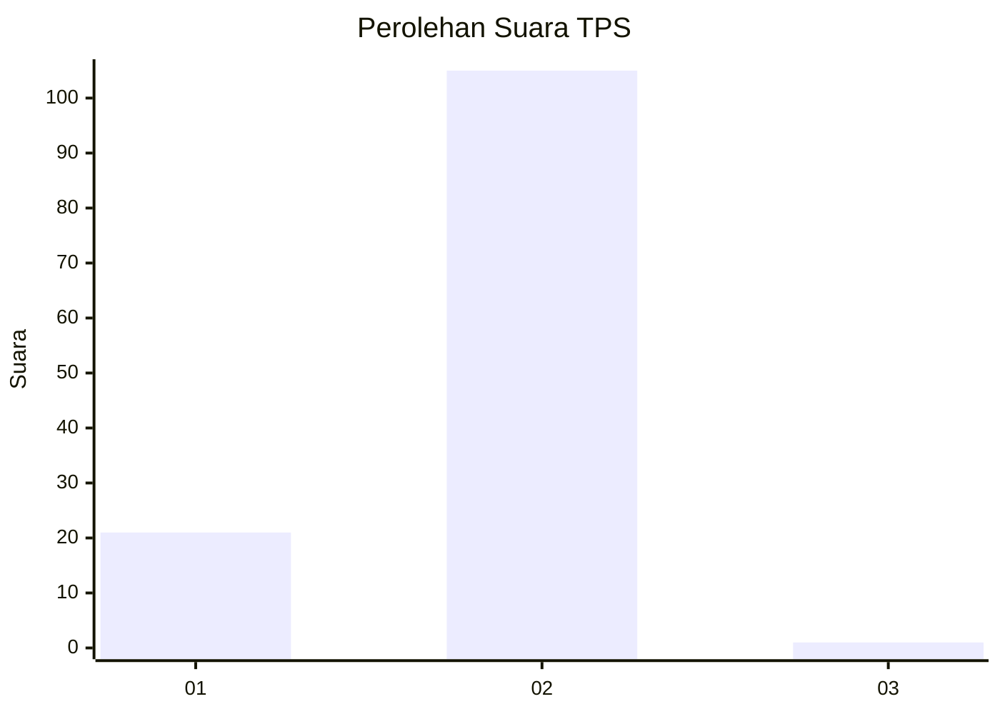
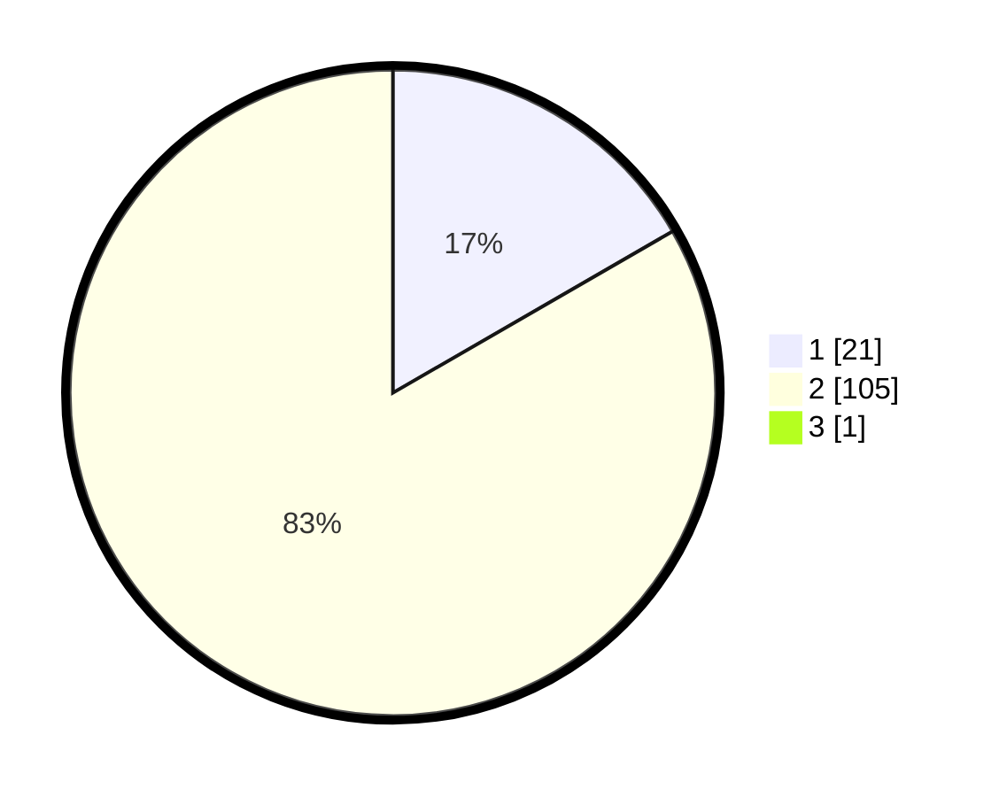

# Hasil

## Grafik

## Tabel

| No. | Nama Paslon    | Suara | Suara (raw) | Persentase |
|:--- |:-------------- | -----:| -----------:| ----------:|
| 1   | ANIES MUHAIMIN | 21    | [21][p-1]   | 16,54      |
| 2   | PRABOWO GIBRAN | 105   | [105][p-2]  | 82,68      |
| 3   | GANJAR MAHFUD  | 1     | [1][p-3]    | 0,79       |

[p-1]: https://github.com/gigit-pemilu/pemilu-2024/blob/main/pilpres/hitung-suara/sub/32-jawa-barat/sub/05-garut/sub/28-cisompet/sub/2001-cisompet/sub/011-tps/sub/paslon-1.txt
[p-2]: https://github.com/gigit-pemilu/pemilu-2024/blob/main/pilpres/hitung-suara/sub/32-jawa-barat/sub/05-garut/sub/28-cisompet/sub/2001-cisompet/sub/011-tps/sub/paslon-2.txt
[p-3]: https://github.com/gigit-pemilu/pemilu-2024/blob/main/pilpres/hitung-suara/sub/32-jawa-barat/sub/05-garut/sub/28-cisompet/sub/2001-cisompet/sub/011-tps/sub/paslon-3.txt

## Foto C Plano

https://sirekap-obj-formc.kpu.go.id/e6b7/pemilu/ppwp/32/05/28/20/01/3205282001011-20240214-233047--30219384-b1cd-4c8a-a41b-a67ea505594c.jpg

https://sirekap-obj-formc.kpu.go.id/e6b7/pemilu/ppwp/32/05/28/20/01/3205282001011-20240214-201150--5d4353c2-13e7-49c8-93c9-c482dfff8b1d.jpg

https://sirekap-obj-formc.kpu.go.id/e6b7/pemilu/ppwp/32/05/28/20/01/3205282001011-20240214-222427--1c89c46c-a563-4ddc-9572-0790e2b1fe77.jpg

## Metadata

| Key        | Value               |
| ---------- | ------------------- |
| Time Stamp | 2024-02-15 12:00:28 |

