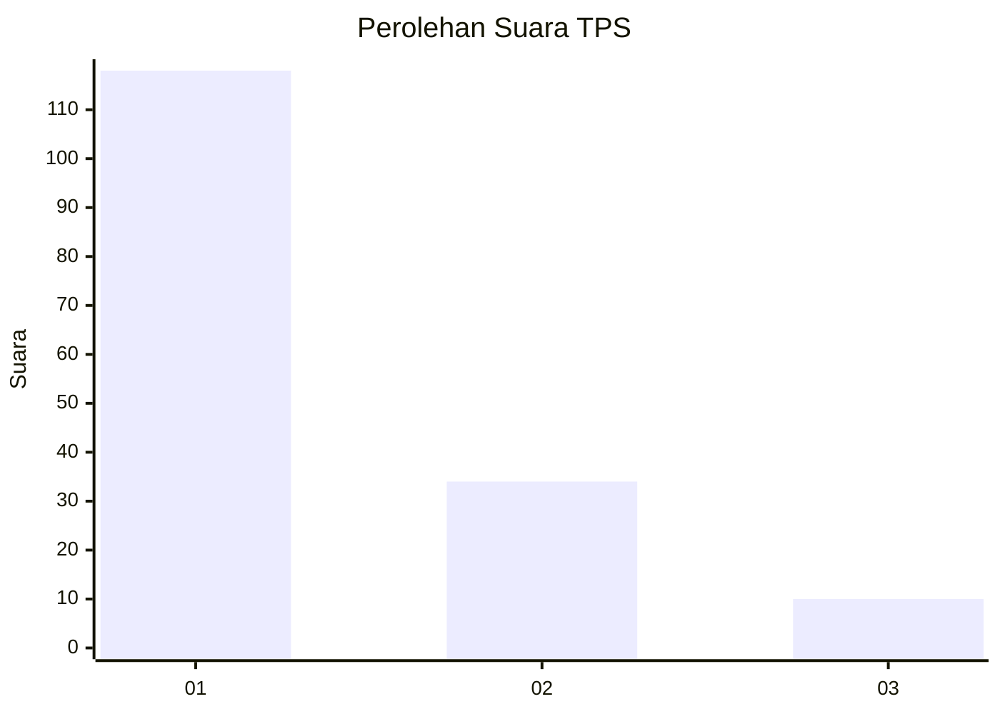
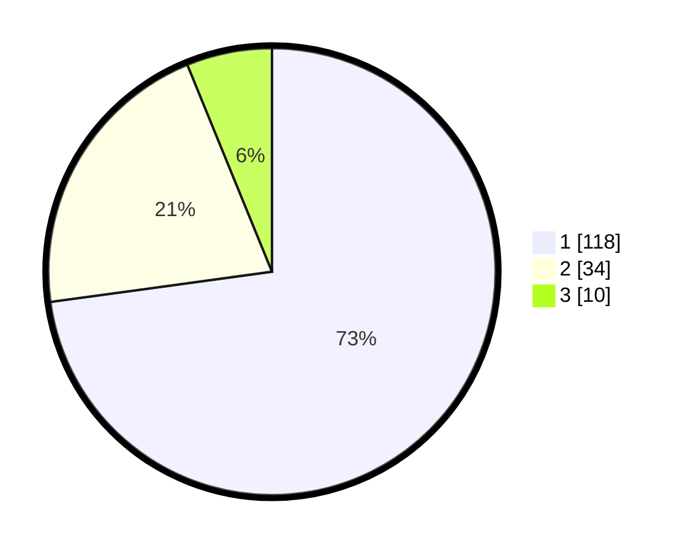

# Hasil

## Grafik

## Tabel

| No. | Nama Paslon    | Suara | Suara (raw) | Persentase |
|:--- |:-------------- | -----:| -----------:| ----------:|
| 1   | ANIES MUHAIMIN | 118   | [118][p-1]  | 72,84      |
| 2   | PRABOWO GIBRAN | 34    | [34][p-2]   | 20,99      |
| 3   | GANJAR MAHFUD  | 10    | [10][p-3]   | 6,17       |

[p-1]: https://github.com/gigit-pemilu/pemilu-2024-32-jawa-barat/blob/main/pilpres/hitung-suara/sub/32-jawa-barat/sub/05-garut/sub/28-cisompet/sub/2004-sukamukti/sub/016-tps/sub/paslon-1.txt
[p-2]: https://github.com/gigit-pemilu/pemilu-2024-32-jawa-barat/blob/main/pilpres/hitung-suara/sub/32-jawa-barat/sub/05-garut/sub/28-cisompet/sub/2004-sukamukti/sub/016-tps/sub/paslon-2.txt
[p-3]: https://github.com/gigit-pemilu/pemilu-2024-32-jawa-barat/blob/main/pilpres/hitung-suara/sub/32-jawa-barat/sub/05-garut/sub/28-cisompet/sub/2004-sukamukti/sub/016-tps/sub/paslon-3.txt

## Foto C Plano

https://sirekap-obj-formc.kpu.go.id/a10f/pemilu/ppwp/32/05/28/20/04/3205282004016-20240215-071001--1df7abf3-e6c6-45bb-8997-886b90959cee.jpg

https://sirekap-obj-formc.kpu.go.id/a10f/pemilu/ppwp/32/05/28/20/04/3205282004016-20240215-002635--c2cdebf2-e582-4e24-b212-f0030d6c67ca.jpg

https://sirekap-obj-formc.kpu.go.id/a10f/pemilu/ppwp/32/05/28/20/04/3205282004016-20240215-002918--6f701a3c-83ef-47f0-b1cf-832b9ca15e69.jpg

## Metadata

| Key        | Value               |
| ---------- | ------------------- |
| Time Stamp | 2024-02-24 22:31:28 |

