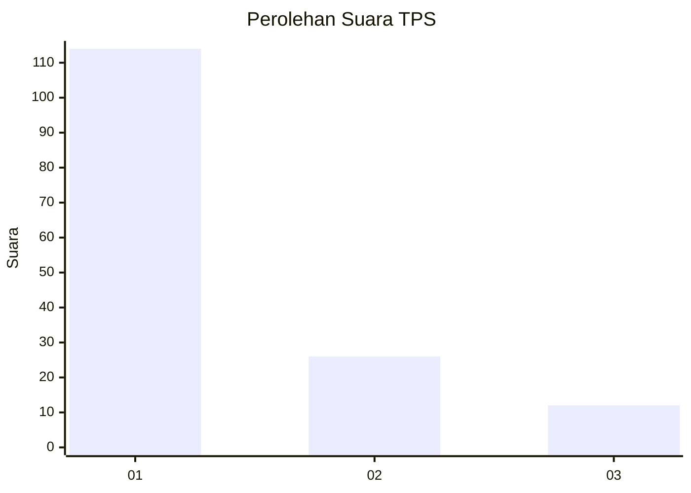
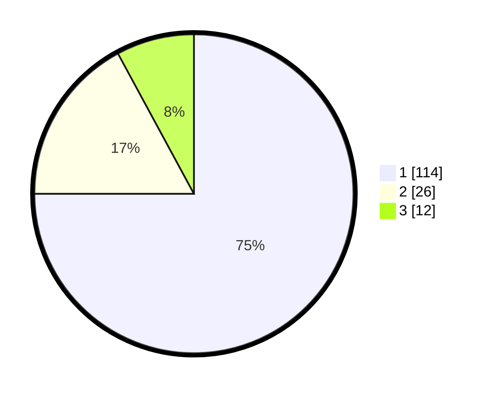

# Hasil

## Grafik

## Tabel

| No. | Nama Paslon    | Suara | Suara (raw) | Persentase |
|:--- |:-------------- | -----:| -----------:| ----------:|
| 1   | ANIES MUHAIMIN | 114   | [114][p-1]  | 75,00      |
| 2   | PRABOWO GIBRAN | 26    | [26][p-2]   | 17,11      |
| 3   | GANJAR MAHFUD  | 12    | [12][p-3]   | 7,89       |

[p-1]: https://github.com/gigit-pemilu/pemilu-2024/blob/main/pilpres/hitung-suara/sub/32-jawa-barat/sub/05-garut/sub/28-cisompet/sub/2006-cikondang/sub/010-tps/sub/paslon-1.txt
[p-2]: https://github.com/gigit-pemilu/pemilu-2024/blob/main/pilpres/hitung-suara/sub/32-jawa-barat/sub/05-garut/sub/28-cisompet/sub/2006-cikondang/sub/010-tps/sub/paslon-2.txt
[p-3]: https://github.com/gigit-pemilu/pemilu-2024/blob/main/pilpres/hitung-suara/sub/32-jawa-barat/sub/05-garut/sub/28-cisompet/sub/2006-cikondang/sub/010-tps/sub/paslon-3.txt

## Foto C Plano

https://sirekap-obj-formc.kpu.go.id/f094/pemilu/ppwp/32/05/28/20/06/3205282006010-20240215-062741--262e2448-3bab-4c3b-b1a6-5873410d8070.jpg

https://sirekap-obj-formc.kpu.go.id/f094/pemilu/ppwp/32/05/28/20/06/3205282006010-20240215-063640--5e6852f9-0e52-4510-a4a6-b88022de0d1c.jpg

https://sirekap-obj-formc.kpu.go.id/f094/pemilu/ppwp/32/05/28/20/06/3205282006010-20240215-063454--8bb2298e-7949-4899-a64b-95110b128bfa.jpg

## Metadata

| Key        | Value               |
| ---------- | ------------------- |
| Time Stamp | 2024-02-25 11:00:00 |

