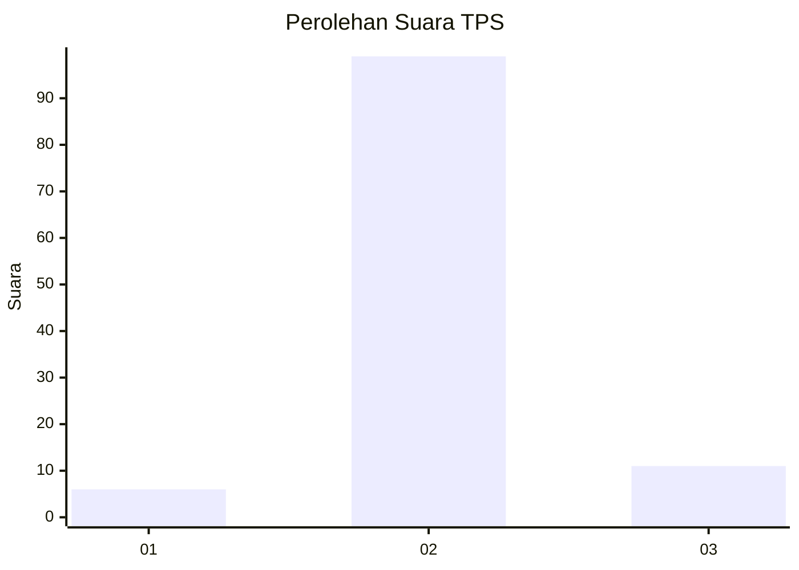
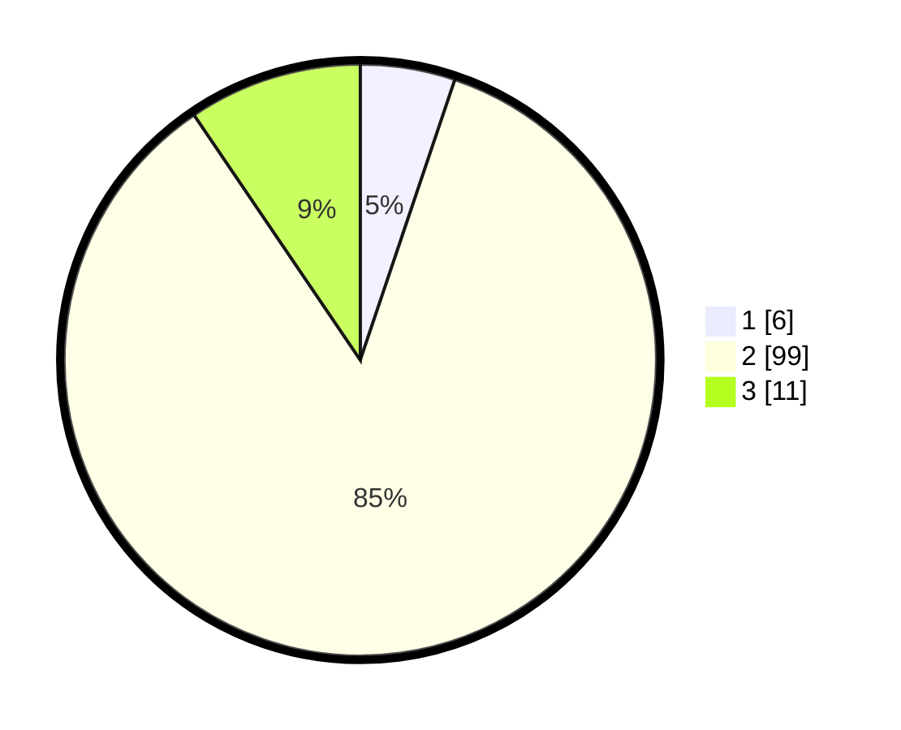

# Hasil

## Grafik

## Tabel

| No. | Nama Paslon    | Suara | Suara (raw) | Persentase |
|:--- |:-------------- | -----:| -----------:| ----------:|
| 1   | ANIES MUHAIMIN | 6     | [6][p-1]    | 5,17       |
| 2   | PRABOWO GIBRAN | 99    | [99][p-2]   | 85,34      |
| 3   | GANJAR MAHFUD  | 11    | [11][p-3]   | 9,48       |

[p-1]: https://github.com/gigit-pemilu/pemilu-2024-32-jawa-barat/blob/main/pilpres/hitung-suara/sub/32-jawa-barat/sub/05-garut/sub/29-cibalong/sub/2005-sagara/sub/003-tps/sub/paslon-1.txt
[p-2]: https://github.com/gigit-pemilu/pemilu-2024-32-jawa-barat/blob/main/pilpres/hitung-suara/sub/32-jawa-barat/sub/05-garut/sub/29-cibalong/sub/2005-sagara/sub/003-tps/sub/paslon-2.txt
[p-3]: https://github.com/gigit-pemilu/pemilu-2024-32-jawa-barat/blob/main/pilpres/hitung-suara/sub/32-jawa-barat/sub/05-garut/sub/29-cibalong/sub/2005-sagara/sub/003-tps/sub/paslon-3.txt

## Foto C Plano

https://sirekap-obj-formc.kpu.go.id/9550/pemilu/ppwp/32/05/29/20/05/3205292005003-20240215-135624--8de2c615-201d-4a68-bfbe-9664b68d9894.jpg

https://sirekap-obj-formc.kpu.go.id/9550/pemilu/ppwp/32/05/29/20/05/3205292005003-20240215-135632--8a9ce002-a1e2-4bb8-9a6d-6cd45d1908f5.jpg

https://sirekap-obj-formc.kpu.go.id/9550/pemilu/ppwp/32/05/29/20/05/3205292005003-20240215-135639--f001efc6-b7ae-4aea-bcd5-f84a28342b7b.jpg

## Metadata

| Key        | Value               |
| ---------- | ------------------- |
| Time Stamp | 2024-02-25 12:00:00 |

