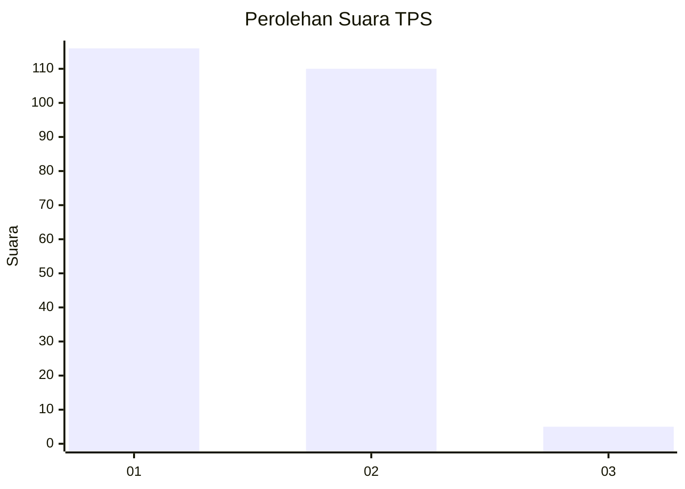
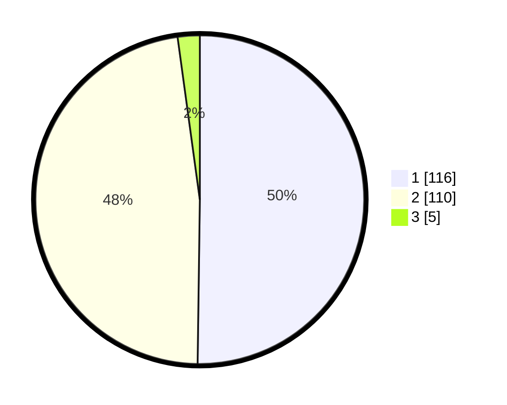

# Hasil

## Grafik

## Tabel

| No. | Nama Paslon    | Suara | Suara (raw) | Persentase |
|:--- |:-------------- | -----:| -----------:| ----------:|
| 1   | ANIES MUHAIMIN | 116   | [116][p-1]  | 50,22      |
| 2   | PRABOWO GIBRAN | 110   | [110][p-2]  | 47,62      |
| 3   | GANJAR MAHFUD  | 5     | [5][p-3]    | 2,16       |

[p-1]: https://github.com/gigit-pemilu/pemilu-2024-32-jawa-barat/blob/main/pilpres/hitung-suara/sub/32-jawa-barat/sub/05-garut/sub/30-cikelet/sub/2001-cikelet/sub/002-tps/sub/paslon-1.txt
[p-2]: https://github.com/gigit-pemilu/pemilu-2024-32-jawa-barat/blob/main/pilpres/hitung-suara/sub/32-jawa-barat/sub/05-garut/sub/30-cikelet/sub/2001-cikelet/sub/002-tps/sub/paslon-2.txt
[p-3]: https://github.com/gigit-pemilu/pemilu-2024-32-jawa-barat/blob/main/pilpres/hitung-suara/sub/32-jawa-barat/sub/05-garut/sub/30-cikelet/sub/2001-cikelet/sub/002-tps/sub/paslon-3.txt

## Foto C Plano

https://sirekap-obj-formc.kpu.go.id/b315/pemilu/ppwp/32/05/30/20/01/3205302001002-20240215-060850--6611aae0-c118-4bc7-95df-2fe4d10ef42a.jpg

https://sirekap-obj-formc.kpu.go.id/b315/pemilu/ppwp/32/05/30/20/01/3205302001002-20240215-060655--2f131433-1098-4a0a-ae84-145c72545bb4.jpg

https://sirekap-obj-formc.kpu.go.id/b315/pemilu/ppwp/32/05/30/20/01/3205302001002-20240215-060326--18302429-adbe-48ea-b994-e5b4c89be997.jpg

## Metadata

| Key        | Value               |
| ---------- | ------------------- |
| Time Stamp | 2024-02-25 16:00:00 |

