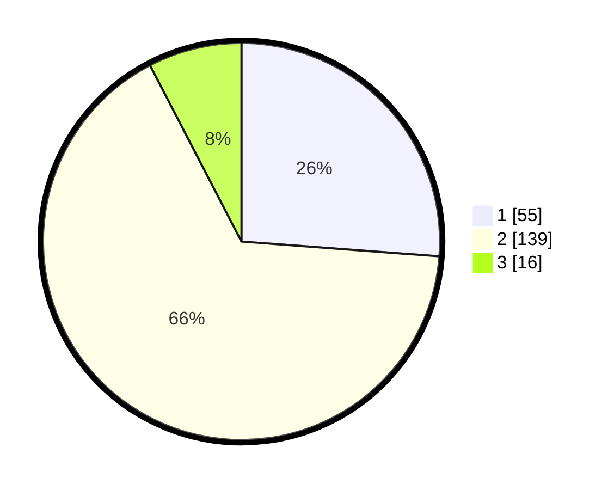

# Hasil

## Grafik

## Tabel

| No. | Nama Paslon    | Suara | Suara (raw) | Persentase |
|:--- |:-------------- | -----:| -----------:| ----------:|
| 1   | ANIES MUHAIMIN | 55    | [55][p-1]   | 26,19      |
| 2   | PRABOWO GIBRAN | 139   | [139][p-2]  | 66,19      |
| 3   | GANJAR MAHFUD  | 16    | [16][p-3]   | 7,62       |

[p-1]: https://github.com/gigit-pemilu/pemilu-2024/blob/main/pilpres/hitung-suara/sub/32-jawa-barat/sub/05-garut/sub/30-cikelet/sub/2001-cikelet/sub/004-tps/sub/paslon-1.txt
[p-2]: https://github.com/gigit-pemilu/pemilu-2024/blob/main/pilpres/hitung-suara/sub/32-jawa-barat/sub/05-garut/sub/30-cikelet/sub/2001-cikelet/sub/004-tps/sub/paslon-2.txt
[p-3]: https://github.com/gigit-pemilu/pemilu-2024/blob/main/pilpres/hitung-suara/sub/32-jawa-barat/sub/05-garut/sub/30-cikelet/sub/2001-cikelet/sub/004-tps/sub/paslon-3.txt

## Foto C Plano

https://sirekap-obj-formc.kpu.go.id/34c4/pemilu/ppwp/32/05/30/20/01/3205302001004-20240216-105252--dabd20e7-abcb-46df-ba1f-31ad6c3bfb81.jpg

https://sirekap-obj-formc.kpu.go.id/34c4/pemilu/ppwp/32/05/30/20/01/3205302001004-20240216-105353--7ac3ab6a-eda7-4a7b-96b8-d6937a58c314.jpg

https://sirekap-obj-formc.kpu.go.id/34c4/pemilu/ppwp/32/05/30/20/01/3205302001004-20240216-105538--4076bb80-921e-46e8-a282-578f40d8fc81.jpg

## Metadata

| Key        | Value               |
| ---------- | ------------------- |
| Time Stamp | 2024-02-24 22:31:28 |

