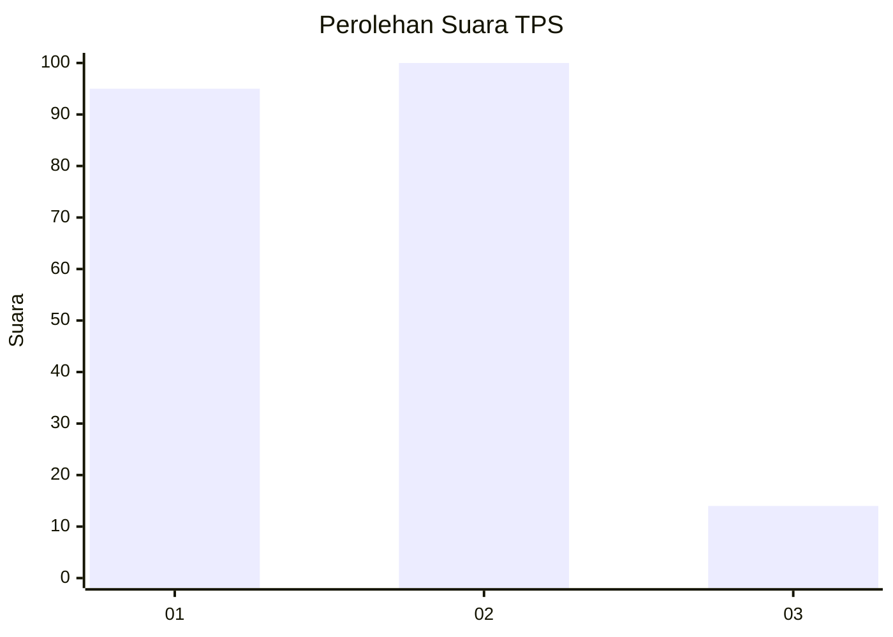
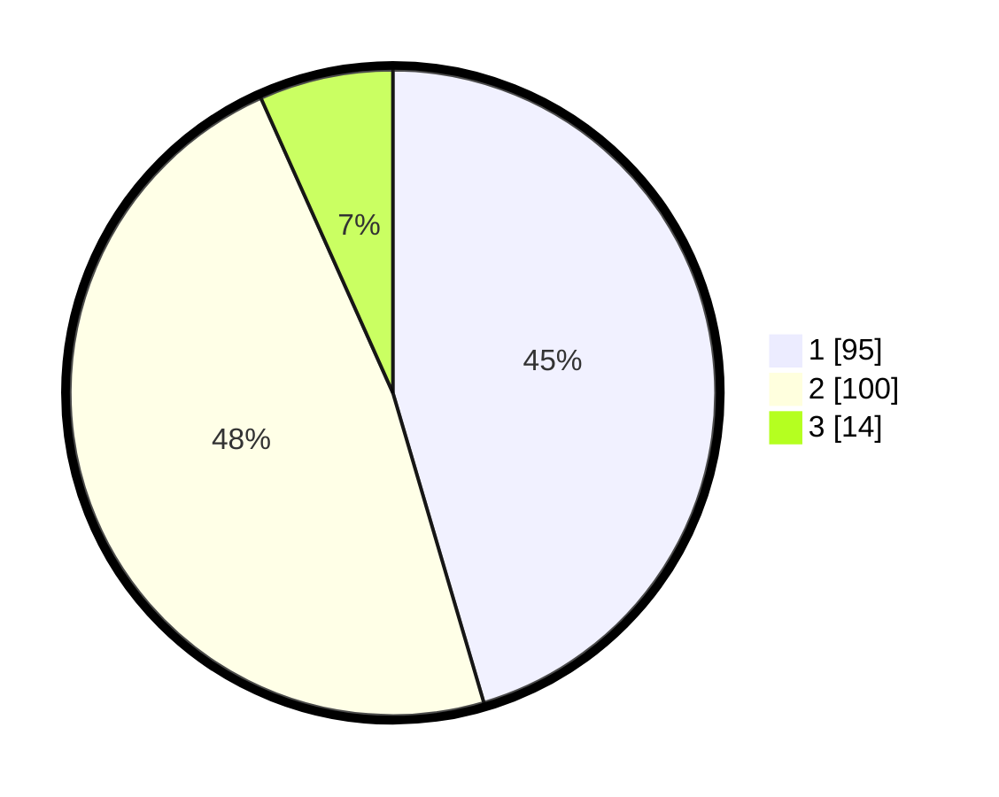

# Hasil

## Grafik

## Tabel

| No. | Nama Paslon    | Suara | Suara (raw) | Persentase |
|:--- |:-------------- | -----:| -----------:| ----------:|
| 1   | ANIES MUHAIMIN | 95    | [95][p-1]   | 45,45      |
| 2   | PRABOWO GIBRAN | 100   | [100][p-2]  | 47,85      |
| 3   | GANJAR MAHFUD  | 14    | [14][p-3]   | 6,70       |

[p-1]: https://github.com/gigit-pemilu/pemilu-2024-32-jawa-barat/blob/main/pilpres/hitung-suara/sub/32-jawa-barat/sub/05-garut/sub/30-cikelet/sub/2001-cikelet/sub/005-tps/sub/paslon-1.txt
[p-2]: https://github.com/gigit-pemilu/pemilu-2024-32-jawa-barat/blob/main/pilpres/hitung-suara/sub/32-jawa-barat/sub/05-garut/sub/30-cikelet/sub/2001-cikelet/sub/005-tps/sub/paslon-2.txt
[p-3]: https://github.com/gigit-pemilu/pemilu-2024-32-jawa-barat/blob/main/pilpres/hitung-suara/sub/32-jawa-barat/sub/05-garut/sub/30-cikelet/sub/2001-cikelet/sub/005-tps/sub/paslon-3.txt

## Foto C Plano

https://sirekap-obj-formc.kpu.go.id/4b22/pemilu/ppwp/32/05/30/20/01/3205302001005-20240215-000225--8b8c795c-2d5f-413b-b470-93fddc11c894.jpg

https://sirekap-obj-formc.kpu.go.id/4b22/pemilu/ppwp/32/05/30/20/01/3205302001005-20240215-000421--eb586ae5-1a32-4be9-9399-c5bdf4f8c394.jpg

https://sirekap-obj-formc.kpu.go.id/4b22/pemilu/ppwp/32/05/30/20/01/3205302001005-20240215-000450--a04eba3b-0b03-4aee-9e9e-2dc22517a2fb.jpg

## Metadata

| Key        | Value               |
| ---------- | ------------------- |
| Time Stamp | 2024-02-16 11:00:29 |

