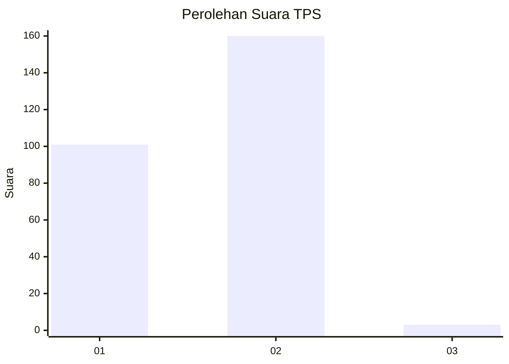
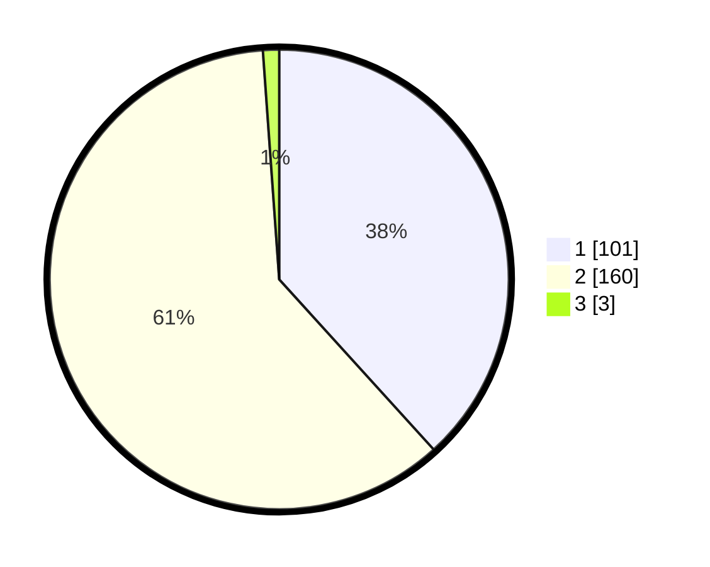

# Hasil

## Grafik

## Tabel

| No. | Nama Paslon    | Suara | Suara (raw) | Persentase |
|:--- |:-------------- | -----:| -----------:| ----------:|
| 1   | ANIES MUHAIMIN | 101   | [101][p-1]  | 38,26      |
| 2   | PRABOWO GIBRAN | 160   | [160][p-2]  | 60,61      |
| 3   | GANJAR MAHFUD  | 3     | [3][p-3]    | 1,14       |

[p-1]: https://github.com/gigit-pemilu/pemilu-2024/blob/main/pilpres/hitung-suara/sub/32-jawa-barat/sub/05-garut/sub/30-cikelet/sub/2002-linggamanik/sub/017-tps/sub/paslon-1.txt
[p-2]: https://github.com/gigit-pemilu/pemilu-2024/blob/main/pilpres/hitung-suara/sub/32-jawa-barat/sub/05-garut/sub/30-cikelet/sub/2002-linggamanik/sub/017-tps/sub/paslon-2.txt
[p-3]: https://github.com/gigit-pemilu/pemilu-2024/blob/main/pilpres/hitung-suara/sub/32-jawa-barat/sub/05-garut/sub/30-cikelet/sub/2002-linggamanik/sub/017-tps/sub/paslon-3.txt

## Foto C Plano

https://sirekap-obj-formc.kpu.go.id/d27f/pemilu/ppwp/32/05/30/20/02/3205302002017-20240215-040523--0ecf10e3-b227-4eda-b957-9e028c272aa6.jpg

https://sirekap-obj-formc.kpu.go.id/d27f/pemilu/ppwp/32/05/30/20/02/3205302002017-20240215-040759--1d54640d-a3f9-4ace-9912-37f2cd301ec5.jpg

https://sirekap-obj-formc.kpu.go.id/d27f/pemilu/ppwp/32/05/30/20/02/3205302002017-20240214-224823--7ee0e8a6-5856-4753-b096-547c15dc96a4.jpg

## Metadata

| Key        | Value               |
| ---------- | ------------------- |
| Time Stamp | 2024-02-24 22:31:28 |

