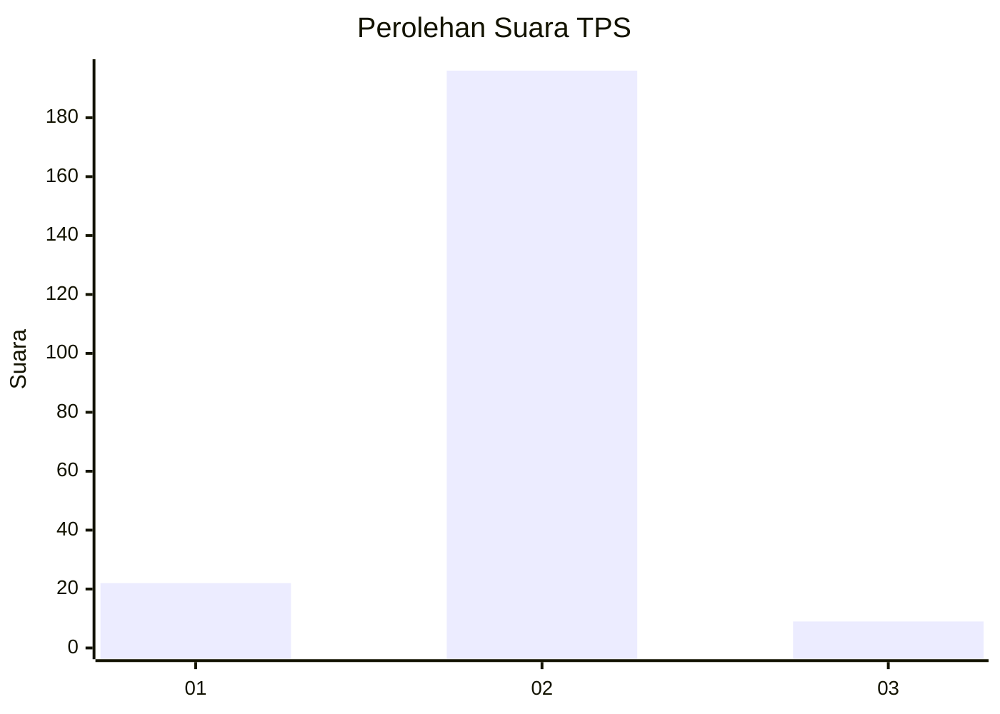
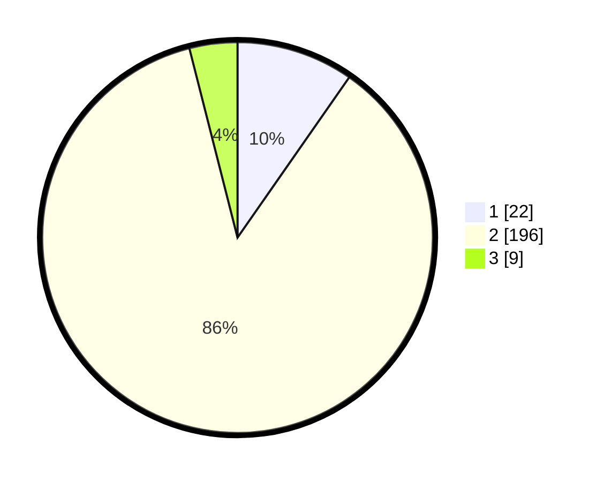

# Hasil

## Grafik

## Tabel

| No. | Nama Paslon    | Suara | Suara (raw) | Persentase |
|:--- |:-------------- | -----:| -----------:| ----------:|
| 1   | ANIES MUHAIMIN | 22    | [22][p-1]   | 9,69       |
| 2   | PRABOWO GIBRAN | 196   | [196][p-2]  | 86,34      |
| 3   | GANJAR MAHFUD  | 9     | [9][p-3]    | 3,96       |

[p-1]: https://github.com/gigit-pemilu/pemilu-2024-32-jawa-barat/blob/main/pilpres/hitung-suara/sub/32-jawa-barat/sub/05-garut/sub/30-cikelet/sub/2005-pamalayan/sub/001-tps/sub/paslon-1.txt
[p-2]: https://github.com/gigit-pemilu/pemilu-2024-32-jawa-barat/blob/main/pilpres/hitung-suara/sub/32-jawa-barat/sub/05-garut/sub/30-cikelet/sub/2005-pamalayan/sub/001-tps/sub/paslon-2.txt
[p-3]: https://github.com/gigit-pemilu/pemilu-2024-32-jawa-barat/blob/main/pilpres/hitung-suara/sub/32-jawa-barat/sub/05-garut/sub/30-cikelet/sub/2005-pamalayan/sub/001-tps/sub/paslon-3.txt

## Foto C Plano

https://sirekap-obj-formc.kpu.go.id/5b19/pemilu/ppwp/32/05/30/20/05/3205302005001-20240215-235613--c9618744-7392-478c-a30d-eee59fa70771.jpg

https://sirekap-obj-formc.kpu.go.id/5b19/pemilu/ppwp/32/05/30/20/05/3205302005001-20240216-194025--50a6929e-1d61-415c-96f8-d83dfd078bbc.jpg

https://sirekap-obj-formc.kpu.go.id/5b19/pemilu/ppwp/32/05/30/20/05/3205302005001-20240215-011542--d6747945-9d60-4e77-ae02-eb7e413bbed0.jpg

## Metadata

| Key        | Value               |
| ---------- | ------------------- |
| Time Stamp | 2024-02-16 21:01:00 |

