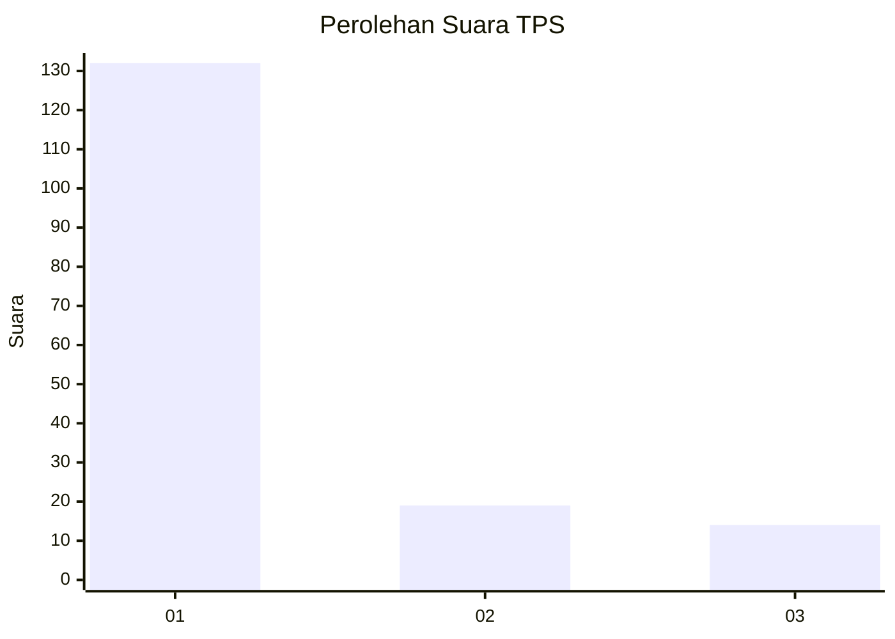
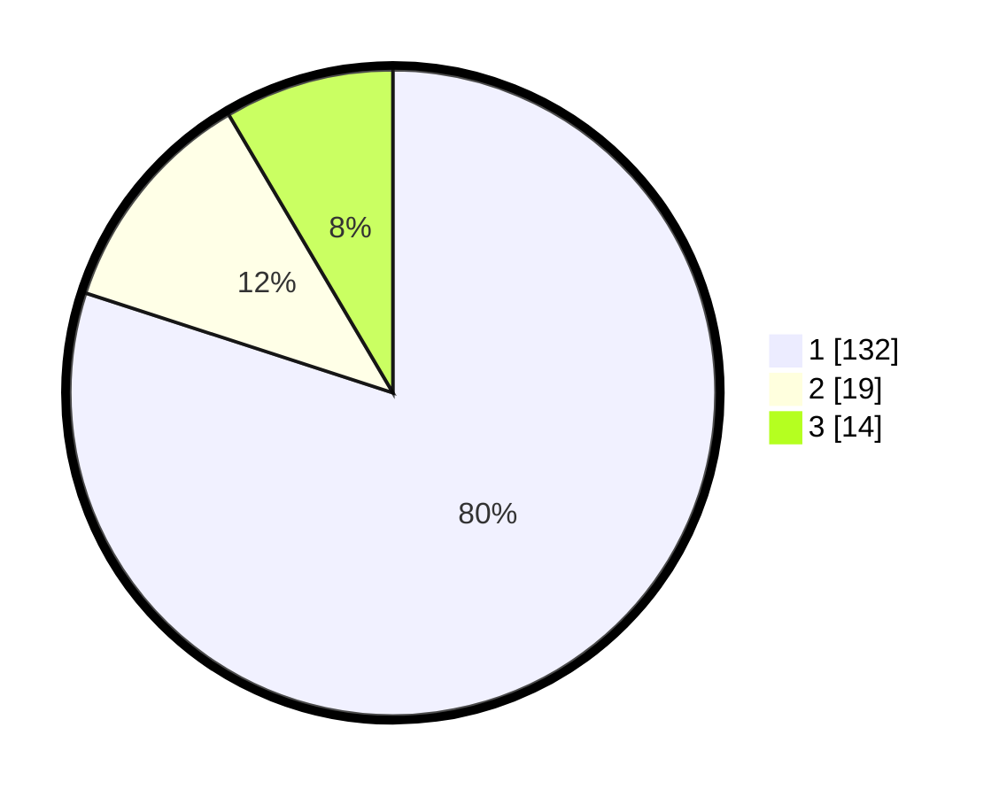

# Hasil

## Grafik

## Tabel

| No. | Nama Paslon    | Suara | Suara (raw) | Persentase |
|:--- |:-------------- | -----:| -----------:| ----------:|
| 1   | ANIES MUHAIMIN | 132   | [132][p-1]  | 80,00      |
| 2   | PRABOWO GIBRAN | 19    | [19][p-2]   | 11,52      |
| 3   | GANJAR MAHFUD  | 14    | [14][p-3]   | 8,48       |

[p-1]: https://github.com/gigit-pemilu/pemilu-2024/blob/main/pilpres/hitung-suara/sub/32-jawa-barat/sub/05-garut/sub/30-cikelet/sub/2007-cijambe/sub/011-tps/sub/paslon-1.txt
[p-2]: https://github.com/gigit-pemilu/pemilu-2024/blob/main/pilpres/hitung-suara/sub/32-jawa-barat/sub/05-garut/sub/30-cikelet/sub/2007-cijambe/sub/011-tps/sub/paslon-2.txt
[p-3]: https://github.com/gigit-pemilu/pemilu-2024/blob/main/pilpres/hitung-suara/sub/32-jawa-barat/sub/05-garut/sub/30-cikelet/sub/2007-cijambe/sub/011-tps/sub/paslon-3.txt

## Foto C Plano

https://sirekap-obj-formc.kpu.go.id/a0bc/pemilu/ppwp/32/05/30/20/07/3205302007011-20240215-193217--522df282-560b-4a42-9b94-821fa2c937d4.jpg

https://sirekap-obj-formc.kpu.go.id/a0bc/pemilu/ppwp/32/05/30/20/07/3205302007011-20240215-194352--b2728d87-dc28-4b5b-8f62-ae0eba75cda8.jpg

https://sirekap-obj-formc.kpu.go.id/a0bc/pemilu/ppwp/32/05/30/20/07/3205302007011-20240215-194643--2013d432-6362-4fd1-b1a1-77b5d086b39a.jpg

## Metadata

| Key        | Value               |
| ---------- | ------------------- |
| Time Stamp | 2024-02-25 11:00:00 |

