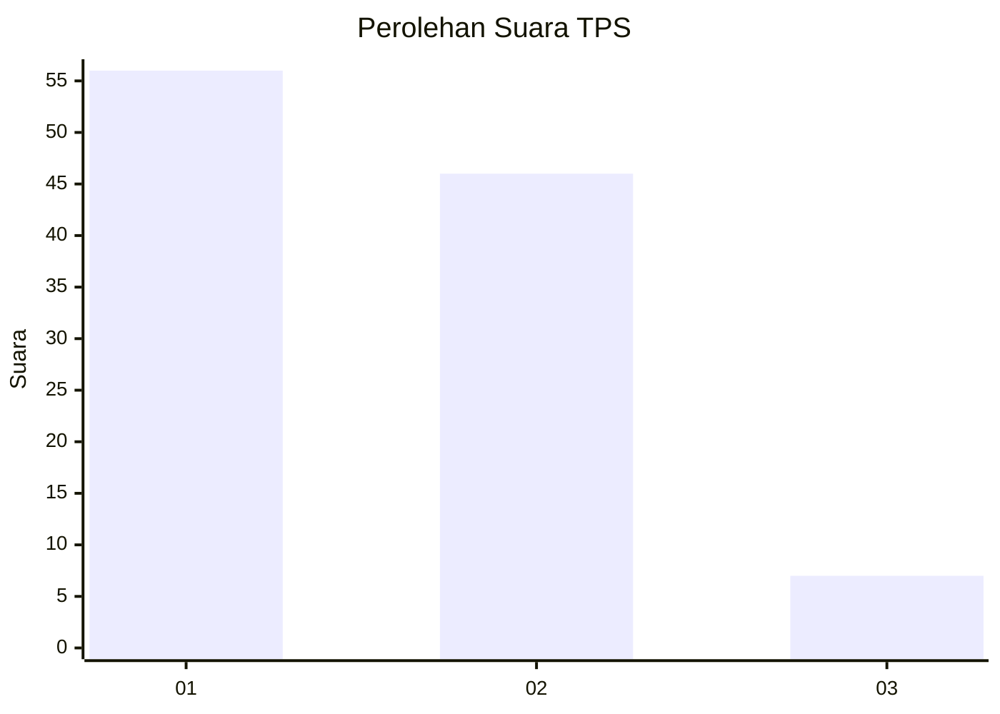
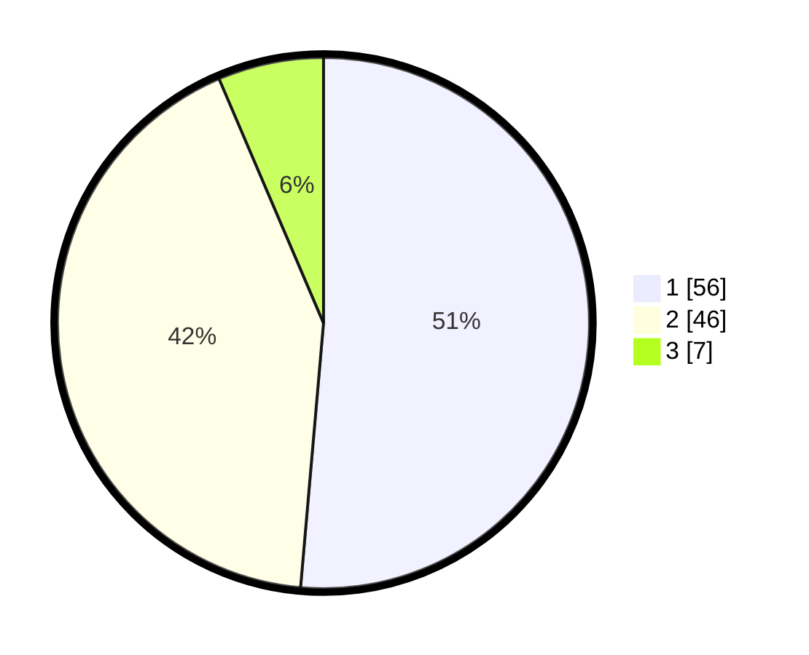

# Hasil

## Grafik

## Tabel

| No. | Nama Paslon    | Suara | Suara (raw) | Persentase |
|:--- |:-------------- | -----:| -----------:| ----------:|
| 1   | ANIES MUHAIMIN | 56    | [56][p-1]   | 51,38      |
| 2   | PRABOWO GIBRAN | 46    | [46][p-2]   | 42,20      |
| 3   | GANJAR MAHFUD  | 7     | [7][p-3]    | 6,42       |

[p-1]: https://github.com/gigit-pemilu/pemilu-2024/blob/main/pilpres/hitung-suara/sub/32-jawa-barat/sub/05-garut/sub/31-bungbulang/sub/2001-bungbulang/sub/007-tps/sub/paslon-1.txt
[p-2]: https://github.com/gigit-pemilu/pemilu-2024/blob/main/pilpres/hitung-suara/sub/32-jawa-barat/sub/05-garut/sub/31-bungbulang/sub/2001-bungbulang/sub/007-tps/sub/paslon-2.txt
[p-3]: https://github.com/gigit-pemilu/pemilu-2024/blob/main/pilpres/hitung-suara/sub/32-jawa-barat/sub/05-garut/sub/31-bungbulang/sub/2001-bungbulang/sub/007-tps/sub/paslon-3.txt

## Foto C Plano

https://sirekap-obj-formc.kpu.go.id/fbc1/pemilu/ppwp/32/05/31/20/01/3205312001007-20240215-215306--5689627f-5e51-417b-8bb4-5b653531b61d.jpg

https://sirekap-obj-formc.kpu.go.id/fbc1/pemilu/ppwp/32/05/31/20/01/3205312001007-20240215-215652--f83bd9da-2533-4ff7-ac99-16ec06182523.jpg

https://sirekap-obj-formc.kpu.go.id/fbc1/pemilu/ppwp/32/05/31/20/01/3205312001007-20240215-230409--df5ad927-5f6f-44c5-b35a-a8f5731a81bc.jpg

## Metadata

| Key        | Value               |
| ---------- | ------------------- |
| Time Stamp | 2024-02-17 19:30:00 |

