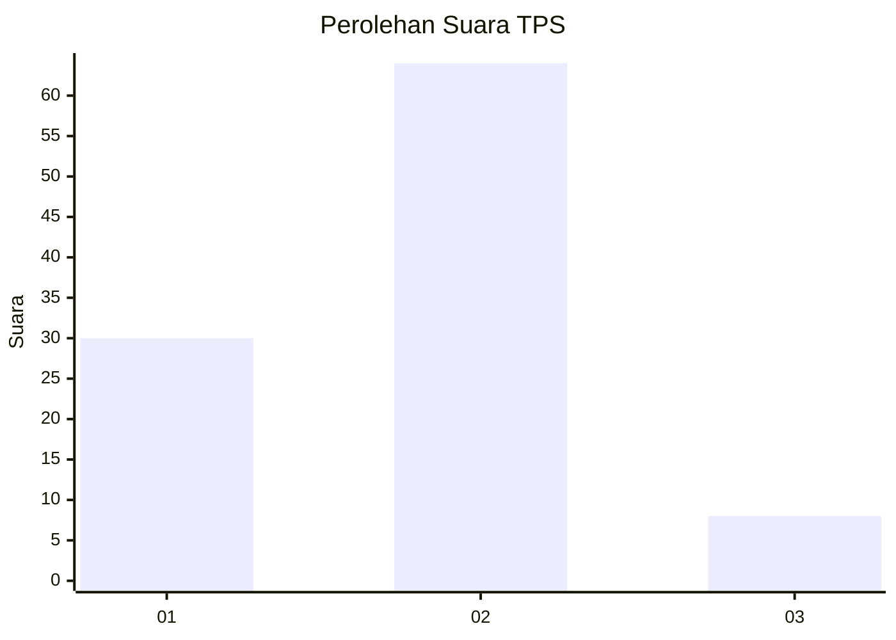
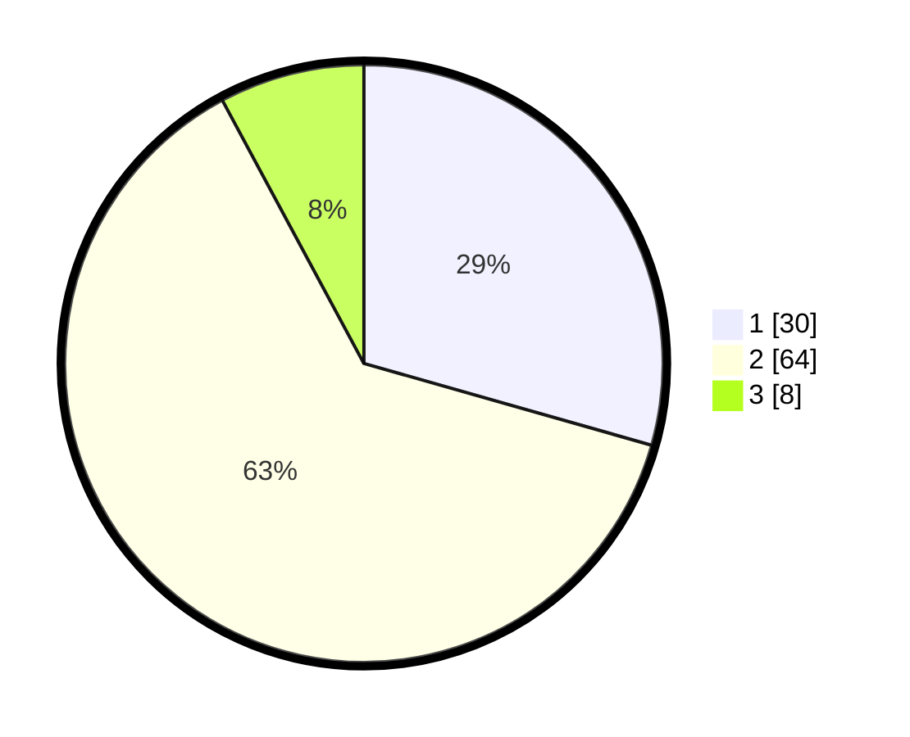

# Hasil

## Grafik

## Tabel

| No. | Nama Paslon    | Suara | Suara (raw) | Persentase |
|:--- |:-------------- | -----:| -----------:| ----------:|
| 1   | ANIES MUHAIMIN | 30    | [30][p-1]   | 29,41      |
| 2   | PRABOWO GIBRAN | 64    | [64][p-2]   | 62,75      |
| 3   | GANJAR MAHFUD  | 8     | [8][p-3]    | 7,84       |

[p-1]: https://github.com/gigit-pemilu/pemilu-2024/blob/main/pilpres/hitung-suara/sub/32-jawa-barat/sub/05-garut/sub/31-bungbulang/sub/2002-hanjuang/sub/004-tps/sub/paslon-1.txt
[p-2]: https://github.com/gigit-pemilu/pemilu-2024/blob/main/pilpres/hitung-suara/sub/32-jawa-barat/sub/05-garut/sub/31-bungbulang/sub/2002-hanjuang/sub/004-tps/sub/paslon-2.txt
[p-3]: https://github.com/gigit-pemilu/pemilu-2024/blob/main/pilpres/hitung-suara/sub/32-jawa-barat/sub/05-garut/sub/31-bungbulang/sub/2002-hanjuang/sub/004-tps/sub/paslon-3.txt

## Foto C Plano

https://sirekap-obj-formc.kpu.go.id/3197/pemilu/ppwp/32/05/31/20/02/3205312002004-20240214-191948--c5653df9-4b9c-4a48-a08c-8ae1c8a4f6b5.jpg

https://sirekap-obj-formc.kpu.go.id/3197/pemilu/ppwp/32/05/31/20/02/3205312002004-20240214-192006--7ff7ed50-1a03-4025-aaad-173d5cf1adf2.jpg

https://sirekap-obj-formc.kpu.go.id/3197/pemilu/ppwp/32/05/31/20/02/3205312002004-20240215-010929--432ee9bc-c7eb-4ff4-9d37-b82dc5917d41.jpg

## Metadata

| Key        | Value               |
| ---------- | ------------------- |
| Time Stamp | 2024-02-19 06:16:00 |

