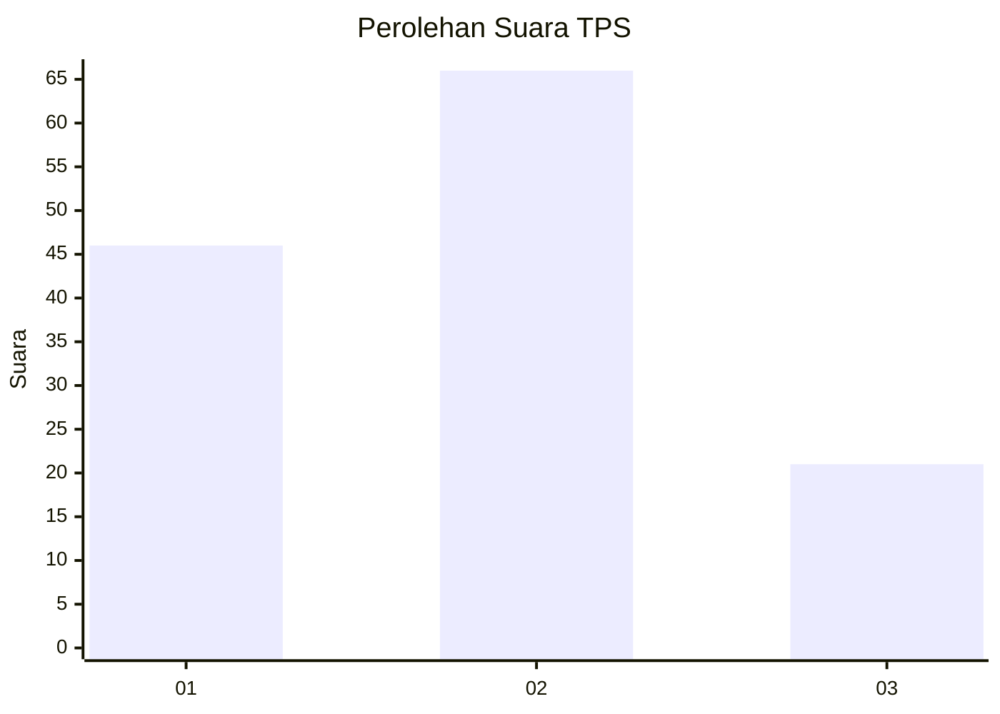
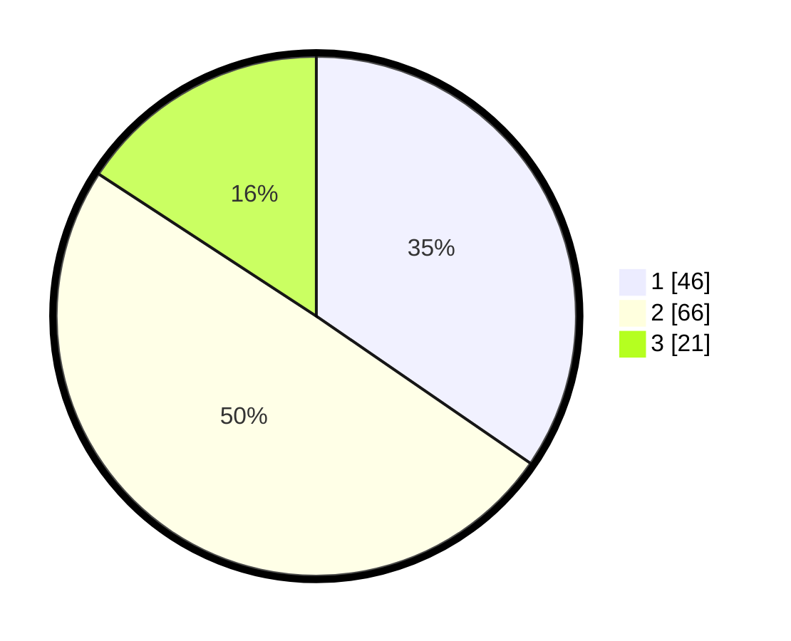

# Hasil

## Grafik

## Tabel

| No. | Nama Paslon    | Suara | Suara (raw) | Persentase |
|:--- |:-------------- | -----:| -----------:| ----------:|
| 1   | ANIES MUHAIMIN | 46    | [46][p-1]   | 34,59      |
| 2   | PRABOWO GIBRAN | 66    | [66][p-2]   | 49,62      |
| 3   | GANJAR MAHFUD  | 21    | [21][p-3]   | 15,79      |

[p-1]: https://github.com/gigit-pemilu/pemilu-2024/blob/main/pilpres/hitung-suara/sub/32-jawa-barat/sub/05-garut/sub/31-bungbulang/sub/2008-sinarjaya/sub/001-tps/sub/paslon-1.txt
[p-2]: https://github.com/gigit-pemilu/pemilu-2024/blob/main/pilpres/hitung-suara/sub/32-jawa-barat/sub/05-garut/sub/31-bungbulang/sub/2008-sinarjaya/sub/001-tps/sub/paslon-2.txt
[p-3]: https://github.com/gigit-pemilu/pemilu-2024/blob/main/pilpres/hitung-suara/sub/32-jawa-barat/sub/05-garut/sub/31-bungbulang/sub/2008-sinarjaya/sub/001-tps/sub/paslon-3.txt

## Foto C Plano

https://sirekap-obj-formc.kpu.go.id/5432/pemilu/ppwp/32/05/31/20/08/3205312008001-20240215-035453--f01c1435-b18e-4b93-bd8e-058127117d0e.jpg

https://sirekap-obj-formc.kpu.go.id/5432/pemilu/ppwp/32/05/31/20/08/3205312008001-20240215-035632--62eedb06-3ec4-4c2d-b5b9-00250a0ed295.jpg

https://sirekap-obj-formc.kpu.go.id/5432/pemilu/ppwp/32/05/31/20/08/3205312008001-20240215-035741--360e16d8-d5b4-4071-a6a9-ea633b18302c.jpg

## Metadata

| Key        | Value               |
| ---------- | ------------------- |
| Time Stamp | 2024-02-19 06:16:00 |

