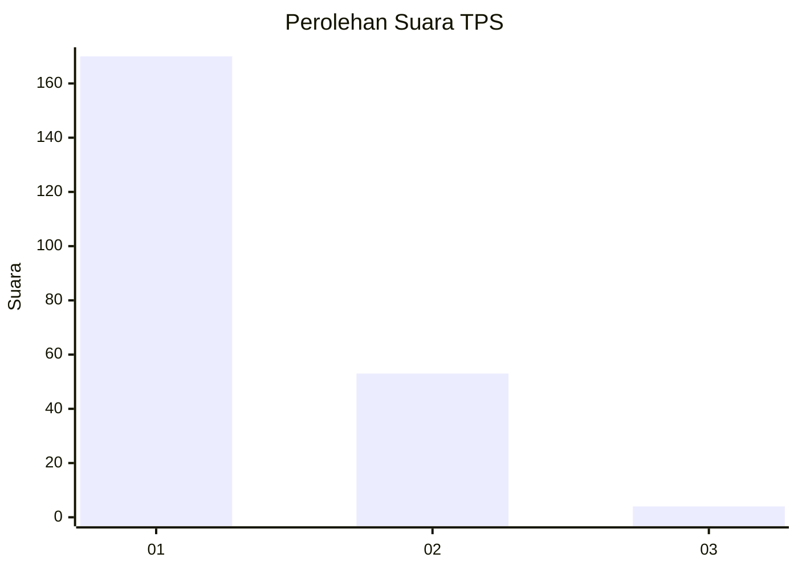
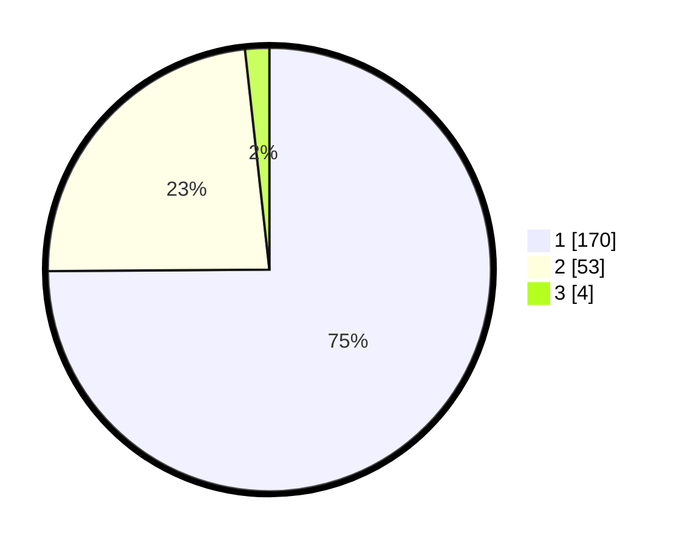

# Hasil

## Grafik

## Tabel

| No. | Nama Paslon    | Suara | Suara (raw) | Persentase |
|:--- |:-------------- | -----:| -----------:| ----------:|
| 1   | ANIES MUHAIMIN | 170   | [170][p-1]  | 74,89      |
| 2   | PRABOWO GIBRAN | 53    | [53][p-2]   | 23,35      |
| 3   | GANJAR MAHFUD  | 4     | [4][p-3]    | 1,76       |

[p-1]: https://github.com/gigit-pemilu/pemilu-2024/blob/main/pilpres/hitung-suara/sub/32-jawa-barat/sub/05-garut/sub/31-bungbulang/sub/2008-sinarjaya/sub/005-tps/sub/paslon-1.txt
[p-2]: https://github.com/gigit-pemilu/pemilu-2024/blob/main/pilpres/hitung-suara/sub/32-jawa-barat/sub/05-garut/sub/31-bungbulang/sub/2008-sinarjaya/sub/005-tps/sub/paslon-2.txt
[p-3]: https://github.com/gigit-pemilu/pemilu-2024/blob/main/pilpres/hitung-suara/sub/32-jawa-barat/sub/05-garut/sub/31-bungbulang/sub/2008-sinarjaya/sub/005-tps/sub/paslon-3.txt

## Foto C Plano

https://sirekap-obj-formc.kpu.go.id/c6db/pemilu/ppwp/32/05/31/20/08/3205312008005-20240215-070616--55039381-6358-4a13-bf66-5fbf868a66cd.jpg

https://sirekap-obj-formc.kpu.go.id/c6db/pemilu/ppwp/32/05/31/20/08/3205312008005-20240215-000501--ee34ec23-a255-43fd-b660-cb79be010f59.jpg

https://sirekap-obj-formc.kpu.go.id/c6db/pemilu/ppwp/32/05/31/20/08/3205312008005-20240215-070910--49fa56b0-5dae-4b11-87cb-942d72f10965.jpg

## Metadata

| Key        | Value               |
| ---------- | ------------------- |
| Time Stamp | 2024-02-19 06:16:00 |

