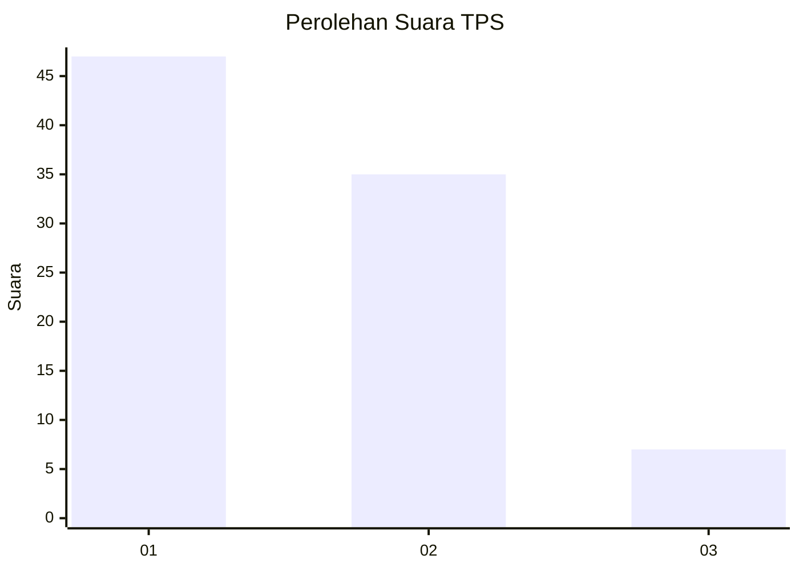
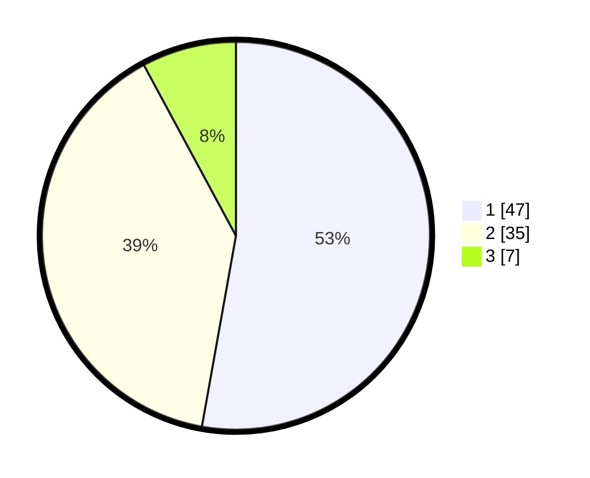

# Hasil

## Grafik

## Tabel

| No. | Nama Paslon    | Suara | Suara (raw) | Persentase |
|:--- |:-------------- | -----:| -----------:| ----------:|
| 1   | ANIES MUHAIMIN | 47    | [47][p-1]   | 52,81      |
| 2   | PRABOWO GIBRAN | 35    | [35][p-2]   | 39,33      |
| 3   | GANJAR MAHFUD  | 7     | [7][p-3]    | 7,87       |

[p-1]: https://github.com/gigit-pemilu/pemilu-2024/blob/main/pilpres/hitung-suara/sub/32-jawa-barat/sub/05-garut/sub/31-bungbulang/sub/2008-sinarjaya/sub/006-tps/sub/paslon-1.txt
[p-2]: https://github.com/gigit-pemilu/pemilu-2024/blob/main/pilpres/hitung-suara/sub/32-jawa-barat/sub/05-garut/sub/31-bungbulang/sub/2008-sinarjaya/sub/006-tps/sub/paslon-2.txt
[p-3]: https://github.com/gigit-pemilu/pemilu-2024/blob/main/pilpres/hitung-suara/sub/32-jawa-barat/sub/05-garut/sub/31-bungbulang/sub/2008-sinarjaya/sub/006-tps/sub/paslon-3.txt

## Foto C Plano

https://sirekap-obj-formc.kpu.go.id/0565/pemilu/ppwp/32/05/31/20/08/3205312008006-20240215-030255--e35b5527-6001-4619-a54a-1ec3e1da0233.jpg

https://sirekap-obj-formc.kpu.go.id/0565/pemilu/ppwp/32/05/31/20/08/3205312008006-20240215-031605--3924c31d-c17c-4cbc-946f-6459133516d0.jpg

https://sirekap-obj-formc.kpu.go.id/0565/pemilu/ppwp/32/05/31/20/08/3205312008006-20240215-034209--f065bf61-e3c6-448f-82cd-cb9fe3b4b6ac.jpg

## Metadata

| Key        | Value               |
| ---------- | ------------------- |
| Time Stamp | 2024-02-19 06:16:00 |

