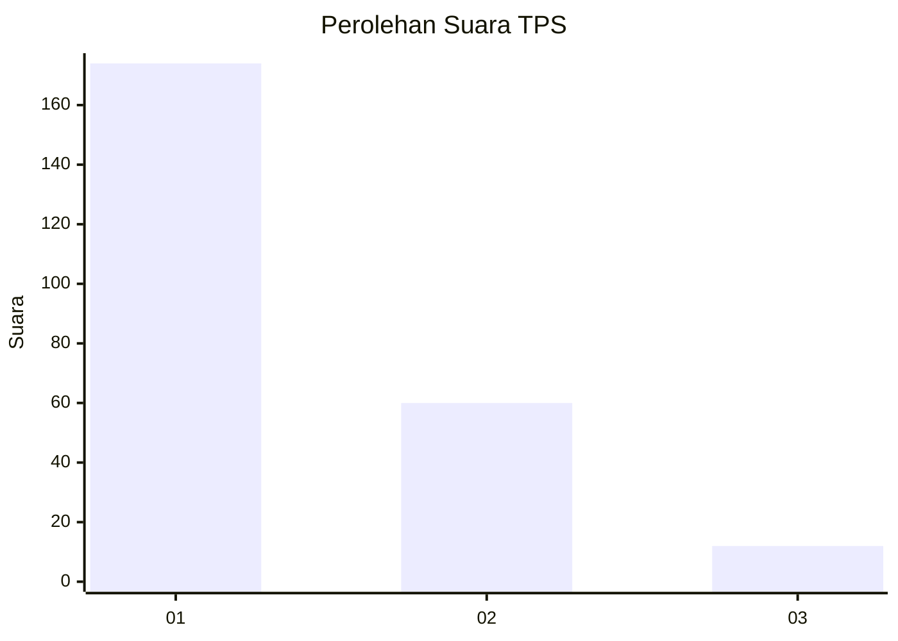
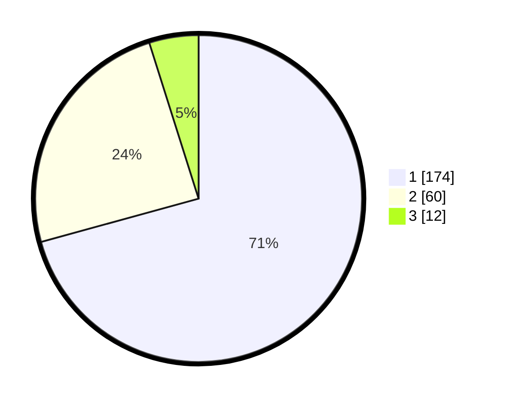

# Hasil

## Grafik

## Tabel

| No. | Nama Paslon    | Suara | Suara (raw) | Persentase |
|:--- |:-------------- | -----:| -----------:| ----------:|
| 1   | ANIES MUHAIMIN | 174   | [174][p-1]  | 70,73      |
| 2   | PRABOWO GIBRAN | 60    | [60][p-2]   | 24,39      |
| 3   | GANJAR MAHFUD  | 12    | [12][p-3]   | 4,88       |

[p-1]: https://github.com/gigit-pemilu/pemilu-2024-32-jawa-barat/blob/main/pilpres/hitung-suara/sub/32-jawa-barat/sub/05-garut/sub/31-bungbulang/sub/2008-sinarjaya/sub/014-tps/sub/paslon-1.txt
[p-2]: https://github.com/gigit-pemilu/pemilu-2024-32-jawa-barat/blob/main/pilpres/hitung-suara/sub/32-jawa-barat/sub/05-garut/sub/31-bungbulang/sub/2008-sinarjaya/sub/014-tps/sub/paslon-2.txt
[p-3]: https://github.com/gigit-pemilu/pemilu-2024-32-jawa-barat/blob/main/pilpres/hitung-suara/sub/32-jawa-barat/sub/05-garut/sub/31-bungbulang/sub/2008-sinarjaya/sub/014-tps/sub/paslon-3.txt

## Foto C Plano

https://sirekap-obj-formc.kpu.go.id/cefe/pemilu/ppwp/32/05/31/20/08/3205312008014-20240215-180623--cfefdf27-98f7-4eb1-9d49-51ee4be85d33.jpg

https://sirekap-obj-formc.kpu.go.id/cefe/pemilu/ppwp/32/05/31/20/08/3205312008014-20240215-210904--b2dae528-953b-4274-bf58-1294d5f464b7.jpg

https://sirekap-obj-formc.kpu.go.id/cefe/pemilu/ppwp/32/05/31/20/08/3205312008014-20240215-210903--55862f70-9f16-4114-b2ac-44d1ec34399b.jpg

## Metadata

| Key        | Value               |
| ---------- | ------------------- |
| Time Stamp | 2024-02-19 06:16:00 |

