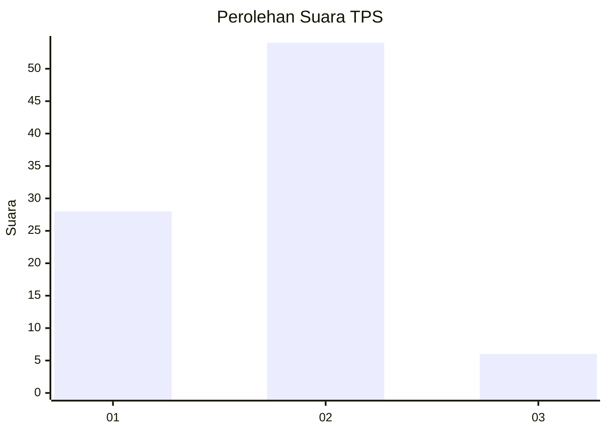
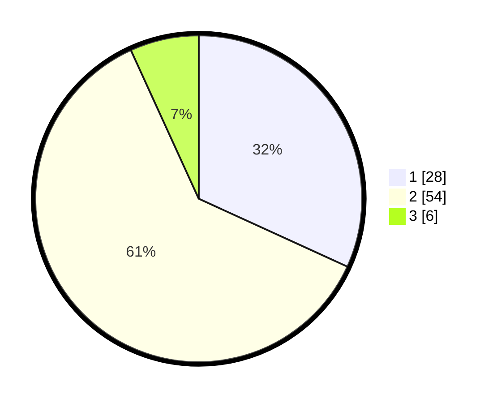

# Hasil

## Grafik

## Tabel

| No. | Nama Paslon    | Suara | Suara (raw) | Persentase |
|:--- |:-------------- | -----:| -----------:| ----------:|
| 1   | ANIES MUHAIMIN | 28    | [28][p-1]   | 31,82      |
| 2   | PRABOWO GIBRAN | 54    | [54][p-2]   | 61,36      |
| 3   | GANJAR MAHFUD  | 6     | [6][p-3]    | 6,82       |

[p-1]: https://github.com/gigit-pemilu/pemilu-2024-32-jawa-barat/blob/main/pilpres/hitung-suara/sub/32-jawa-barat/sub/05-garut/sub/31-bungbulang/sub/2013-hegarmanah/sub/004-tps/sub/paslon-1.txt
[p-2]: https://github.com/gigit-pemilu/pemilu-2024-32-jawa-barat/blob/main/pilpres/hitung-suara/sub/32-jawa-barat/sub/05-garut/sub/31-bungbulang/sub/2013-hegarmanah/sub/004-tps/sub/paslon-2.txt
[p-3]: https://github.com/gigit-pemilu/pemilu-2024-32-jawa-barat/blob/main/pilpres/hitung-suara/sub/32-jawa-barat/sub/05-garut/sub/31-bungbulang/sub/2013-hegarmanah/sub/004-tps/sub/paslon-3.txt

## Foto C Plano

https://sirekap-obj-formc.kpu.go.id/35a0/pemilu/ppwp/32/05/31/20/13/3205312013004-20240215-015723--36a33b76-f2c2-43bd-9a7d-b0ff67b2a2ec.jpg

https://sirekap-obj-formc.kpu.go.id/35a0/pemilu/ppwp/32/05/31/20/13/3205312013004-20240215-015739--4bc65b96-79ea-427e-b044-8030322b837b.jpg

https://sirekap-obj-formc.kpu.go.id/35a0/pemilu/ppwp/32/05/31/20/13/3205312013004-20240215-015754--65a99d6d-0776-4cb9-ac55-461d70071b52.jpg

## Metadata

| Key        | Value               |
| ---------- | ------------------- |
| Time Stamp | 2024-02-19 06:16:00 |

