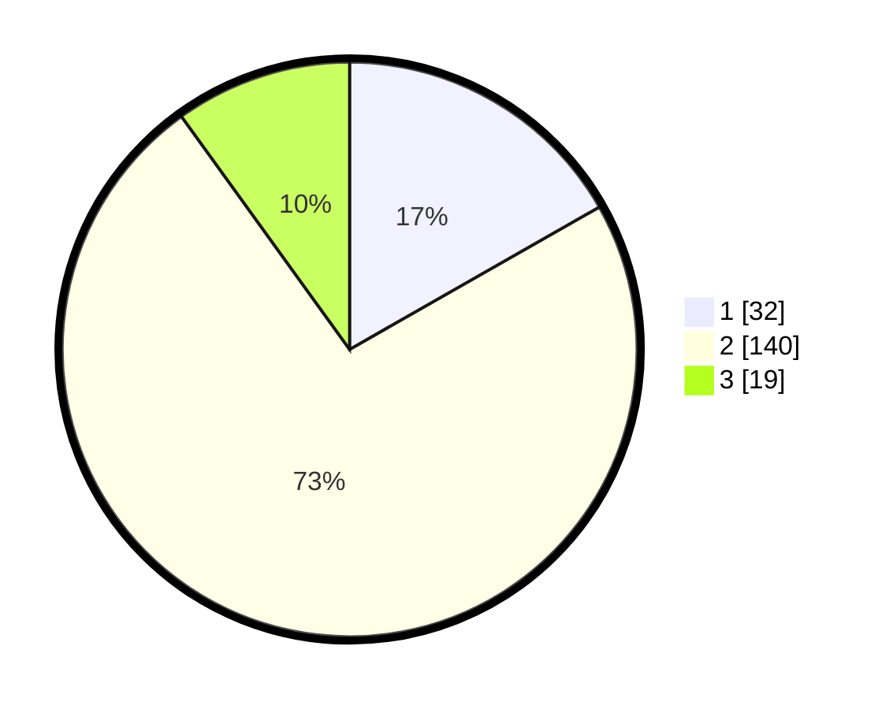

# Hasil

## Grafik

## Tabel

| No. | Nama Paslon    | Suara | Suara (raw) | Persentase |
|:--- |:-------------- | -----:| -----------:| ----------:|
| 1   | ANIES MUHAIMIN | 32    | [32][p-1]   | 16,75      |
| 2   | PRABOWO GIBRAN | 140   | [140][p-2]  | 73,30      |
| 3   | GANJAR MAHFUD  | 19    | [19][p-3]   | 9,95       |

[p-1]: https://github.com/gigit-pemilu/pemilu-2024/blob/main/pilpres/hitung-suara/sub/32-jawa-barat/sub/05-garut/sub/32-mekarmukti/sub/2001-mekarmukti/sub/004-tps/sub/paslon-1.txt
[p-2]: https://github.com/gigit-pemilu/pemilu-2024/blob/main/pilpres/hitung-suara/sub/32-jawa-barat/sub/05-garut/sub/32-mekarmukti/sub/2001-mekarmukti/sub/004-tps/sub/paslon-2.txt
[p-3]: https://github.com/gigit-pemilu/pemilu-2024/blob/main/pilpres/hitung-suara/sub/32-jawa-barat/sub/05-garut/sub/32-mekarmukti/sub/2001-mekarmukti/sub/004-tps/sub/paslon-3.txt

## Foto C Plano

https://sirekap-obj-formc.kpu.go.id/d556/pemilu/ppwp/32/05/32/20/01/3205322001004-20240215-074626--3d029f54-2197-47dd-a823-bd7ad9a821b9.jpg

https://sirekap-obj-formc.kpu.go.id/d556/pemilu/ppwp/32/05/32/20/01/3205322001004-20240215-074840--8ad3ea88-5dae-44bd-9493-d72b732ce009.jpg

https://sirekap-obj-formc.kpu.go.id/d556/pemilu/ppwp/32/05/32/20/01/3205322001004-20240215-075004--52cc67ae-a26c-49aa-b8b7-9f71ecb69a94.jpg

## Metadata

| Key        | Value               |
| ---------- | ------------------- |
| Time Stamp | 2024-02-25 11:00:00 |

