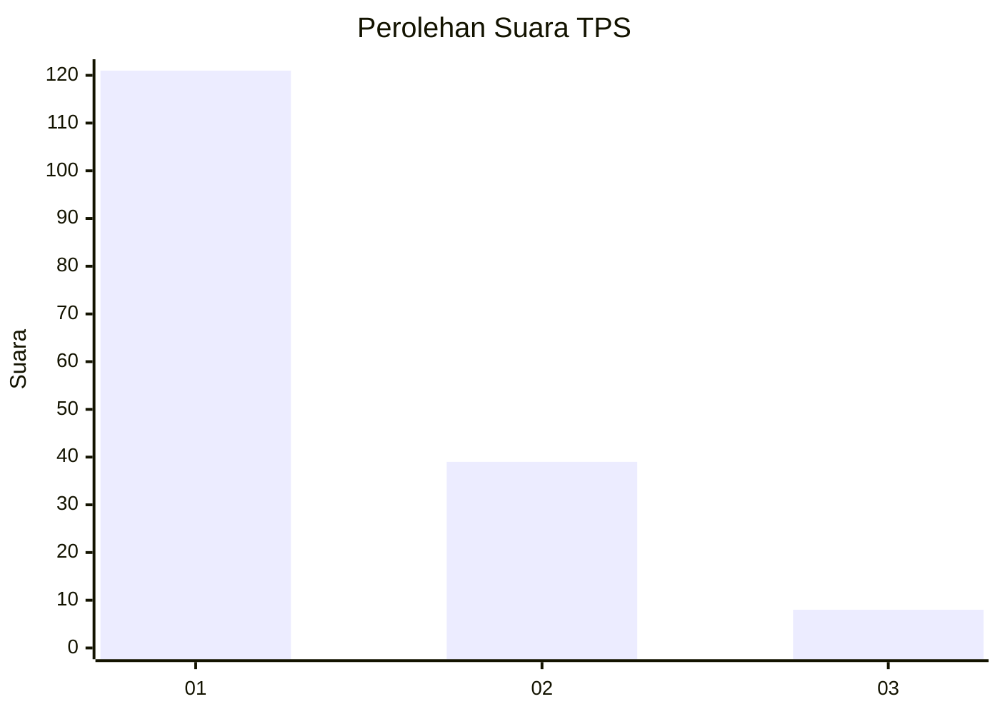
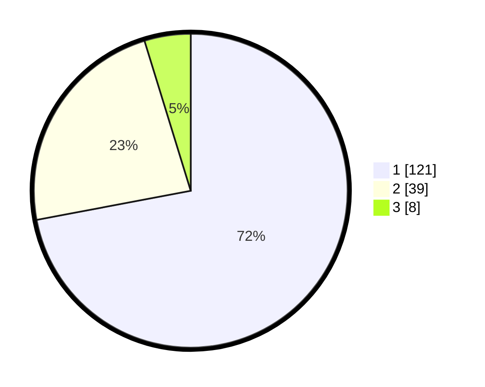

# Hasil

## Grafik

## Tabel

| No. | Nama Paslon    | Suara | Suara (raw) | Persentase |
|:--- |:-------------- | -----:| -----------:| ----------:|
| 1   | ANIES MUHAIMIN | 121   | [121][p-1]  | 72,02      |
| 2   | PRABOWO GIBRAN | 39    | [39][p-2]   | 23,21      |
| 3   | GANJAR MAHFUD  | 8     | [8][p-3]    | 4,76       |

[p-1]: https://github.com/gigit-pemilu/pemilu-2024/blob/main/pilpres/hitung-suara/sub/32-jawa-barat/sub/05-garut/sub/33-pakenjeng/sub/2001-neglasari/sub/016-tps/sub/paslon-1.txt
[p-2]: https://github.com/gigit-pemilu/pemilu-2024/blob/main/pilpres/hitung-suara/sub/32-jawa-barat/sub/05-garut/sub/33-pakenjeng/sub/2001-neglasari/sub/016-tps/sub/paslon-2.txt
[p-3]: https://github.com/gigit-pemilu/pemilu-2024/blob/main/pilpres/hitung-suara/sub/32-jawa-barat/sub/05-garut/sub/33-pakenjeng/sub/2001-neglasari/sub/016-tps/sub/paslon-3.txt

## Foto C Plano

https://sirekap-obj-formc.kpu.go.id/0ab5/pemilu/ppwp/32/05/33/20/01/3205332001016-20240214-235327--951a07fb-6720-4800-bb69-c4433051e5b5.jpg

https://sirekap-obj-formc.kpu.go.id/0ab5/pemilu/ppwp/32/05/33/20/01/3205332001016-20240214-235504--f5d8c0e6-733b-46bb-9373-e391e6f862dd.jpg

https://sirekap-obj-formc.kpu.go.id/0ab5/pemilu/ppwp/32/05/33/20/01/3205332001016-20240214-235527--de8e79ef-d4b3-4c09-91f9-3ce91c001acd.jpg

## Metadata

| Key        | Value               |
| ---------- | ------------------- |
| Time Stamp | 2024-02-20 18:00:00 |

