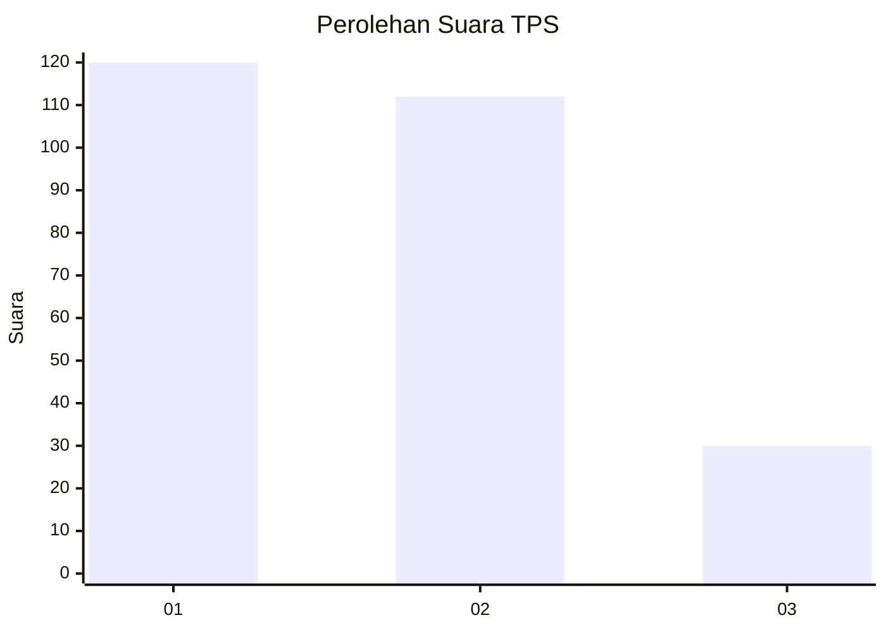
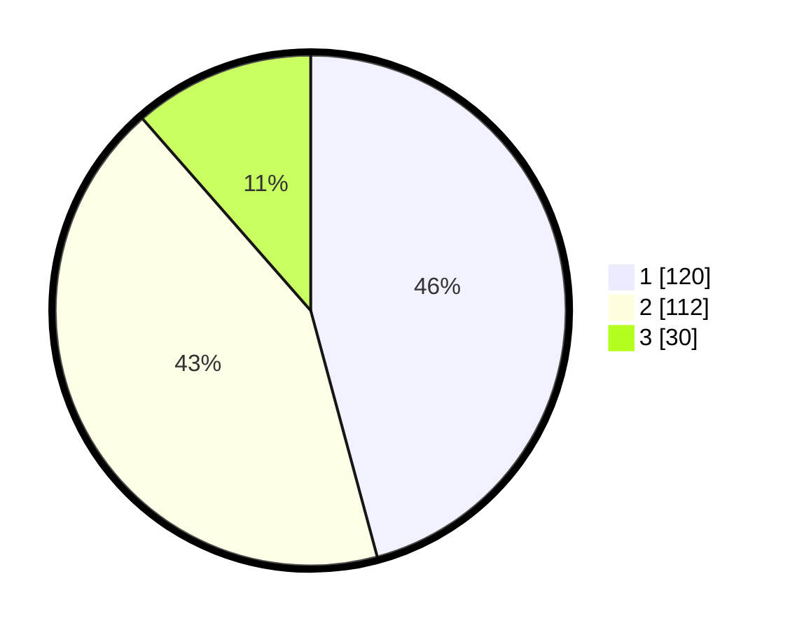

# Hasil

## Grafik

## Tabel

| No. | Nama Paslon    | Suara | Suara (raw) | Persentase |
|:--- |:-------------- | -----:| -----------:| ----------:|
| 1   | ANIES MUHAIMIN | 120   | [120][p-1]  | 45,80      |
| 2   | PRABOWO GIBRAN | 112   | [112][p-2]  | 42,75      |
| 3   | GANJAR MAHFUD  | 30    | [30][p-3]   | 11,45      |

[p-1]: https://github.com/gigit-pemilu/pemilu-2024/blob/main/pilpres/hitung-suara/sub/32-jawa-barat/sub/05-garut/sub/33-pakenjeng/sub/2005-sukamulya/sub/004-tps/sub/paslon-1.txt
[p-2]: https://github.com/gigit-pemilu/pemilu-2024/blob/main/pilpres/hitung-suara/sub/32-jawa-barat/sub/05-garut/sub/33-pakenjeng/sub/2005-sukamulya/sub/004-tps/sub/paslon-2.txt
[p-3]: https://github.com/gigit-pemilu/pemilu-2024/blob/main/pilpres/hitung-suara/sub/32-jawa-barat/sub/05-garut/sub/33-pakenjeng/sub/2005-sukamulya/sub/004-tps/sub/paslon-3.txt

## Foto C Plano

https://sirekap-obj-formc.kpu.go.id/2202/pemilu/ppwp/32/05/33/20/05/3205332005004-20240214-223517--522b660f-c0bd-46de-97de-d1706f386a33.jpg

https://sirekap-obj-formc.kpu.go.id/2202/pemilu/ppwp/32/05/33/20/05/3205332005004-20240214-224506--45b0cd33-f7f5-49ae-9bbd-92ff048604fd.jpg

https://sirekap-obj-formc.kpu.go.id/2202/pemilu/ppwp/32/05/33/20/05/3205332005004-20240214-223857--7c7ef0be-8f35-4c2b-8a41-83d8ab8c5250.jpg

## Metadata

| Key        | Value               |
| ---------- | ------------------- |
| Time Stamp | 2024-02-20 18:00:00 |

