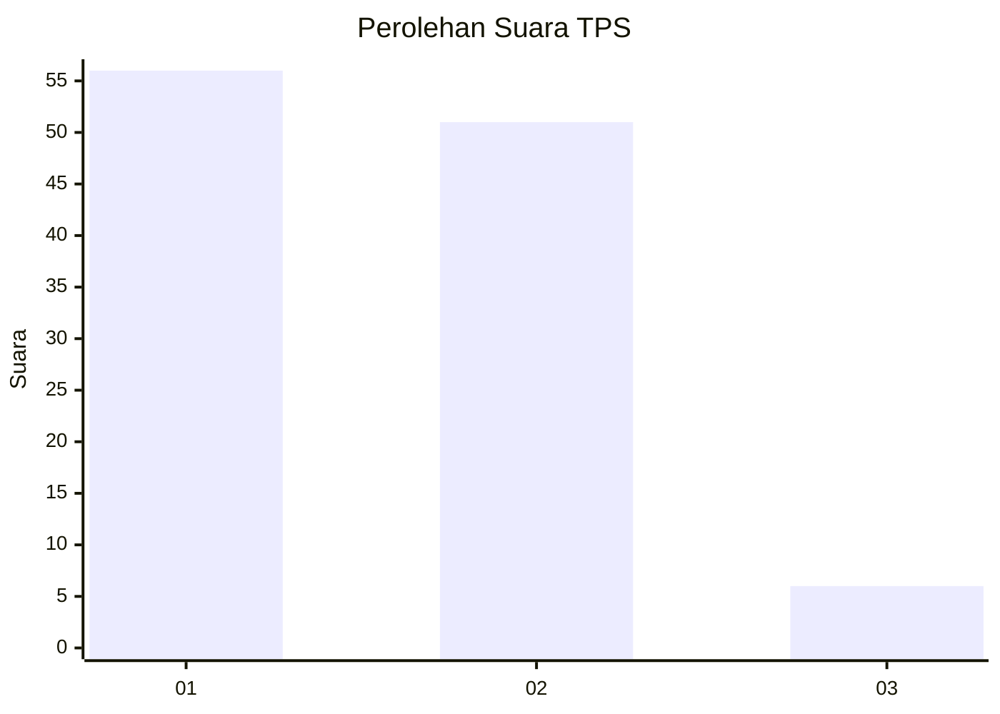
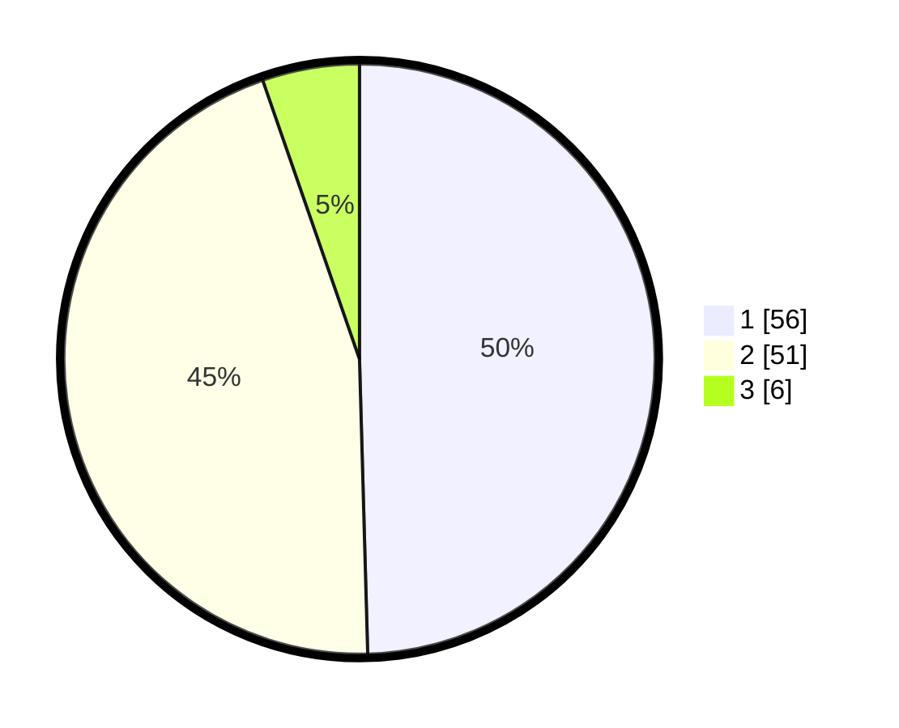

# Hasil

## Grafik

## Tabel

| No. | Nama Paslon    | Suara | Suara (raw) | Persentase |
|:--- |:-------------- | -----:| -----------:| ----------:|
| 1   | ANIES MUHAIMIN | 56    | [56][p-1]   | 49,56      |
| 2   | PRABOWO GIBRAN | 51    | [51][p-2]   | 45,13      |
| 3   | GANJAR MAHFUD  | 6     | [6][p-3]    | 5,31       |

[p-1]: https://github.com/gigit-pemilu/pemilu-2024/blob/main/pilpres/hitung-suara/sub/32-jawa-barat/sub/05-garut/sub/33-pakenjeng/sub/2009-panyindangan/sub/008-tps/sub/paslon-1.txt
[p-2]: https://github.com/gigit-pemilu/pemilu-2024/blob/main/pilpres/hitung-suara/sub/32-jawa-barat/sub/05-garut/sub/33-pakenjeng/sub/2009-panyindangan/sub/008-tps/sub/paslon-2.txt
[p-3]: https://github.com/gigit-pemilu/pemilu-2024/blob/main/pilpres/hitung-suara/sub/32-jawa-barat/sub/05-garut/sub/33-pakenjeng/sub/2009-panyindangan/sub/008-tps/sub/paslon-3.txt

## Foto C Plano

https://sirekap-obj-formc.kpu.go.id/924c/pemilu/ppwp/32/05/33/20/09/3205332009008-20240215-134033--99323f61-9a7d-49f9-9a40-1c3e64b50f75.jpg

https://sirekap-obj-formc.kpu.go.id/924c/pemilu/ppwp/32/05/33/20/09/3205332009008-20240215-215917--45d830ac-a034-4b4d-a9cb-58b0e1537ecb.jpg

https://sirekap-obj-formc.kpu.go.id/924c/pemilu/ppwp/32/05/33/20/09/3205332009008-20240215-134744--c001cedf-be9d-4e1e-bfac-cba477ed263f.jpg

## Metadata

| Key        | Value               |
| ---------- | ------------------- |
| Time Stamp | 2024-02-15 22:30:27 |

