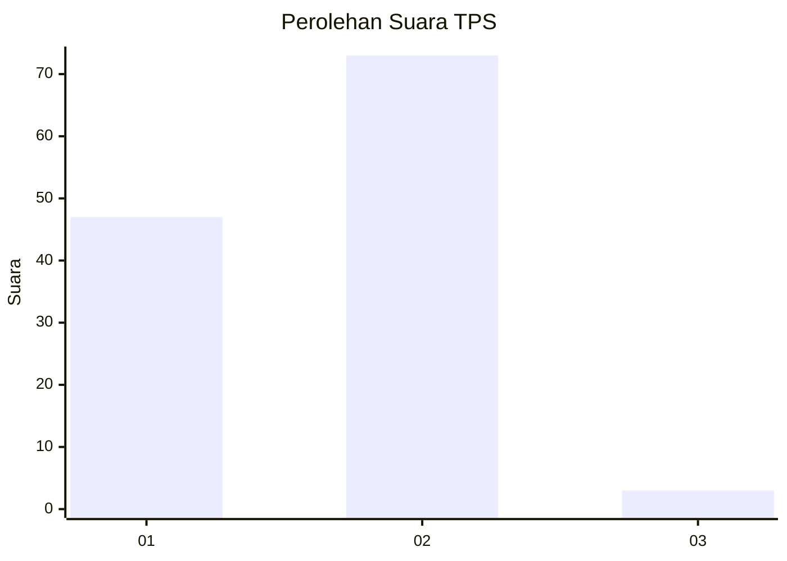
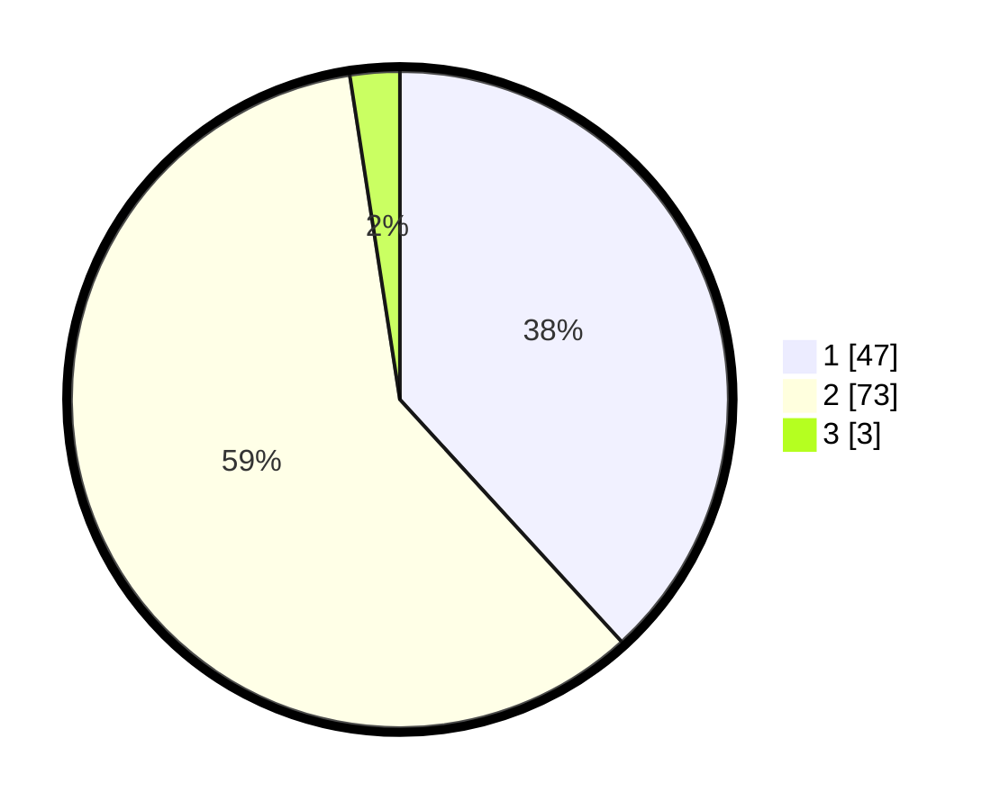

# Hasil

## Grafik

## Tabel

| No. | Nama Paslon    | Suara | Suara (raw) | Persentase |
|:--- |:-------------- | -----:| -----------:| ----------:|
| 1   | ANIES MUHAIMIN | 47    | [47][p-1]   | 38,21      |
| 2   | PRABOWO GIBRAN | 73    | [73][p-2]   | 59,35      |
| 3   | GANJAR MAHFUD  | 3     | [3][p-3]    | 2,44       |

[p-1]: https://github.com/gigit-pemilu/pemilu-2024-32-jawa-barat/blob/main/pilpres/hitung-suara/sub/32-jawa-barat/sub/05-garut/sub/34-pamulihan/sub/2001-pakenjeng/sub/001-tps/sub/paslon-1.txt
[p-2]: https://github.com/gigit-pemilu/pemilu-2024-32-jawa-barat/blob/main/pilpres/hitung-suara/sub/32-jawa-barat/sub/05-garut/sub/34-pamulihan/sub/2001-pakenjeng/sub/001-tps/sub/paslon-2.txt
[p-3]: https://github.com/gigit-pemilu/pemilu-2024-32-jawa-barat/blob/main/pilpres/hitung-suara/sub/32-jawa-barat/sub/05-garut/sub/34-pamulihan/sub/2001-pakenjeng/sub/001-tps/sub/paslon-3.txt

## Foto C Plano

https://sirekap-obj-formc.kpu.go.id/c98b/pemilu/ppwp/32/05/34/20/01/3205342001001-20240215-140132--eeed96c0-4222-4ecf-aac4-bdb7079bb0ac.jpg

https://sirekap-obj-formc.kpu.go.id/c98b/pemilu/ppwp/32/05/34/20/01/3205342001001-20240215-140214--14276fe8-894a-4106-9147-0bedff8633a7.jpg

https://sirekap-obj-formc.kpu.go.id/c98b/pemilu/ppwp/32/05/34/20/01/3205342001001-20240215-140258--522469c8-b2dd-4686-ad4e-b7131158edd0.jpg

## Metadata

| Key        | Value               |
| ---------- | ------------------- |
| Time Stamp | 2024-02-15 16:30:25 |

